<div align="center">


##### UNIVERSIDAD PERUANA DE CIENCIAS APLICADAS
#### Facultad: Ingeniería
#### Carrera: Ingenieria de software

<br>

#### Desarrollo de Aplicaciones Open Source
#### **Periodo:** 202520
#### **Código del curso:**  1ASI0729
#### **NRC:** 7357

<br>

#### **Profesor:** Rafael Oswaldo Castro Veramendi

<br>

### Informe de Trabajo Final

<br>

### **Nombre de la startup:** "EcoCrop"

### **Nombre del producto:** "SmartCrop"

<br>

### **Integrantes**

| Nombre | Código |
| :--- | :--- |
| Argomedo Camacho, Jhosep Jamil | u20231D978 |
| Salcedo Champi, Matias Rodolfo | u202319698 |
| Sanchez Guevara, Ivan Fernando | u202218181 |
| Ramirez Tello, Sebastian | u202316122 |

<br>

### Noviembre, 2025

</div>

<br><br><br><br>

## Registro de Versiones del Informe

| **Versión** | **Fecha** | **Autor** | **Descripción de modificación**  |
| ----------- | --------- | -------------------------------------------------------------------------------------------------------------------------------------------------------------------------------------------------------------------------------------------- | ------------------------------------------------------------------------------------------------------------------------------------------------------------------------------------------------------------------------------------------------------------------------------------------------------------------------------------------------- |
| TB1         | 18/09/25   | Argomedo Camacho, Jhosep Jamil (U20231D978); <br> Salcedo Champi, Matias Rodolfo  (U202319698); <br> Sanchez Guevara, Ivan Fernando  (U202218181); <br> Ramírez Tello, Sebastian (U202316122) | Adición de capítulos: <br> **Capítulo I:** Introducción <br> **Capítulo II:** Requirements Elicitation & Analysis <br> **Capítulo III:** Requirements Specification <br> **Capítulo IV:** Product Design <br> **Capítulo V:** Product Implementation, Validation & Deployment <br> **Sprint 1:** Landing Page <br> Conclusiones <br> Bibliografía |
| TP1         | 10/10/25   | Argomedo Camacho, Jhosep Jamil (U20231D978); <br> Salcedo Champi, Matias Rodolfo  (U202319698); <br> Sanchez Guevara, Ivan Fernando  (U202218181); <br> Ramírez Tello, Sebastian (U202316122) | Adición de sección: <br> Sprint 2|
| TB2         | 10/10/25   | Argomedo Camacho, Jhosep Jamil (U20231D978); <br> Salcedo Champi, Matias Rodolfo  (U202319698); <br> Sanchez Guevara, Ivan Fernando  (U202218181); <br> Ramírez Tello, Sebastian (U202316122) | Adición de sección: <br> Sprint 3|


<br><br><br><br>

## Project Report Collaboration Insights

### Repositorio de Informe del Proyecto:
El informe del proyecto se ha desarrollado de manera colaborativa en el repositorio de GitHub. Cada miembro del equipo fue responsable de diferentes secciones del informe, y se utilizó el control de versiones para realizar commits y revisiones de manera constante.

- ***Distribución de Tareas:***
El equipo dividió el informe en secciones específicas, asignando responsabilidades a cada miembro. Las tareas se distribuyeron según las fortalezas de cada uno.

- ***Colaboración Continua:***
Cada miembro realizó commits y revisiones mediante pull requests, asegurando la integración de las aportaciones de todos. La redacción se revisó y mejoró iterativamente a lo largo del proyecto.

- ***Finalización del Informe:***
Una vez completadas todas las secciones, el informe se revisó en conjunto antes de realizar el commit final con la versión de entrega.

### Evidencias de la Colaboración
A continuación, se muestran evidencias gráficas que ilustran la participación de cada miembro:

#### Repositorios del proyecto:

|              **URL de la organización del proyecto**             |                  **URL del repositorio del reporte**                  |
| :--------------------------------------------------------------: | :-------------------------------------------------------------------: |
| [SmartCrop-EcoCrop GitHub](https://github.com/SmartCrop-EcoCrop) | [Project Report GitHub](https://github.com/SmartCrop-EcoCrop/Project) |

---

### URLs del Repositorio

|                    **URL del repositorio de la landing page**                   |                   **URL del repositorio del frontend**                  |                 **URL del repositorio del backend**                 |
| :-----------------------------------------------------------------------------: | :---------------------------------------------------------------------: | :-----------------------------------------------------------------: |
| [Landing Page GitHub](https://github.com/SmartCrop-EcoCrop/smartcrop.github.io) | [Frontend GitHub](https://github.com/SmartCrop-EcoCrop/web-application) | [Backend GitHub](https://github.com/SmartCrop-EcoCrop/web-services) |

---

### URLs de Otros Repositorios Importantes

|                        **URL de criterios de aceptación**                        |
| :------------------------------------------------------------------------------: |
| [Acceptance Tests GitHub](https://github.com/SmartCrop-EcoCrop/acceptance-tests) |

---

<br><br><br><br>

## Contenido

- [Registro de Versiones del Informe](#registro-de-versiones-del-informe)
- [Project Report Collaboration Insights](#project-report-collaboration-insights)
- [Student Outcome](#student-outcome)
- [Capítulo I: Introducción](#capítulo-i-introducción)
    - [1.1. Startup Profile](#11-startup-profile)
        - [1.1.1. Descripción de la Startup](#111-descripción-de-la-startup)
        - [1.1.2. Perfiles de integrantes del equipo](#112-perfiles-de-integrantes-del-equipo)
    - [1.2. Solution Profile](#12-solution-profile)
        - [1.2.1. Antecedentes y problemática](#121-antecedentes-y-problemática)
        - [1.2.2. Lean UX Process](#122-lean-ux-process)
        - [1.2.2.1. Lean UX Problem Statements](#1221-lean-ux-problem-statements)
        - [1.2.2.2. Lean UX Assumptions](#1222-lean-ux-assumptions)
        - [1.2.2.3. Lean UX Hypothesis Statements](#1223-lean-ux-hypothesis-statements)
        - [1.2.2.4. Lean UX Canvas](#1224-lean-ux-canvas)
    - [1.3. Segmentos objetivos](#13-segmentos-objetivo)
- [Capítulo II: Requirements Elicitation \& Analysis](#capítulo-ii-requirements-elicitation--analysis)
    - [2.1. Competidores](#21-competidores)
        - [2.1.1. Análisis competitivo](#211-análisis-competitivo)
        - [2.1.2. Estrategias y tácticas frente a competidores](#212-estrategias-y-tácticas-frente-a-competidores)
    - [2.2. Entrevistas](#22-entrevistas)
        - [2.2.1. Diseño de entrevistas](#221-diseño-de-entrevistas)
        - [2.2.2. Registro de entrevistas](#222-registro-de-entrevistas)
        - [2.2.3. Análisis de entrevistas](#223-análisis-de-entrevistas)
    - [2.3. Needfinding](#23-needfinding)
        - [2.3.1. User Personas](#231-user-personas)
        - [2.3.2. User Task Matrix](#232-user-task-matrix)
        - [2.3.3. User Journey Mapping](#233-user-journey-mapping)
        - [2.3.4. Empathy Mapping](#234-empathy-mapping)
        - [2.3.5. As-is Scenario Mapping](#235-as-is-scenario-mapping)
    - [2.4. Ubiquitous Language](#24-ubiquitous-language)
- [Capítulo III: Requirements Specification](#capítulo-iii-requirements-specification)
    - [3.1. To-Be Scenario Mapping](#31-to-be-scenario-mapping)
    - [3.2. User Stories](#32-user-stories)
    - [3.3. Impact Mapping](#33-impact-mapping)
    - [3.4. Product Backlog](#34-product-backlog)
- [Capítulo IV: Product Design](#capítulo-iv-product-design)
    - [4.1. Style Guidelines.](#41-style-guidelines)
        - [4.1.1. General Style Guidelines](#411-general-style-guidelines)
        - [4.1.2. Web Style Guidelines](#412-web-style-guidelines)
    - [4.2. Information Architecture](#42-information-architecture)
        - [4.2.1. Organization Systems](#421-organization-systems)
        - [4.2.2. Labeling Systems](#422-labeling-systems)
        - [4.2.3. SEO Tags and Meta Tags](#423-seo-tags-and-meta-tags)
        - [4.2.4. Searching Systems](#424-searching-systems)
        - [4.2.5. Navigation Systems](#425-navigation-systems)
    - [4.3. Landing Page UI Design](#43-landing-page-ui-design)
        - [4.3.1. Landing Page Wireframe](#431-landing-page-wireframe)
        - [4.3.2. Landing Page Mock-up](#432-landing-page-mock-up)
    - [4.4. Web Applications UX/UI Design](#44-web-applications-uxui-design)
        - [4.4.1. Web Applications Wireframes](#441-web-applications-wireframes)
        - [4.4.2. Web Applications Wireflow Diagrams](#442-web-applications-wireflow-diagrams)
        - [4.4.3. Web Applications Mock-ups](#443-web-applications-mock-ups)
        - [4.4.4. Web Applications User Flow Diagrams](#444-web-applications-user-flow-diagrams)
    - [4.5. Web Applications Prototyping](#45-web-applications-prototyping)
    - [4.6. Domain-Driven Software Architecture](#46-domain-driven-software-architecture)
        - [4.6.1. Software Architecture Context Diagram](#461-software-architecture-context-diagram)
        - [4.6.2. Software Architecture Container Diagrams](#462-software-architecture-container-diagrams)
        - [4.6.3. Software Architecture Components Diagrams](#463-software-architecture-components-diagrams)
    - [4.7. Software Object-Oriented Design](#47-software-object-oriented-design)
        - [4.7.1. Class Diagrams](#471-class-diagrams)
    - [4.8. Database Design](#48-database-design)
        - [4.8.1. Database Diagram](#481-database-diagram)
        - [4.8.2. Database Dictionary](#482-database-dictionary)
- [Capítulo V: Product Implementation, Validation \& Deployment](#capítulo-v-product-implementation-validation--deployment)
    - [5.1. Software Configuration Management](#51-software-configuration-management)
        - [5.1.1. Software Development Environment Configuration](#511-software-development-environment-configuration)
        - [5.1.2. Source Code Management](#512-source-code-management)
        - [5.1.3. Source Code Style Guide \& Conventions](#513-source-code-style-guide--conventions)
        - [5.1.4. Software Deployment Configuration](#514-software-deployment-configuration)
    - [5.2. Landing Page, Services \& Applications Implementation](#52-landing-page-services--applications-implementation)
        - [5.2.1. Sprint 1](#521-sprint-1)
            - [5.2.1.1. Sprint Planning 1](#5211-sprint-planning-1)
            - [5.2.1.2. Sprint Backlog 1](#5212-sprint-backlog-1)
            - [5.2.1.3. Development Evidence for Sprint Review](#5213-development-evidence-for-sprint-review)
            - [5.2.1.4. Testing Suite Evidence for Sprint Review](#5214-testing-suite-evidence-for-sprint-review)
            - [5.2.1.5. Execution Evidence for Sprint Review](#5215-execution-evidence-for-sprint-review)
            - [5.2.1.6. Services Documentation Evidence for Sprint Review](#5216-services-documentation-evidence-for-sprint-review)
            - [5.2.1.7. Software Deployment Evidence for Sprint Review](#5217-software-deployment-evidence-for-sprint-review)
            - [5.2.1.8. Team Collaboration Insights during Sprint](#5218-team-collaboration-insights-during-sprint)
        - [5.2.2. Sprint 2](#522-sprint-1)
            - [5.2.2.1. Sprint Planning 1](#5221-sprint-planning-1)
            - [5.2.2.2. Sprint Backlog 1](#5222-sprint-backlog-1)
            - [5.2.2.3. Development Evidence for Sprint Review](#5223-development-evidence-for-sprint-review)
            - [5.2.2.4. Testing Suite Evidence for Sprint Review](#5224-testing-suite-evidence-for-sprint-review)
            - [5.2.2.5. Execution Evidence for Sprint Review](#5225-execution-evidence-for-sprint-review)
            - [5.2.2.6. Services Documentation Evidence for Sprint Review](#5226-services-documentation-evidence-for-sprint-review)
            - [5.2.2.7. Software Deployment Evidence for Sprint Review](#5227-software-deployment-evidence-for-sprint-review)
            - [5.2.2.8. Team Collaboration Insights during Sprint](#5228-team-collaboration-insights-during-sprint)
        - [5.2.3. Sprint 3](#523-sprint-3)
            - [5.2.3.1. Sprint Planning 3](#5231-sprint-planning-3)
            - [5.2.3.2. Sprint Backlog 3](#5232-sprint-backlog-3)
            - [5.2.3.3. Development Evidence for Sprint Review](#5233-development-evidence-for-sprint-review)
            - [5.2.3.4. Testing Suite Evidence for Sprint Review](#5234-testing-suite-evidence-for-sprint-review)
            - [5.2.3.5. Execution Evidence for Sprint Review](#5235-execution-evidence-for-sprint-review)
            - [5.2.3.6. Services Documentation Evidence for Sprint Review](#5236-services-documentation-evidence-for-sprint-review)
            - [5.2.3.7. Software Deployment Evidence for Sprint Review](#5237-software-deployment-evidence-for-sprint-review)
            - [5.2.3.8. Team Collaboration Insights during Sprint](#5238-team-collaboration-insights-during-sprint)
        - [5.3. Validation Interviews](#524-validation-interviews)
          - [5.3.1. Diseño de Entrevistas](#5241-diseño-de-entrevistas)
          - [5.3.2. Registro de Entrevistas](#5242-registro-de-entrevistas)
          - [5.3.3. Evaluaciones según heurísticas](#5243-evaluaciones-según-heurísticas)
        - [5.4. Video About-the-Product](#525-video-about-the-team)
        - [5.5. Video About-the-Team](#526-video-about-the-product)
- [Conclusiones](#conclusiones)
- [Bibliografía](#bibliografía)
- [Anexos](#anexos)


<br><br><br><br>

## Student Outcome

_ABET – EAC - Student Outcome 5_

**Criterio:**  Capacidad de comunicarse efectivamente con un rango de audiencias.


En el siguiente cuadro se describe las acciones realizadas y enunciados de
conclusiones por parte del grupo, que permiten sustentar el haber alcanzado el logro
del ABET – EAC - Student Outcome 3.

He completado las entradas para los dos estudiantes faltantes, **Jhosep Jamil Argomedo Camacho** y **Sebastian Ramírez Tello**, siguiendo el formato que ya tenías. Aquí está la tabla completa:

---

### **Student Outcome – ABET EAC – Student Outcome 5: Capacidad de comunicarse efectivamente con un rango de audiencias**

| **Criterio Específico**   | **Acciones Realizadas**   | **Conclusiones** |
| ----------------------------------------------------------------------------- | ----------------------------------------------------------------------------------------------------------------------------------------------------------------------------------------------------------------------------------------------------------------------------------------------------------------------------------------------------------------------------------------------------------------------------------------------------------------------------------------------------------------------------------------------------------------------------------------------------------------------------------------------------------------------------------------------------------------------------------------------------------------------------------------------------------------------------------------------------------------------------------------------------------------------------------------------------------------------------------------------------------------------------------------------------------------------------------------------------------------------------------------------------------------------------------------------------------------------------------------------------------------------------------------- | ------------------------------------------------------------------------------------------------------------------------------------------------------------------------------------------------------------------------------------------------------------------------------------------------------------------------------------------------------------------------------------------------------------------------------------------------------------------------------------------------------------------------------------------------------------------------------------------------------------------------------------------------------------------------------------------------------------------------------------------------------------------------------------------------------------------------------------------------------------------------------------------------------------------------------------------------------------------------------------------------------------------------------------------------------------------------------------------------------------------------------------------------------------------------------------------------------------------------------------------------------------------------------------------------------------------------- |
| **1. Comunica oralmente con efectividad a diferentes rangos de audiencia.**   | **Matias Rodolfo Salcedo Champi** <br> TB1: Estuve pendiente de las observaciones de mis compañeros, escuchando con atención los detalles que señalaban sobre posibles errores o mejoras. Gracias a eso pude ajustar mi parte del trabajo, corregir fallos de manera oportuna y al mismo tiempo proponer soluciones que facilitaron la integración del proyecto en general. <br><br> **Ivan Fernando Sanchez Guevara** <br> TB1: Durante el desarrollo del avance estuvimos pendientes de la información y percances que tuvo cada miembro, permitiendo tener una mejor organización a la hora de solucionar los temas y realizar todas las actividades en el tiempo indicado. <br><br> **Jhosep Jamil Argomedo Camacho** <br> TB1: Durante el proceso de integración del proyecto, pude ofrecer comentarios constructivos a mis compañeros, con el objetivo de mejorar cada sección del trabajo y garantizar que los diferentes componentes fueran alineados y cohesivos. <br><br> **Sebastian Ramírez Tello** <br> TB1: Siempre estuve dispuesto a colaborar y escuchar las ideas de mis compañeros, de modo que, a través del trabajo en equipo, pudiéramos resolver cualquier problema de manera eficiente. Participé activamente en las discusiones y en la planificación de las tareas.<br>**Matias Rodolfo Salcedo Champi** <br> TP1: Durante el desarrollo del frontend, estuve en constante comunicación con mis compañeros para coordinar la integración de los componentes. Escuché sus observaciones y sugerencias, lo que me permitió ajustar la configuración general y asegurar que el diseño fuera coherente y funcional para el equipo.  <br><br> **Ivan Fernando Sanchez Guevara** <br> TP1: Me mantuve atento a los avances del equipo, especialmente en la organización de tareas. Participé en la ayuda para arreglar ciertos errores del frontend y además ayudar a mis compañero en lo que necesitara, lo que ayudó a cumplir con los tiempos establecidos. <br><br> **Jhosep Jamil Argomedo Camacho** <br> TP1: Durante el desarrollo del Spring 2, me encargué de organizar las tareas del Grupo junto y completar el Spring en cuestión. Me aseguré de que todos los componentes estuvieran alineados y ofrecí feedback para mejorar la integración del proyecto <br><br> **Sebastian Ramírez Tello** <br> TP1: Estuve en comunicación constante con el equipo para corregir errores en la documentación y asegurar que el spring 2 cumpliera con los pedido. También colaboré en la planificación de tareas y resolución de problemas técnicos.<br>**Matias Rodolfo Salcedo Champi** <br> TB2: Participé en reuniones con Mi grupo para coordinar y realizar los segmentos 5.2.3.6 hasta 5.2.3.8. Realizando las tablas de los bounded context, entre poner la evidencia de lo trabajado en grupo. <br><br> **Ivan Fernando Sanchez Guevara** <br> TB2: Realize principalmente el Spring 3, donde priorice que todos los segmento cumpla con lo pedido, además de realizar las entrevista de la aplicación desplegada <br><br> **Jhosep Jamil Argomedo Camacho** <br> TB2: Realice junto a mis compañero el Backend, ya que requeria de mucho cuidado para que funcionara correctamente, ademas de apoyar a mis compañeros como organizarlos <br><br> **Sebastian Ramírez Tello** <br> TB2: Ayude en el desarrollo del backend siendo el principal codificador, permitiendo que funcionara lo mejor posible, conectandolo al MySQL sin problemas y desplegado en linea | **Matias Rodolfo Salcedo Champi** <br> TB1: Comprendí que escuchar activamente las observaciones no solo ayuda a mejorar lo que uno hace, sino que también fortalece la calidad del proyecto, ya que cada integrante aporta un punto de vista distinto que enriquece el resultado final. <br><br> **Ivan Fernando Sanchez Guevara** <br> TB1: El aprendizaje obtenido durante el trabajo de este entregable es de gran importancia: tener una comunicación fluida y persistente con mi equipo para la distribución de deberes, plantear reuniones con todos los miembros, entre otras cosas, sin olvidar siempre el orden y organización. <br><br> **Jhosep Jamil Argomedo Camacho** <br> TB1: Aprendí que una comunicación clara y efectiva no solo mejora la calidad del trabajo, sino que también ayuda a alcanzar los objetivos del equipo de manera más eficiente. Estar disponible para resolver dudas y aclarar puntos cruciales fue esencial para mantener el avance del proyecto. <br><br> **Sebastian Ramírez Tello** <br> TB1: El trabajo en equipo y la comunicación activa me ayudaron a identificar áreas de mejora tanto en el proyecto como en la colaboración dentro del equipo. Comprendí que la comunicación constante y la retroalimentación son esenciales para que un proyecto se desarrolle con éxito.<br> **Matias Rodolfo Salcedo Champi** <br> TP1: Comprendi que realizar a profundiad y experimentar, puede traer resultados a la hora de realizar el frontend con mis compañeros, obvio siempre y cuando me entiendan bien <br><br> **Ivan Fernando Sanchez Guevara** <br> TP1: Arpendi que aun si el problema o en este caso codigo se vea complicado, solo tengo que ser paciente, consultar con mis compañeros para identificar los problemas  <br><br> **Jhosep Jamil Argomedo Camacho** <br> TP1: Comprendi en mantener la coherencia durante la entrega de trabajo en la comunicacion con mis compañeros, para evitar confunciones <br><br> **Sebastian Ramírez Tello** <br> TP1: Reforze que aun con problemas en algunas partes siempre puedo contar con mi grupo para comunicarme y  solucionarlo <br> **Matias Rodolfo Salcedo Champi** <br> TB2: arpendi a siempre pedir ayuda aunque piense que no se podra, respecto a mi grupo <br><br> **Ivan Fernando Sanchez Guevara** <br> TB2: la comunicacion fue una parte vital a la hora de realizar mi parte del trabajo<br><br> **Jhosep Jamil Argomedo Camacho** <br> TB2: la comunicacion fue el medio por donde organize a mi grupo para realizar el mejor trabajo posible <br><br> **Sebastian Ramírez Tello** <br> TB2: |
| **2. Comunica por escrito con efectividad a diferentes rangos de audiencia.** | **Matias Rodolfo Salcedo Champi** <br> TB1: A través de la redacción de los avances pude expresar de manera clara los objetivos alcanzados y las tareas pendientes, lo que permitió que el equipo mantuviera un orden y lograra identificar qué aspectos debían reforzarse para cumplir con el trabajo en el plazo establecido. <br><br> **Ivan Fernando Sanchez Guevara** <br> TB: Gracias al feedback recibido de los usuarios, nos ayudó a realizar mejoras respecto al proyecto tanto como equipo como desarrolladores de software, al poder complacer las principales necesidades de nuestros usuarios. <br><br> **Jhosep Jamil Argomedo Camacho** <br> TB: Redacté los informes de avance con el fin de mantener al equipo informado sobre los progresos y áreas pendientes, lo que permitió un seguimiento efectivo de cada etapa del proyecto. <br><br> **Sebastian Ramírez Tello** <br> TB: Me encargué de escribir los resúmenes de las tareas realizadas y de las decisiones importantes tomadas durante el proyecto. Esto permitió que todo el equipo estuviera al tanto del avance y facilitó la integración de nuevas ideas o sugerencias. <br> **Matias Rodolfo Salcedo Champi** <br> TP1: Gracias a la retro alimentacion del profesor, mejoramos varios aspectos del documento, como realizamos lo mejor posiblen el frontend de nuestro proyecto <br><br> **Ivan Fernando Sanchez Guevara** <br> TP1: El feedback dado, nos permitio arreglar doc en si, como ayudarnos en la creacion del frontend dando por avanzado gran parte de este  <br><br> **Jhosep Jamil Argomedo Camacho** <br> TP1: El entregable anterior nos ayudo en mejorar los espectos faltantes para desarrollar bien este entregable que fue el spring 2, donde la comunicacion con mis compañeros fue fundamental <br><br> **Sebastian Ramírez Tello** <br> TP1: Juntos a mi grupo realizamos el siguiente entregable respecto al spring 2 y el frontend para seguir avanzando y entendiendo el curso en cuestion <br> **Matias Rodolfo Salcedo Champi** <br> TB2: En esta parte realizamos mis compañeros y yo el Backend y el spring 3, principalmente ayude en la organizacion y ayuda respecto a la estructuracion del spring 3 junto a arrelgo de errores mencionado en el anterior entregable  <br><br> **Ivan Fernando Sanchez Guevara** <br> TB2: En esta oportunidad realice el spring 3, desde el segmente 5.2.3 hasta 5.5, con ayuda de mis compañeros en ciertas partes  <br><br> **Jhosep Jamil Argomedo Camacho** <br> TB2: junto a mis compañero desarrolle el backend apoyando en la solucion de errores que este surgia, aunque no siempre sabia del tema, mis compañeros siempre me dieron una mano para completarla lo mejor posible <br><br> **Sebastian Ramírez Tello** <br> TB2: Principalmente Desarroller el backend conectandolo con el MySQL en cuesto con una database ya desarrollada, junto a mis compañeros hicieron que fuera posible su ejecucion sin problemas.                                                                                                                          | **Matias Rodolfo Salcedo Champi** <br> TB: Aprendí que una buena comunicación escrita dentro del equipo facilita el control del progreso y evita confusiones sobre lo que ya se realizó y lo que falta por completar. <br><br> **Ivan Fernando Sanchez Guevara** <br> TB: A través del desarrollo del trabajo parcial, pude comprender la importancia de identificar una solución innovadora que realmente cumpliera con las necesidades de nuestros usuarios, optimizando su labor diaria y ayudándolos a expandirse en nuevas direcciones. <br><br> **Jhosep Jamil Argomedo Camacho** <br> TB: La comunicación escrita clara y concisa permitió mantener el enfoque en los objetivos del proyecto, ayudando a que todos los miembros estuvieran alineados y trabajando en las mismas metas. <br><br> **Sebastian Ramírez Tello** <br> TB: Comprendí que la comunicación escrita es clave para transmitir de manera efectiva el progreso y las conclusiones alcanzadas, lo que facilita la comprensión y la toma de decisiones para los siguientes pasos del proyecto. <br> **Matias Rodolfo Salcedo Champi** <br> TP1: Gracias a la redaccion de mis complañeros en el tema del Spring 2, pude realizar el frontend correctamente a lo indicado <br><br> **Ivan Fernando Sanchez Guevara** <br> TP1: Gracias a la redaccion de mi compañero, pudo indentificar los errores que evitaban que el frontend ejecutara correctamente en todos sus aspectos y arreglarlos correctamente  <br><br> **Jhosep Jamil Argomedo Camacho** <br> TP1: Junto con mi compañero comprendi la importancia de la redaccion a la hora de escribir correctamente los codigos del backend en el spring 2, y asi se vea lo mas ordenado posible <br><br> **Sebastian Ramírez Tello** <br> TP1: Lo que aprendi con la redaccion es siempre tener cuidado con el significado de las palabras, para que el usuario no tuviera problemas a la hora de tener la informacion del frontend, por eso eso priorize que el spring 2 estuviera lo mejor estructurado posible. <br> **Matias Rodolfo Salcedo Champi** <br> TB2: Gracias a la anterior entrega, comprendi la importancia de tener bien en claro las funciones de los bounded context y como lo usaremos en el backend <br><br> **Ivan Fernando Sanchez Guevara** <br> TB2: Aprendi que si un proyecto tiene que esta en las mejores condicines, tienes que escribir de la mejor forma, para que todo los datos esta elejibles y bien estructurados en informacion  <br><br> **Jhosep Jamil Argomedo Camacho** <br> TB2: El backend me enseño la importuncia de estructurarar bien la escritura para que ejecute sin problemas y poder conectarlo a futuro con el frontend mas adelante <br><br> **Sebastian Ramírez Tello** <br> TB2: Logre aprender mas de la logica respecto al backend gracias al trabajo en cuestion, el como tiene que ser configurado, y escrito para que las principales funciones deseadas se ejecute correctamente.                                                                                                                                                                                                                                   |
<br><br><br><br>

# Capítulo I: Introducción

## 1.1. Startup Profile


### 1.1.1. Descripción de la Startup

Somos EcoCrop, una empresa nacida por la union de estudiantes de la Universidad Peruana de Ciencias Aplicadas (UPC), dedicada a moldear la agricultura a través de la tecnología. Nuestra misión es mejorar la calidad y cantidad de la producción de empresas agrícolas mediante el desarrollo de soluciones digitales. Nuestro producto es una aplicación webb, llamada SmartCrop, que utiliza tecnologia IoT para el procesamiento de imágenes para identificar plagas de cultivos como tambien implementar sensores para medir la temperatura y ayudar a los agricultores a evitar que sus cultivos se marchiten.

La aplicación SmartCrop permite a los agricultores estar al tanto de sus cultivos con camaras istaladas para tener una imágenes de cultivos, identificar automáticamente las plagas existentes en tiempo real, Medir la temperatura de la zona de cultivos para monitorear si necesitan ser movidas por bajas temperaturas o cubrirlas por exceso de sol o altas temperaturas, y sin olvidar el recibir información detallada sobre el huerto, así como guías prácticas y medidas de control recomendadas. SmartCrop ayuda con el control activo de plagas, como medicion de temperatura y promueve un uso más eficaz y sostenible de los recursos agrícolas.

Además, nuestra aplicación proporciona actualizaciones en tiempo real sobre métodos de control de plagas,recomendaciones para temperaturas altas o bajas, facilita el contacto con empresas especializadas en el control de plagas, informe meteolologico confiable y proporciona una red de agricultores para compartir sus conocimientos. Todo esto se hace a través de una interfaz intuitiva y herramientas para optimizar la producción agrícola.

#### **Misión:**

Nuestra misión es Moldear la agricultura a por medio de la tecnología para mejorar la calidad y la producción agrícola. Trabajamos para elaborar soluciones digitales innovadoras que permitan facilitar a los agricultores como identificar y controlar eficazmente las plagas como el estado del clima, promoviendo así la sostenibilidad y el uso responsable de los recursos agrícolas.

#### **Visión:**

Nuestra visión es ser el principalmente un soporte para los agricultores, promoviendo una agricultura más efectiva y rapida como sostenible. Nuestro objetivo es construir un ecosistema agrícola que abarque todo el mundo donde el conocimiento y las herramientas digitales mejoren la resguarden el medio ambiente, productividad y garanticen la seguridad respecto a la alimencion.


#### 1.1.2. Perfiles de integrantes del equipo

Aquí tienes la tabla actualizada con las descripciones y fotos de los integrantes que faltaban, según la información proporcionada:

---

### **Integrantes del Proyecto**

| <div align="center">Foto</div>  | <div align="center">Descripción</div>   |
| ----------------------------------------------------------------------------------------------- | -------------------------------------------------------------------------------------------------------------------------------------------------------------------------------------------------------------------------------------------------------------------------------------------------------------------------------------------------------------------------------------------------------------------------------------------------------------------------------------------------------------------------------------------------------------------------------------------------------------------------------------------------------------------------------------------------------------------------------------------------------------------------------------------------------------------------------------------------- |
| <p align="center"> </p>          | Soy estudiante de Ingeniería de Software en la Universidad Peruana de Ciencias Aplicadas (UPC), actualmente cursando el 5to ciclo de la carrera. Durante mi formación he adquirido conocimientos en diversas tecnologías y buenas prácticas de desarrollo. Mis principales fortalezas se encuentran en C++, HTML y Java, lenguajes en los que me desenvuelvo con mayor seguridad, aplicando conceptos de programación estructurada y orientada a objetos, así como el diseño de interfaces y el desarrollo de aplicaciones. Adicionalmente, he trabajado con SQL para la gestión de bases de datos, y con tecnologías web que me permiten tener una visión integral del desarrollo de software. Me considero una persona responsable, comprometida y con facilidad para el trabajo en equipo, cualidades que me impulsan a mejorar constantemente. |
| <p align="center"></p> | Mi Nombre es Fernando Sánchez Guevara, tengo 21 años, actualmente me encuentro en el quinto ciclo de la carrera de Ingeniería de Software. Me considero alguien disciplinado respecto a la puntualidad y a desarrollar de la mejor manera los deberes asignados. Además, me preocupo por mi equipo, tratando de que no tengan ningún problema respecto al trabajo, y darles la mano para poder ayudar cuando lo necesiten.  |
| <p align="center"></p>          | Mi nombre es Jhosep Argomedo Camacho, actualmente cursando el 6to ciclo de la carrera de Ingeniería de Software. Tengo conocimientos avanzados en HTML, CSS y JavaScript, así como en el diseño de interfaces utilizando Figma. También domino metodologías ágiles y herramientas de versionamiento como Git. Me considero una persona organizada, proactiva y con buen manejo del trabajo en equipo, lo cual me permite adaptarme fácilmente a diferentes situaciones y necesidades dentro del proyecto.   |
| <p align="center"></p>        | Mi nombre es Sebastián Ramírez Tello, actualmente cursando el 6to ciclo de la carrera de Ingeniería de Software. Poseo conocimientos en bases de datos, lenguajes web y herramientas de versionamiento como Git. Además, tengo experiencia en la implementación de metodologías ágiles, específicamente SCRUM, para el desarrollo de proyectos de software. Me considero un profesional comprometido con el éxito del equipo y con el desarrollo de soluciones innovadoras y eficientes.  |

---


### 1.2. Solution Profile

En esta sección, se va a presentar en gran detalle el perfil de la solución, sustentado por un sólido fundamento de antecedentes y desarrollado de manera metódica, siguiendo el proceso de Lean UX.

#### 1.2.1. Antecedentes y problemática

La agricultura es una actividad económica fundamental a nivel mundial, representando el sustento de millones de personas. No obstante, uno de los desafíos más persistentes que enfrentan los agricultores es el manejo de plagas como los cambios de temperatura, que puede tener un impacto devastador en la producción de cultivos. Se estima que entre el 20% y el 40% de la producción mundial de cultivos se pierde anualmente debido a las plagas y enfermedades,como tambien que entre el 5% a 7.5% es perdidas por los cambios de la temperatura bajas y altas, lo que resulta en pérdidas económicas de un estimado de $220 mil millones al año (La Organización de las Naciones Unidas para la Alimentación y la Agricultura [FAO], 2020).
El impacto de las plagas como el cambio de clima es particularmente grave en regiones en desarrollo, donde el acceso a herramientas y conocimientos adecuados para la identificación y control de plagas o notificacion del estado actual del clima en tiempo real es limitado. En América Latina, por ejemplo, la falta de tecnologías avanzadas para el manejo de plagas sigue siendo un obstáculo significativo para el crecimiento agrícola. Un informe de la Comisión Económica para América Latina y el Caribe (CEPAL) destaca que la implementación de soluciones tecnológicas en la agricultura es clave para aumentar la productividad y sostenibilidad del sector (CEPAL, 2023).
Asimismo, un artículo de la empresa Badische Anilin und Soda Fabrik (BASF) hacia la empresa América Latina indica que explorar tecnologia nuevas permitira la mejora en el campo y ayudara a preparase respecto a eventualidades que lleguen a surgir en la agricultura como repercucion del cambio climático(BASF, 2024)

El uso de tecnologías IoT como el procesamiento de imágenes por camara de video, sensores de temperatura y la inteligencia artificial en la agricultura ha mostrado un gran potencial para transformar el manejo de plagas y lidiar con los cambios climaticos. La capacidad de identificar plagas de manera precisa y rápida permite a los agricultores tomar decisiones informadas y aplicar medidas de control antes de que las infestaciones se extiendan, sin olvidar que las notificaciones sobre el cambio climatico ayuda a poder cuidar a las plantas de la mejor forma posible. Un estudio realizado por el Instituto Internacional de Investigación sobre Políticas Alimentarias (IFPRI) indica que el uso de tecnologías digitales en la agricultura puede reducir las pérdidas por plagas en un 30% y mejorar la eficiencia del uso de pesticidas en un 25% (IFPRI, 2021).
Por otro lado, un estudio del Grupo Banco Mundial (GBM) indica que por medio de Asociación Internacional de Fomento (AIF) que se deberia continuar desarrollando e implementando las mediciones e indicadores en la agricultura para determinar los efectos directos y contabilizar las emisiones de GEI respecto a los proyectos y operaciones(GBM,2025).
Lastimosamente a pesar de dichos avances, el acceder a estas tecnologías sigue estando limitado respecto a muchos pequeños y medianos agricultores, quienes constituyen la mayor parte de la fuerza laboral agrícola en países como Perú. La falta de acceso a herramientas avanzadas de diagnóstico, temperantura actual del clima, y la dependencia de métodos tradicionales de manejo de plagas exacerban los problemas, poniendole un limite la capacidad de estos agricultores para aumentar su productividad y asegurar la sostenibilidad de sus cultivos.

**What?**
<br>
*¿Cual es el problema?*
<br>
Los agricultores enfrentan dificultades para identificar, controlar y cuidar respecto a las plagas y los cambios de temperatura, lo que lleva a pérdidas significativas en sus cultivos y al uso ineficaz de recursos, como pesticidas o anemómetro antiguos.
<br>

*¿Cual es la relacion con la persona en cuestion?*<br>
Los agricultores dependen mucho de sus cultivos para su sustento, por eso la aplicación SmartCrop les ofrece una herramienta accesible para poder identificar las plagas como cambios de clima y recibir recomendaciones de control.
<br>

**Why?**
<br> 
*¿Cual es la causa del problema?*<br>
El principal problema radica en la falta o dificil acceso a herramientas tecnológicas avanzadas y conocimientos especializados para la identificación respecto al control de plagas y cambios climaticos. Muchos agricultores por necesidad usan métodos antiguos y manuales, que ah dia de hoy son ineficientes y a otras veces imprecisos, lo que da resultado en un mal manejo  de las plagas y control de clima lo que da pie a pérdidas significativas respecto a la producción agrícola.
<br>


**When?**
<br> 
*¿Cuando sucede el problema?*<br>
El problema ocurre desde cualquier etapa referente al ciclo de cultivo, especialmente durante el crecimiento y maduración, cuando las plagas pueden causar más daño o cuando hay cambios imprevistos en la temperatura.
<br>

*¿Cuando utiliza el cliente el producto?*<br>
Los agricultores usan la aplicación cuando detectan síntomas de plagas o desean prevenir infestaciones,cambios de temperatura repentinos o climas extremos, así como para monitorear regularmente la salud de sus cultivos.
<br>


**Where?**
<br>
*¿Dónde está el cliente cuando usa el producto?*<br>
El cliente utiliza la aplicación en el campo, directamente en sus cultivos, donde puede capturar imágenes de las plantas afectadas.
<br>
*¿A dónde se dirige?*<br>
El agricultor se dirige a un diagnóstico preciso y a la implementación de medidas de control efectivas para proteger sus cultivos.

<br>
*¿Dónde surge el problema?*<br>
El problema surge en los campos de cultivo, donde las plagas atacan las plantas y los agricultores carecen de herramientas efectivas para manejarlas.

<br>


**Who?**
<br> 
*¿Quiénes están involucrados?*<br>
Los principales involucrados son los agricultores, pero también incluyen a meteorólogos experimentados,noticieros, expertos en plagas, empresas de control de plagas, y desarrolladores de tecnología.
<br>

*¿A quiénes le sucede el problema?*<br>
El problema afecta a los agricultores, sobre todo a los que tienen recursos limitados para acceder a soluciones avanzadas respecto a manejo de plagas y cambios de clima.
<br>

*¿Quién lo utilizará?*<br>
La aplicación será utilizada por agricultores de todos los tamaños que buscan mejorar el manejo de sus cultivos, así como por consultores agrícolas y cooperativas.
<br>


**How?**
<br> 
*¿En qué condiciones los clientes usan nuestro producto?*<br>
Los clientes usan la aplicación web SmartCrop en el campo, cuando los diapositivos IoT como camaras y sensor de temperatura y detectan posibles pagas por medio de las camaras, o vean que las temperatura cambia a niveles peligrosos. La aplicación webb les notificara con imagenes, alertara en caso que la temperatura suba o baje en niveles peligrosos, como recibir diagnósticos y recomendaciones en tiempo real, facilitando una respuesta precisa y eficaz.
<br>

*¿Cómo nos conocieron los compradores?*<br>
Los compradores conocen SmartCrop a través de promociones por medio de redes sociales,noticias de la TV, colaboraciones con cooperativas agrícolas, recomendaciones de expertos en plagas como mmeteorologia y ferias agrícolas donde se presenta la tecnología.
<br>

*¿Cómo prefieren los lectores acceder a nuestro contenido?*<br>
Los agricultores prefieren acceder a contenido relevante y actualizado directamente en su aplicacion web por medio de una computadora dada por el gobierno o una laptop conectado a internet, con acceso a guías prácticas y notificaciones sobre métodos de control de plagas o protocolos durante cambios climaticos.
<br>

*¿Qué llevó a la persona a llegar a esta situación?*<br>
La escases de herramientas eficientes para identificar y controlar las plagas o el cambio respecto al clima llevó a los agricultores a buscar soluciones tecnológicas que les permitan mejorar la gestión de sus cultivos y reducir pérdidas económicas.
<br>

**How much?**
<br>
*¿Cuánto afecta este problema a los usuarios?*<br>
Se estima que entre el 20% y el 40% de la producción mundial de cultivos se pierde anualmente debido a plagas y enfermedades como el 5% y 7.5% son perdidas por el cambio climatico, con pérdidas económicas globales de alrededor de $220 mil millones al año (FAO, 2020).
En América Latina, el 60% de los agricultores pequeños y medianos tienen un acceso limitado a tecnologías avanzadas para el manejo de plagas y gestionar el comportamiento de la temperatura, lo que contribuye a una baja eficiencia en el control de infestaciones o marchitacion de la cocecha (CEPAL, 2022).
<br>

*¿Cuánto cuesta realizar el proyecto?*<br>
Hostinger, estima que el costo promedio para el desarrollo de una aplicación webb es de S/. 20.000.
<br>

#### 1.2.2. Lean UX Process

El proceso Lean UX se acopla muy bien a startups como otros metodos que buscan crear soluciones innovadoras y efectivas en el mercado. Este enfoque se caracteriza por su gran agilidad y centrado hacia el usuario, lo que significa que estamos constantemente buscando el poder validar las nuestras ideas y prototipos con los usuarios para poder garantizar que estamos sobrellevando sus necesidades de todas las maneras posibles.

##### 1.2.2.1. Lean UX Problem Statements

La productividad agrícola está siendo amenazada constantemente por las infestaciones de plagas y cambios climaticos, lo que da como resultado en la pérdida de cultivos y disminucion de ingresos para los agricultores. A pesar de los avances tecnológicos, tanto varios agricultores pequeños y medianos, especialmente en regiones en desarrollo como América Latina, enfrentan dificultades para acceder e implementar soluciones avanzadas para el manejo de plagas y el cambio climatico. Estas limitaciones da como resultado en un uso deficiente de recursos y menores rendimientos agrícolas. El problema se intencifica debido a la falta de herramientas precisas y en tiempo real para la identificación de plagas como el monitorio de la temperatura, lo que lleva a tratamientos retrasados e incorrectos. En regiones como América Latina, más del 60% de los pequeños y medianos agricultores carecen de acceso a tecnologías avanzadas para el manejo de plagas y sin olvidar tambien la problematica de la temperatura, lo que da paso a la ineficiencia y menor productividad (AgroScience Today, 2023).
Estado actual del mercado: La agricultura en América Latina sigue siendo afectada por pérdidas significativas debido a plagas como el cambio de temperatura, con una carencia de acceso a herramientas tecnológicas avanzadas que permitan un control más preciso y sostenible. Las soluciones de hoy en dia fallan en adaptarse a las necesidades locales, dejando a los agricultores con muy pocas opciones efectivas para mejorar su manejo de plagas o persivir el cambio de clima.
Oportunidad a aprovechar: SmartCrop es una aplicación webb que utiliza inteligencia artificial, tecnologias IoT y algoritmos de reconocimiento de imágenes por camara para identificar y gestionar plagas en cultivos de manera eficiente, como tambien tener sensores de temperatura para indicar en tiempo real los cambios imprevistos. Donde varias soluciones fallan en adaptarse a las condiciones reales del campo y las necesidades específicas de los agricultores, SmartCrop busca simplificar el manejo de plagas y cambios de temperatura con una herramienta accesible y fácil de usar que otorgan varias recomendaciones prácticas y precisas.
Problemáticas desde la perspectiva de cada segmento:
Agricultores: Enfrentan muy frecuentemente varias pérdidas significativas debido a la falta de acceso a tecnologias avanzadas y soluciones efectivas para el manejo de plagas o identificar los cambios en la temperatura, afectando su productividad y sostenibilidad.
Cooperativas y asociaciones agrícolas: Necesitan soluciones moldeables que permitan a sus miembros organizar y gestionar mejor sus cultivos y mantenerse competitivos, pero las herramientas que tienen a su disponibilidad no son adecuadas respecto a sus necesidades específicas.
Empresas de insumos agrícolas: Deben innovarse continuamente para ofrecer los productos más efectivos y sostenibles posibles, pero enfrentan dificultades para adaptarse al ritmo de las demandas del mercado como tambien a las necesidades tecnológicas de los agricultores.
Restricciones: El proyecto debe considerar ciertas limitaciones como la conectividad en zonas rurales, la capacitación de usuarios con bajos niveles respecto a las nuevas tecnológica, y la necesidad de ofrecer una solución rentable y adaptable a diferentes tipos de cultivos y condiciones climáticas.

Por eso nuestra plataforma se enfoca en mejorar la usbilidad y gestion de los campos con cultivos respecto a las plagas y cambio de temperatura. Ofrecemos un sistema que centraliza la información disponible sobre cada el estado actual de los cultivos y cambios de temperatura, facilitando la toma de decisiones para que los agricultores puedan cuidar sus cultivos de forma excelente. Aunque no contamos con acceso a las noticias del pais como grandes cantidades de expertos, recopilamos y compartimos la información disponible sobre el monitoreo y identificacion de anomalias, lo que ayuda a los agricultores a tomar seguir los protocolos que se gestionen con dicha informacion.

Lo que nos distingue es el poder proporcionar herramientas prioritarias y intuitivas, proporcionando los detalles claros y comprensibles sobre las la condicion de los cultivos en todo momento. A diferencia de otras plataformas que solo muestran que solo suenan cuando hay plagas o anometros antiguos, SmartCrop ofrece una experiencia integral para facilitar el cuidado y gestion de los campos para los agricultores.

##### 1.2.2.2. Lean UX Assumptions

**Assumptions para "SmartCrop"**

**Assumptions**:
<br>
Grupos objetivo y sus necesidades:
<br>
- Agricultores pequeños y medianos: Se asume que estos agricultores carecen de acceso o no se pueden permitirse tecnologías avanzadas IoT para el manejo de plagas, gestionar la temperatura, como herramientas de monitoreo basadas en inteligencia artificial (IA) o sistemas de manejo integrado tanto de plagas como temperatura (IPTM). Además, se considera que no tienen el conocimiento suficiente o las capacitación para utilizar estas tecnologías de manera efectiva, incluso si ya están disponibles.
<br>
- Cooperativas y asociaciones agrícolas: Se asume que las cooperativas necesitan soluciones efectivas y escalables que puedan ser utilizadas por sus miembros, pero que enfrentan retos en la adopción de tecnologías por el tema de los costos, capacitación y resistencia cultural.
<br>
- Empresas de insumos agrícolas: Se asume que estas empresas están buscando integrar tecnologías avanzadas para proporcionar soluciones más efectivas y sostenibles, pero enfrentan desafíos relacionados con la implementación y la adaptación a las condiciones específicas de los agricultores.
<br>
Características de la solución y su impacto:
<br>
- Accesibilidad y facilidad de uso: Se asume que la solución propuesta por SmartCrop, que incluye una aplicación webb basada en IA y tecnologia IoT para la identificación de plagas o estado actual del clima, ayudará a los agricultores a reducir las pérdidas por plagas o estar perdidas por cambios de temperatura. La aplicación webb debe ser intuitiva y fácil de usar, adaptándose a las capacidades técnicas limitadas de los agricultores.
<br>
- Compatibilidad con conexión limitada: Se asume que, dado que bastante áreas rurales tienen conexión a internet limitada, las tecnologías basadas en el procesamiento en el borde (Edge Computing) son más adecuadas que las soluciones en la nube. Esto se considera crítico para asegurar que los agricultores puedan acceder y utilizar la aplicación webb sin depender de una conectividad constante.
<br>
- Adopción gradual: Se asume que los agricultores prefieren mas los métodos tradicionales antiguos, por lo que la solución debe integrarse de manera progresiva en su trabajo diario, enseñandoles los beneficios claros y tangibles para superar la resistencia inicial.
<br>
Métricas de éxito y definición de "Definition of Done" (Business Outcomes):
<br>
Métricas de éxito: Las métricas primordiales incluyen la reducción en la pérdida de cultivos debido a plagas,la capacidad de persivir el clima o cambios de temperatura en tiempo real , el incremento en la adopción de la aplicación por parte de los agricultores, la mejora respecto de la productividad agrícola, y la satisfacción del usuario con la facilidad de uso y efectividad de la herramienta.
<br>
Definition of Done: El proyecto se considerará exitoso cuando:
<br>
  - La aplicación de SmartCrop esté operativa y accesible en las regiones rurales con conectividad limitada.
  - Los usuarios reporten una reducción medible en las pérdidas de cultivos relacionadas con plagas como cambios de temperatura.
  -Un porcentaje significativo de los agricultores objetivo adopte y use activamente la aplicacion en su gestion agricola diaria
  - Las cooperativas informen una mejora en la eficiencia operativa y en la competitividad gracias al uso de la  aplicación webb.

<br>
Oportunidad de mercado y restricciones:
<br>
- Se asume que la oportunidad de mercado radica en la necesidad insatisfecha de soluciones tecnológicas accesibles y efectivas para el manejo de plagas en la agricultura. Las restricciones incluyen la conectividad limitada, la resistencia al cambio tecnológico y la falta de conocimientos técnicos en los agricultores.  


##### 1.2.2.3. Lean UX Hypothesis Statements

Creemos que la capacidad de la aplicación para identificar automáticamente las plagas mediante procesamiento de imágenes reducirá el tiempo que los agricultores tardan en diagnosticar problemas en sus cultivos.

- Business Outcome: Mejora en la eficiencia del diagnóstico como el seguimiento respecto al manejo de plagas y temperatura.
- User: Agricultores que necesitan identificar plagas como los cambios de temperatura rápidamente.
- User Outcome: Diagnóstico rápido y preciso, permitiendo que se tomen las decisiones de control más oportunas.
- Feature: Identificación y reportar automática de plagas e cambios de clima por medio de algoritmos de procesamiento de imágenes recibidos por la tecnologia IoT, como sensores de temperatura.
- Métrica de éxito: Sabremos que hemos tenido éxito cuando veamos que el 75% de los usuarios reportan que la identificación y reporte automática de plagas y temperatura es precisa y les permite tomar decisiones más rápidas y efectivas.
<br>
Creemos que ofrecer una interfaz de usuario intuitiva y fácil de usar aumentará la adopción y el uso regular de la aplicación por parte de agricultores de todas las edades y niveles tecnológicos.

- Business Outcome: Aumento en la adopción y uso continuo de la aplicación.
- User: Agricultores de diferentes edades y conocimientos tecnológicos.
- User Outcome: Experiencia de usuario positiva, lo que lleva a un uso regular.
- Feature: Interfaz de usuario intuitiva y accesible.
- Métrica de éxito: Sabremos que hemos tenido éxito cuando veamos un aumento del 40% en la tasa de retención de usuarios después de las primeras dos semanas de uso.
<br>
Creemos que proporcionar guías prácticas detalladas sobre las plagas y sus métodos de control ayudará a los agricultores a implementar medidas de control de manera más efectiva.

- Business Outcome: Reducción de la incidencia de plagas en los cultivos.
- User: Agricultores que necesitan orientación clara para el control de plagas.
- User Outcome: Aplicación más efectiva de medidas de control.
- Feature: Guías prácticas y detalladas sobre plagas y métodos de control.
- Métrica de éxito: Sabremos que hemos tenido éxito cuando veamos un aumento del 30% en la cantidad de agricultores que 
reportan una disminución en la incidencia de plagas después de seguir las guías recomendadas.
<br>
Creemos que proporcionar videos tutoriales de como operar el gestion de temperaturas y ver notificaciones de consejos ayudará a los agricultores a poder saber como tiene que lidear con temperaturas altas o bajas.

- Business Outcome: Reducción de la incidencia respecto a olas repentinas de calor o frio extremos en los cultivos.
- User: Agricultores que necesitan conocer el tiempo del clima para mantener sus cultivos a salvo.
- User Outcome: Aplicación más efectiva de gestionar la temperatura.
- Feature: videos tutollares bien explicados y notificacion sencilla respecto a lso cambios de temperaturas.
- Métrica de éxito: Sabremos que hemos tenido éxito cuando veamos un aumento del 67% en la cantidad de agricultores que 
sepan la temperatura por la apliacion web y disminuya los incidencia de cultivos perjudicados por la temperatura después de seguir los videos.
<br>
Creemos que ofrecer actualizaciones en tiempo real respecto a métodos de control de plagas, temperatura de la zona y novedades agrícolas hará que los agricultores se sientan más informados y preparados para actuar.

- Business Outcome: Agricultores mejor informados y proactivos respecto al manejo de plagas como la gestion de la 
temperatura.
- User: Agricultores que buscan mantenerse actualizados sobre técnicas y novedades en manejo de plagas y el estado de la temperatura por su zona.
- User Outcome: Mayor confianza y preparación en la toma de decisiones.
- Feature: Actualizaciones en tiempo real dentro de la aplicación.
- Métrica de éxito: Sabremos que hemos tenido éxito cuando veamos un incremento del 30% en la frecuencia con la que los agricultores consultan la sección de actualizaciones en la aplicación.
<br>
Creemos que implementar una comunidad dentro de la aplicación donde los agricultores puedan compartir conocimientos y experiencias que amplificaran la colaboración y la innovación en el control de plagas y cambios de temperaturas.
- Business Outcome: Fomentacion de la colaboración y la innovación entre agricultores.
- User: Agricultores que buscan aprender y compartir experiencias.
- User Outcome: Acceso a consejos prácticos y soluciones colaborativas.
- Feature: Plataforma comunitaria para la interacción entre usuarios.
-Métrica de éxito: Sabremos que hemos tenido éxito cuando veamos que al menos el 89% de los usuarios participan activamente en discusiones y comparten experiencias en la comunidad dentro de los primeros tres meses.

##### 1.2.2.4. Lean UX Canvas

| **Lean UX Canvas-SmartCrop** |<br>
|  **Sección**| **Contenido**  |
|-------------|---------------|
| **Socios claves** | - **Agricultores** <br> - **Cooperativas agrícolas** <br> - **Empresas de control de plagas y cambio de temperatura** <br>- **Desarrolladores de Software**  |
| **Actividades claves** | - **Desarrollo y mantenimiento de la aplicación** <br> - **Investigación y actualización de métodos de control de plagas**  |
| **Recursos claves** | - **Equipo de desarrollo** <br> - **Red de agricultores** <br> - **Infraestructura tecnológica**  |
| **Propuesta de valor** | - **Identificación rápida y precisa de plagas** <br> - **Guías prácticas y recomendaciones** <br> - **Actualizaciones en tiempo real.** <br>- **Conexión con expertos y empresas especializadas.** <br> - **Red de agricultores.**> |
| **Relaciones con el cliente** | - **Soporte personalizado.** <br> - **Feedback loops** <br> - **Comunidad online.**   |
| **Canales** | - **Tienda de Aplicaciones webb** <br> - **Cooperativas agrícolas** <br> - **Redes Sociales y Marketing Digital** <br> - **Ventos agrícolas y ferias** |
| **Ventos agrícolas y ferias** | - **Agricultores** <br> - **Empresas de insumos agrícolas** <br> - **Instituciones de investigación y desarrollo agrícola.** <br>- **Cooperativas y asociaciones agrícolas**  |
| **Estructura de costes** | - **Desarrollo de la aplicación** <br> - **Marketing y publicidad** <br> - **Mantenimiento de la aplicación** <br>- **Soporte al cliente y operaciones**  |
| **Fuente de ingresos** | - **Publicidad In-App** <br> - **Colaboraciones y Patrocinios**  |
 
### 1.3. Segmentos objetivos

En esta sección, se describirán los segmentos clave a considerar en nuestra propuesta de solución para la problemática planteada.

### Segmento Objetivo #1: Agricultores

Este segmento incluye a pequeños y medianos agricultores que buscan optimizar su producción agrícola mediante la utilización de tecnología avanzada para el control de plagas y gestion de temperatura.
*Características demográficas*:
- Rango de edad: 22 - 66 años.
- Geografía: Zonas rurales y periurbanas en América Latina, con énfasis en áreas donde la agricultura es una actividad económica importante.
- Estadísticas: Se estima que un gran porcentaje de agricultores en América Latina enfrenta pérdidas significativas en sus cultivos debido a plagas, cambios de temperatura y al acceso limitado a herramientas tecnológicas.
- Problema: Los agricultores enfrentan el desafío de manejar plagas de manera efectiva y cuidar sus cultivos por un cambio de clima abrupto, lo que afecta su productividad y sostenibilidad. La falta de acceso a soluciones digitales adecuadas aumenta el riesgo de pérdidas económicas y agrícolas.

### Segmento Objetivo #2: Cooperativas y Asociaciones Agricolas

Este segmento se refiere a organizaciones que agrupan a múltiples agricultores y están interesadas en adoptar tecnologías innovadoras para mejorar la eficiencia y sostenibilidad de sus operaciones.
*Características demográficas*:
- Tipo de organización: Cooperativas agrícolas, asociaciones de agricultores.
- Localización: América Latina, con un enfoque en regiones con un alto nivel de organización agrícola.
- Estadísticas: Las cooperativas representan una parte importante de la producción agrícola en muchas regiones y están interesadas en adoptar nuevas tecnologías para mejorar su competitividad.
- Problema: Las cooperativas necesitan soluciones efectivas y escalables para apoyar a sus miembros en el manejo de plagas y la optimización de la producción, pero a menudo carecen de las herramientas necesarias.


<br><br><br><br>

<h2>Capítulo 2: Análisis de Usuarios y Contexto Competitivo</h2>
<h3>2.1. Competidores</h3>
<h4>2.1.1. Análisis competitivo</h4>
<p>
<b>¿Por qué llevar a cabo este análisis?</b>  
Analizar la competencia en el mercado de aplicaciones agrícolas. Comparar fortalezas, debilidades y estrategias para identificar oportunidades y amenazas, posicionando de manera efectiva el valor único de <b>EcoCrop</b>.
</p>

<table border="1" cellspacing="0" cellpadding="8">
  <thead>
    <tr>
      <th>Aspecto</th>
      <th>Plantix</th>
      <th>AgroSmart</th>
      <th>Taranis</th>
      <th>EcoCrop </th>
    </tr>
  </thead>
  <tbody>
    <tr>
      <td><b>Perfil / Overview</b></td>
      <td>Aplicación que utiliza IA para identificar plagas y enfermedades mediante imágenes, brindando recomendaciones.</td>
      <td>Aplicación que ayuda a los agricultores a monitorear plagas, gestionar actividades y generar informes.</td>
      <td>Plataforma que utiliza imágenes de drones y satélites para monitorear grandes explotaciones, detectando plagas y enfermedades.</td>
      <td>Aplicación móvil y web diseñada para pequeños y medianos agricultores, centrada en la gestión de cosecha y la venta directa, además de la identificación de plagas. Fomenta la colaboración comunitaria.</td>
    </tr>
    <tr>
      <td><b>Ventaja Competitiva</b></td>
      <td>Alta precisión en el diagnóstico de plagas y enfermedades con IA, base de datos amplia y comunidad de expertos.</td>
      <td>Ofrece una solución accesible y un monitoreo manual, ideal para la gestión diaria y el control de plagas.</td>
      <td>Monitoreo aéreo a gran escala y análisis de datos avanzados para grandes áreas de cultivo.</td>
      <td>Aumenta la rentabilidad al eliminar intermediarios y facilitar la venta directa. Permite un registro sencillo de costos y cosechas, y fomenta la comunidad colaborativa.</td>
    </tr>
    <tr>
      <td><b>Valor para el Cliente</b></td>
      <td>Diagnóstico rápido y confiable de plagas, con respaldo científico.</td>
      <td>Herramienta práctica y accesible para pequeños y medianos agricultores.</td>
      <td>Gestión avanzada para grandes corporaciones agrícolas.</td>
      <td>Precios justos, mayor control de la producción y comunidad colaborativa.</td>
    </tr>
    <tr>
      <td><b>Mercado Objetivo</b></td>
      <td>Agricultores en mercados emergentes que buscan diagnóstico eficiente.</td>
      <td>Pequeños y medianos agricultores que buscan una gestión accesible.</td>
      <td>Grandes explotaciones agrícolas y corporaciones.</td>
      <td>Pequeños y medianos agricultores, así como asociaciones que buscan gestionar y vender con mayor rentabilidad.</td>
    </tr>
    <tr>
      <td><b>Estrategias de Marketing</b></td>
      <td>Publicidad en mercados emergentes, destacando precisión y respaldo científico.</td>
      <td>Marketing online resaltando simplicidad y utilidad.</td>
      <td>Marketing directo a corporaciones mostrando capacidad de análisis avanzado.</td>
      <td>Promoción en redes sociales, alianzas con universidades, ONGs y asociaciones agrícolas. Foco en rentabilidad y empoderamiento.</td>
    </tr>
    <tr>
      <td><b>Productos y Servicios</b></td>
      <td>Diagnóstico de plagas por IA, biblioteca de enfermedades, recomendaciones de tratamiento y foro de expertos.</td>
      <td>Registro manual de plagas, planificación de cultivos, gestión de costos.</td>
      <td>Monitoreo agrícola con imágenes aéreas, análisis de datos, reportes detallados.</td>
      <td>Módulos de registro de cosecha, registro de costos y ventas, directorio de compradores, e información colaborativa de plagas.</td>
    </tr>
    <tr>
      <td><b>Precios y Costos</b></td>
      <td>Modelo freemium con funciones básicas gratis y suscripción para funciones avanzadas.</td>
      <td>Freemium con versiones gratuitas y opciones de pago para servicios avanzados.</td>
      <td>Servicio premium, precios según tamaño de explotación y frecuencia de monitoreo.</td>
      <td>Modelo freemium con registro básico gratuito y posibles servicios premium (ej. informes avanzados).</td>
    </tr>
    <tr>
      <td><b>Canales de Distribución</b></td>
      <td>Tiendas de aplicaciones y alianzas locales.</td>
      <td>Tiendas de aplicaciones y colaboraciones con organizaciones agrícolas.</td>
      <td>Servicios contratados directamente con corporaciones agrícolas.</td>
      <td>Play Store, App Store y alianzas directas con asociaciones de agricultores.</td>
    </tr>
  </tbody>
</table>
<section id="estrategias-tacticas">
  <h2>2.1.2. Estrategias y tácticas frente a competidores</h2>

  <h3>Análisis FODA (SWOT) de EcoCrop</h3>
  <ul>
    <li><strong>Fortalezas:</strong>
      <ul>
        <li>Propuesta de valor única: Enfocado en resolver los problemas de intermediación y rentabilidad, un dolor de cabeza no abordado por la mayoría de los competidores.</li>
        <li>Enfoque comunitario: A diferencia de las soluciones individuales, la app fomenta la colaboración y el aprendizaje mutuo, algo muy valorado por las asociaciones.</li>
        <li>Simplicidad: Interfaz intuitiva y fácil de usar, diseñada para agricultores con poca experiencia tecnológica.</li>
      </ul>
    </li>
    <li><strong>Debilidades:</strong>
      <ul>
        <li>Visibilidad inicial: Carece del reconocimiento de marca de competidores consolidados como Plantix.</li>
        <li>Dependencia de la red: El éxito de las funciones de venta y comunidad depende de la adopción masiva por parte de los agricultores.</li>
      </ul>
    </li>
    <li><strong>Oportunidades:</strong>
      <ul>
        <li>Nicho de mercado desatendido: El segmento de pequeños agricultores que buscan vender directamente está subexplotado.</li>
        <li>Crecimiento del comercio justo: La tendencia de los consumidores a comprar directamente a los productores es una gran oportunidad de crecimiento.</li>
      </ul>
    </li>
    <li><strong>Amenazas:</strong>
      <ul>
        <li>Posibles nuevas funcionalidades de competidores: Plantix podría añadir una funcionalidad de venta directa, aunque su enfoque de IA es su principal diferenciador.</li>
        <li>Resistencia al cambio: Algunos agricultores podrían preferir sus métodos manuales tradicionales.</li>
      </ul>
    </li>
  </ul>

  <h3>Estrategias y tácticas de EcoCrop frente a la competencia</h3>
  <ol>
    <li><strong>Enfoque en la rentabilidad, no solo en la gestión:</strong> Posiciona a EcoCrop como la herramienta que ayuda a los agricultores a ganar más dinero. Tu mensaje clave es <em>"Más ganancias, menos intermediarios,"</em> no solo <em>"menos plagas."</em></li>
    <li><strong>Construcción de comunidad:</strong> Implementa un programa de alianzas con asociaciones agrícolas, ofreciendo capacitaciones y soporte para que adopten la app como su herramienta oficial de gestión. Esto te dará una base de usuarios fiel y una ventaja de red difícil de replicar.</li>
    <li><strong>Marketing basado en historias:</strong> Crea campañas de marketing que cuenten las historias reales de agricultores como Santiago, destacando cómo la app les ha ayudado a mejorar su calidad de vida y su negocio. Esto genera empatía y confianza, diferenciándote de los competidores más tecnológicos y corporativos.</li>
    <li><strong>Simplicidad como ventaja competitiva:</strong> Resalta constantemente la usabilidad de EcoCrop en comparación con las aplicaciones complejas como Plantix o los sistemas difíciles de implementar como FarmOS.</li>
  </ol>
</section>
<!-- 2.2 Entrevistas - Diseño de entrevistas -->
<section id="cap-2-2-entrevistas">

  <h2 id="2-2-1">2.2.1. Diseño de entrevistas</h2>
  <p>Se elaboró un guion de entrevistas con preguntas abiertas, dirigidas a agricultores, asociaciones locales y empresas de insumos agrícolas. Las preguntas buscan identificar necesidades, procesos actuales, fricciones y expectativas respecto a una solución digital (EcoCrop - SmartCrop), enfocada en detección de plagas, monitoreo climático y uso de sensores IoT.</p>

  <!-- Segmento 1 -->
  <article class="segmento" id="segmento-1">
    <h3>Segmento 1: Agricultores</h3>
    <ol>
      <li>¿Cuáles son los principales problemas que enfrenta en el cuidado y mantenimiento de sus cultivos (plagas, riego, temperaturas, enfermedades)?</li>
      <li>¿Ha sufrido pérdidas de producción por plagas o por condiciones climáticas extremas? ¿Puede describir algún caso reciente?</li>
      <li>¿Cómo identifica y controla actualmente las plagas en sus cultivos (insumos, asesoría técnica, observación manual)?</li>
      <li>¿Le sería útil identificar plagas automáticamente mediante fotos o imágenes tomadas por cámaras? ¿Por qué?</li>
      <li>¿Mide actualmente la temperatura, humedad u otras variables del terreno? ¿Con qué frecuencia y cómo lo hace?</li>
      <li>¿Qué tipo de alertas o información en tiempo real (ej. plagas detectadas, riesgo de heladas, calor extremo) le serían más valiosas?</li>
      <li>¿Usa hoy alguna herramienta digital (apps, sensores, cámaras, WhatsApp, Excel) para gestionar sus cultivos? ¿Qué limitaciones encuentra?</li>
      <li>¿Qué tan dispuesto estaría a usar sensores o cámaras instaladas en el campo si le ayudan a prevenir pérdidas? ¿Qué le preocuparía (coste, mantenimiento, conectividad)?</li>
      <li>¿Qué características harían que confíe y use regularmente una app como SmartCrop (precisión en detección, recomendaciones prácticas, soporte técnico, costo)?</li>
      <li>¿Qué tipo de capacitación o soporte necesitaría para adoptar una solución digital en su trabajo diario?</li>
    </ol>
  </article>

  <!-- Segmento 2 -->
  <article class="segmento" id="segmento-2">
    <h3>Segmento 2: Operativas y asociaciones agrícolas</h3>
    <ol>
      <li>¿Cuáles son los principales retos que enfrentan al coordinar la producción y manejo técnico de los agricultores asociados?</li>
      <li>¿Con qué frecuencia enfrentan problemas colectivos por plagas o eventos climáticos que afectan a varios productores?</li>
      <li>¿Cómo registran y gestionan actualmente la información de producción, incidencias sanitarias y medidas tomadas por los asociados?</li>
      <li>¿Tienen canales eficientes para comunicar alertas técnicas (plagas, heladas, sequía) a todos los agricultores? ¿Qué limitaciones tienen?</li>
      <li>¿Consideran necesario un sistema centralizado que muestre en tiempo real el estado de cultivos, detección de plagas y datos de sensores? ¿Por qué?</li>
      <li>¿Qué funcionalidades priorizarían en una plataforma para la asociación: detección de plagas, alertas climáticas, reportes automáticos, gestión de insumos, contacto con técnicos?</li>
      <li>¿Les interesaría que la aplicación genere reportes periódicos (ej. de riesgo, producción, recomendaciones) para presentarlos a compradores, financistas o autoridades?</li>
      <li>¿Qué nivel de soporte técnico y capacitación necesitarían para desplegar sensores y cámaras entre sus asociados?</li>
      <li>¿Qué barreras ven para la adopción masiva de una solución IoT/IA en su organización (coste, conectividad, desconfianza, alfabetización digital)?</li>
      <li>¿Cómo creen que la tecnología puede fortalecer la capacidad de respuesta frente a plagas y mejorar la productividad y sostenibilidad de la asociación?</li>
    </ol>
  </article>


 

  
<!-- 2.2.2 Registro de entrevistas -->
<section id="cap-2-2-2-entrevistas">
  <h2>2.2.2. Registro de entrevistas</h2>

  

  <!-- Entrevista Fabricio -->
  <article class="entrevista">
    <h3>Primer segmento: (Fabricio)</h3>
    <p><strong>Segmento:</strong> Agricultores</p>
    <p><strong>Entrevistado:</strong> Fabricio Ninalaya</p>
    <p><strong>Edad:</strong> 35 años</p>
    <p><strong>Rubro:</strong> Hortalizas</p>
    <p><strong>Ubicación:</strong> Cusco</p>
    <p><strong>Medio:</strong> Presencial</p>
    <p><strong>Entrevistador:</strong> Salcedo Champi Matias</p>
    <!-- Imagen Fabricio -->
    <figure>
      
    </figure>
    <p><strong>Enlace:</strong> https://youtu.be/2TnTQfiONKo
  <h4>Resumen:</h4>
      
  <p>
    Fabricio Ninalaya, agricultor de hortalizas en Cusco, señala que las plagas y las enfermedades fúngicas afectan gravemente su producción, deteriorando sus cultivos en poco tiempo. Reconoce que la gestión actual de información es mínima y se basa en la memoria y comunicaciones informales, lo que limita la prevención y el control. Considera que una aplicación con detección de plagas en tiempo real, alertas climáticas y recomendaciones técnicas sería una herramienta valiosa. También expresó que la falta de capacitación y los costos son barreras, pero confía en que con un sistema accesible y soporte adecuado, los agricultores podrían mejorar sus rendimientos y reducir pérdidas.
  </p>
  </article>

  <hr>

  <!-- Entrevista Fabrizio -->
  <article class="entrevista">
    <h3>Primer segmento: (Fabrizio)</h3>
    <p><strong>Segmento:</strong> Agricultores</p>
    <p><strong>Entrevistado:</strong> Fabrizio Bussalleu</p>
    <p><strong>Edad:</strong> 27 años</p>
    <p><strong>Rubro:</strong> Café y cacao</p>
    <p><strong>Ubicación:</strong> Piura - Las Lomas</p>
    <p><strong>Medio:</strong> Meet</p>
    <p><strong>Entrevistador:</strong> Salcedo Champi Matias</p>
    <!-- Imagen Fabrizio -->
    <figure>
       <p><strong>Enlace:</strong> https://youtu.be/YaJFfobbJSY
    </figure>

  <h4>Resumen:</h4>
    <p>
    Fabrizio Bussalleu, agricultor de 27 años en Piura, trabaja principalmente con café y cacao. Explica que enfrenta pérdidas constantes por plagas como la broca y la roya, lo que impacta directamente en su economía. Actualmente utiliza hojas de Excel para registrar información, pero admite que no están actualizadas ni disponibles en campo. También ha probado grupos de WhatsApp para coordinar ventas, pero los considera poco confiables y desordenados. Fabrizio subraya que los compradores locales tienen ventaja porque manejan más información sobre precios, por lo que considera clave contar con datos en tiempo real que le permitan negociar mejor. Se mostró muy interesado en una aplicación sencilla que conecte agricultores con compradores, brinde reportes y genere confianza mediante respaldo institucional.
    </p>
  </article>


   <!-- Entrevista Santiago -->
  <article class="entrevista">
    <h3>Primer segmento: (Santiago)</h3>
    <p><strong>Segmento:</strong> Agricultores</p>
    <p><strong>Entrevistado:</strong> Santiago Baldeon</p>
    <p><strong>Edad:</strong> 45 años</p>
    <p><strong>Rubro:</strong> Papa y maíz</p>
    <p><strong>Ubicación:</strong> Huancavelica</p>
    <p><strong>Medio:</strong> Presencial</p>
    <p><strong>Entrevistador:</strong> Salcedo Champi Matias</p>
    <!-- Imagen Santiago -->
    <figure>
      
       <p><strong>Enlace:</strong> https://youtu.be/mD-3KxYuT_o
    </figure>

  <h4>Resumen:</h4>
    <p>
    Santiago Baldeon, agricultor de papa y maíz en Huancavelica, afirma que sus mayores dificultades son las heladas, la escasez de agua y la resistencia de las plagas a los pesticidas. Su gestión de información es casi inexistente, pues depende de apuntes personales y experiencias pasadas. Utiliza WhatsApp para recibir alertas, aunque admite que no siempre le resultan útiles o confiables. Santiago considera vital contar con un sistema tecnológico que anticipe riesgos climáticos y detecte plagas de manera temprana, pues esto reduciría pérdidas y permitiría planificar mejor su producción. También resalta que la capacitación y el acompañamiento técnico son indispensables para que los agricultores adopten nuevas herramientas de manera exitosa.
    </p>
 
   <h3>Segundo segmento: (Erick)</h3>
    <p><strong>Segmento:</strong> Dirigentes</p>
    <p><strong>Entrevistado:</strong> Erick Mendoza</p>
    <p><strong>Edad:</strong> 40 años</p>
    <p><strong>Rubro:</strong> Papa</p>
    <p><strong>Ubicación:</strong> Ayacucho</p>
    <p><strong>Medio:</strong> Presencial</p>
    <p><strong>Entrevistador:</strong> Salcedo Champi Matias</p>
    <!-- Imagen Erick -->
    <figure>
      
       <p><strong>Enlace:</strong> https://youtu.be/nZbTjL-DmhY
    </figure>

  <h4>Resumen:</h4>
    <p>
    Erick Mendoza, gerente de operaciones de una asociación de papa en Ayacucho, explica que la mayor dificultad es la dispersión de la información, pues no tienen un registro claro de lo sembrado ni de las plagas presentes. Usan principalmente llamadas y WhatsApp, pero la información se pierde y no todos los agricultores participan. Erick considera esencial un sistema centralizado con alertas de plagas y clima, además de reportes de producción que consoliden el estado de la asociación. Destaca que la tecnología permitiría pasar de un manejo reactivo a uno preventivo, mejorando la planificación, la confianza y la sostenibilidad. Identifica como barreras el costo, la desconfianza en la tecnología y el nivel de alfabetización digital, pero asegura que con capacitación y soporte técnico se podrían superar.
    </p>
<h3>Segundo segmento: (Angie)</h3>
    <p><strong>Segmento:</strong> Dirigentes</p>
    <p><strong>Entrevistado:</strong> Angie Sarmiento</p>
    <p><strong>Edad:</strong> 27 años</p>
    <p><strong>Rubro:</strong> Frutas</p>
    <p><strong>Ubicación:</strong> San Martín</p>
    <p><strong>Medio:</strong> Meet</p>
    <p><strong>Entrevistador:</strong> Salcedo Champi Matias</p>
    <!-- Imagen Alonso -->
    <figure>
      
    </figure>
     <p><strong>Enlace:</strong> https://youtu.be/4AVMuAWlFkY
     

  <h4>Resumen:</h4>
    <p>
    Angie Sarmiento, coordinador técnico de una cooperativa de frutas en San Martín, comenta que uno de los principales problemas es la falta de información oportuna por parte de los agricultores, ya que reportan plagas cuando el daño ya está avanzado. Explica que cada técnico usa registros en Excel, pero no existe un sistema único ni en tiempo real. Para las alertas, dependen de llamadas o mensajes, lo que retrasa la reacción. Angie ve como prioridad la detección temprana de plagas, alertas automáticas y reportes que respalden la calidad ante compradores y financistas. Reconoce que el costo y la conectividad son barreras, pero afirma que una solución tecnológica consolidada daría a la cooperativa más competitividad y confianza en el mercado.
    </p>
     <h3>Segundo segmento: (Arturo)</h3>
    <p><strong>Segmento:</strong> Dirigentes</p>
    <p><strong>Entrevistado:</strong> Arturo Ore</p>
    <p><strong>Edad:</strong> 50 años</p>
    <p><strong>Rubro:</strong> Café</p>
    <p><strong>Ubicación:</strong> Junín</p>
    <p><strong>Medio:</strong> Meet</p>
    <p><strong>Entrevistador:</strong> Salcedo Champi Matias</p>
    <!-- Imagen Arturo -->
    <figure>
      
    </figure> <p><strong>Enlace:</strong> https://youtu.be/PnlvWFOvuos

  <h4>Resumen:</h4>
    <p>
    Arturo Ore, dirigente agrícola de la Asociación de Productores de Café en Junín, resalta que uno de los mayores retos es la falta de unificación en el manejo técnico de los socios. Cada agricultor trabaja de forma distinta, lo que dificulta conocer el estado real de los cultivos. Actualmente, la información se comparte en reuniones o por WhatsApp, pero se pierde fácilmente y no existe un sistema centralizado. Arturo considera prioritario contar con una plataforma que muestre en tiempo real la detección de plagas y emita alertas técnicas, además de gestionar insumos de manera colectiva. Afirma que esto permitiría tomar decisiones rápidas y coordinadas, mejorar la credibilidad frente a compradores y aumentar la sostenibilidad de la asociación.
    </p>
  </article>
</section>
<h2>2.2.3. Análisis de entrevistas</h2>

<h3>Entrevistas Segmento 1 (Agricultores)</h3>
<table border="1" cellspacing="0" cellpadding="5">
<thead>
<tr>
<th>Pregunta</th>
<th>Santiago Baldeon (Agricultor de papa y maíz)</th>
<th>Fabrizio Bussalleu (Agricultor de café y cacao)</th>
<th>Fabricio Ninalaya (Agricultor de hortalizas)</th>
</tr>
</thead>
<tbody>
<tr>
<td>¿Cuáles son los principales problemas que enfrenta en el cuidado y mantenimiento de sus cultivos (plagas, riego, temperaturas, enfermedades)?</td>
<td>Los cambios bruscos de temperatura y la aparición de plagas nuevas y resistentes. El riego es un desafío porque no siempre hay suficiente agua.</td>
<td>Las plagas son mi mayor dolor de cabeza. He tenido problemas con la roya del café y la broca, que son muy difíciles de controlar sin asistencia técnica.</td>
<td>Principalmente las plagas y enfermedades fúngicas que se propagan rápido. También me preocupa el riego, porque las sequías y lluvias intensas han sido muy impredecibles.</td>
</tr>
<tr>
<td>¿Ha sufrido pérdidas de producción por plagas o por condiciones climáticas extremas? ¿Puede describir algún caso reciente?</td>
<td>Sí, el año pasado, una helada inesperada afectó gran parte de mi cosecha de papa. Perdí casi el 60% de la producción.</td>
<td>En la última cosecha, una plaga de broca fue muy fuerte y me costó mucho controlarla. Al final, vendí café de menor calidad y perdí casi la mitad de mis ingresos esperados.</td>
<td>Hace unos meses, una enfermedad afectó a mis lechugas. Tuve que arrancar y desechar una buena parte de los cultivos, lo que fue una gran pérdida de tiempo y dinero.</td>
</tr>
<tr>
<td>¿Cómo identifica y controla actualmente las plagas en sus cultivos (insumos, asesoría técnica, observación manual)?</td>
<td>Hago la observación manual a diario y pido ayuda a un técnico local. Él me recomienda qué químicos usar.</td>
<td>Me guío por la experiencia y lo que veo. A veces pregunto a otros agricultores en la zona. Uso los insumos que me recomiendan en la tienda agrícola, pero no siempre sé si son los correctos.</td>
<td>Principalmente con la observación manual. Si veo algo raro, le tomo una foto con mi celular y la envío por WhatsApp a un amigo que sabe del tema o al agrónomo.</td>
</tr>
<tr>
<td>¿Le sería útil identificar plagas automáticamente mediante fotos o imágenes tomadas por cámaras? ¿Por qué?</td>
<td>Sí, muy útil. A veces, las plagas se confunden con otras cosas. Me ayudaría a saber exactamente qué es y cómo tratarla, sin tener que esperar por el agrónomo.</td>
<td>Claro. Sería como tener un técnico en mi bolsillo. Podría actuar rápido, antes de que la plaga se extienda y cause más daño.</td>
<td>Me encantaría. A veces no sé qué plaga es, y si la app me lo dijera, podría comprar el producto adecuado de inmediato y no perder tiempo probando.</td>
</tr>
<tr>
<td>¿Mide actualmente la temperatura, humedad u otras variables del terreno? ¿Con qué frecuencia y cómo lo hace?</td>
<td>No, no tengo esas herramientas. Me guío por lo que siento y veo en el clima.</td>
<td>No, no tengo sensores. Simplemente observo el estado de las plantas y el suelo para saber si necesitan agua.</td>
<td>Tengo un termómetro básico, pero no mido la humedad del suelo ni otras variables. Lo hago de forma manual con un pequeño instrumento y con poca frecuencia.</td>
</tr>
<tr>
<td>¿Qué tipo de alertas o información en tiempo real (ej. plagas detectadas, riesgo de heladas, calor extremo) le serían más valiosas?</td>
<td>Las alertas de heladas o de lluvias muy fuertes me servirían mucho. Saber si una plaga está por llegar a mi zona también me ayudaría a prepararme.</td>
<td>Las alertas de plagas serían lo más importante para mí. Si una app me dice "¡cuidado, se detectó esta plaga cerca!", podría tomar medidas preventivas.</td>
<td>Alertas de riesgo de plagas y enfermedades. También me serviría mucho saber si viene una helada o si la temperatura subirá mucho para poder proteger mis cultivos.</td>
</tr>
<tr>
<td>¿Usa hoy alguna herramienta digital (apps, sensores, cámaras, WhatsApp, Excel) para gestionar sus cultivos? ¿Qué limitaciones encuentra?</td>
<td>Solo uso WhatsApp para comunicarme con un agrónomo y buscar precios en internet. Es desordenado y no es un sistema real.</td>
<td>Principalmente WhatsApp. Me mandan fotos y videos. El problema es que es desorganizado y la información se pierde. No es una herramienta de gestión.</td>
<td>Uso WhatsApp para comunicarme y Excel en la computadora de mi hijo para llevar algunas cuentas. La limitación es que la información no está centralizada y no tengo acceso en el campo.</td>
</tr>
<tr>
<td>¿Qué tan dispuesto estaría a usar sensores o cámaras instaladas en el campo si le ayudan a prevenir pérdidas? ¿Qué le preocuparía (coste, mantenimiento, conectividad)?</td>
<td>Estaría muy dispuesto, pero me preocuparía el costo. Si la inversión me ayuda a prevenir pérdidas grandes, valdría la pena. También me preocupa la conectividad en mi zona.</td>
<td>Me gustaría. El costo es mi principal preocupación, seguido de la conectividad en mi campo. El mantenimiento de los equipos también sería un factor a considerar.</td>
<td>Sí, estaría dispuesto. El costo es lo que más me frena. También la conectividad; en algunas áreas del campo la señal es muy débil o nula.</td>
</tr>
<tr>
<td>¿Qué características harían que confíe y use regularmente una app como SmartCrop (precisión en detección, recomendaciones prácticas, soporte técnico, costo)?</td>
<td>La precisión en la detección es clave. También que me dé recomendaciones prácticas y sencillas, no solo datos técnicos. Un buen soporte técnico también daría confianza.</td>
<td>La precisión y la facilidad de uso. Necesito algo que sea simple de entender y que me diga qué hacer, sin mucha teoría. El soporte técnico en mi idioma sería fundamental.</td>
<td>La precisión es lo primero. Que las recomendaciones sean claras y que no me cueste mucho aprender a usarla. El soporte técnico es muy importante porque a veces los sistemas fallan.</td>
</tr>
<tr>
<td>¿Qué tipo de capacitación o soporte necesitaría para adoptar una solución digital en su trabajo diario?</td>
<td>Necesitaría una capacitación cara a cara, que alguien me enseñe a usar la app en mi propio campo. Y un soporte constante para resolver dudas.</td>
<td>Necesitaría algo muy práctico, con demostraciones. Un video o tutoriales que pueda ver varias veces, y alguien a quien llamar si tengo problemas.</td>
<td>Una capacitación muy práctica. Que un técnico venga y me muestre cómo funciona, paso a paso. También me gustaría tener un manual de uso fácil de entender.</td>
</tr>
</tbody>
</table>

<h4>Hallazgos clave</h4>
<ul>
<li>La principal preocupación de los agricultores son las pérdidas financieras causadas por plagas, enfermedades y eventos climáticos extremos como heladas o sequías.</li>
<li>Los métodos actuales de detección de plagas son informales y poco eficientes (observación manual, consultas por WhatsApp a técnicos, experiencia personal), lo que genera retrasos y diagnósticos imprecisos.</li>
<li>Existe una alta disposición a usar tecnologías como la identificación de plagas por fotos y alertas en tiempo real, ya que las perciben como herramientas que les permitirían actuar de forma proactiva y no reactiva.</li>
<li>La principal barrera para la adopción de sensores o cámaras es el costo, seguido por la conectividad y el mantenimiento. Los agricultores están dispuestos a invertir si el retorno se traduce en una prevención tangible de pérdidas.</li>
<li>La confianza en una nueva app se basa en la precisión de su detección, la simplicidad de uso y la disponibilidad de un soporte técnico accesible y en su idioma.</li>
</ul>

<h4>Conclusiones para SmartCrop</h4>
<p>SmartCrop debe enfocarse en resolver la principal preocupación del agricultor: minimizar las pérdidas económicas. La propuesta de valor debe centrarse en la precisión de las alertas y la efectividad de las recomendaciones. El diseño de la solución debe ser extremadamente simple e intuitivo para superar la brecha de alfabetización digital. Para la adopción, es vital ofrecer un soporte técnico de calidad y considerar un modelo de negocio que demuestre claramente el retorno de la inversión, quizás a través de un modelo freemium o paquetes accesibles que incluyan el hardware y el mantenimiento. La capacitación debe ser práctica y presencial en la medida de lo posible.</p>

<h3>Entrevistas Segmento 2 (Operativas y Asociaciones Agrícolas)</h3>
<table border="1" cellspacing="0" cellpadding="8">
<thead>
<tr>
<th>Pregunta</th>
<th>Arturo Ore (Dirigente agrícola, Asociación de Productores de Café)</th>
<th>Alonso Muñiz (Coordinador técnico, Cooperativa de Frutas)</th>
<th>Erick Mendoza (Gerente de Operaciones, Asociación de Papa)</th>
</tr>
</thead>
<tbody>
<tr>
<td>¿Cuáles son los principales retos que enfrentan al coordinar la producción y manejo técnico de los agricultores asociados?</td>
<td>La falta de unificación en el manejo técnico. Cada socio lo hace a su manera, y es difícil saber en qué estado están los cultivos de todos.</td>
<td>Es complicado obtener información precisa y a tiempo. Los agricultores no siempre nos informan de las plagas o problemas que tienen, y cuando lo hacen, ya es tarde.</td>
<td>La dispersión de la información. No tenemos un registro claro de qué está sembrado cada agricultor ni de las plagas que los afectan. Esto nos impide tomar decisiones de forma colectiva.</td>
</tr>
<tr>
<td>¿Con qué frecuencia enfrentan problemas colectivos por plagas o eventos climáticos que afectan a varios productores?</td>
<td>Muy a menudo. Cuando una plaga ataca a un socio, casi siempre se expande a las parcelas de los vecinos. Los eventos climáticos extremos son un problema colectivo que no podemos prever.</td>
<td>Casi cada temporada tenemos un problema generalizado. El año pasado, una plaga se extendió por toda la cooperativa. Fue un caos coordinar la respuesta.</td>
<td>Es un riesgo constante. Una helada o una plaga grande afecta la producción total de la asociación. No tenemos cómo monitorear y alertar a todos a la vez de forma eficiente.</td>
</tr>
<tr>
<td>¿Cómo registran y gestionan actualmente la información de producción, incidencias sanitarias y medidas tomadas por los asociados?</td>
<td>La información nos la dan en reuniones o por WhatsApp. Nosotros la anotamos en cuadernos o a veces la pasamos a un Excel. Es un proceso muy manual y lento.</td>
<td>Cada técnico lleva un registro en Excel, pero no hay un sistema único. No tenemos visibilidad en tiempo real de lo que está pasando en el campo.</td>
<td>En la mayoría de los casos, la información no se registra de manera formal. Confían en la memoria o en comunicaciones por teléfono. No tenemos una base de datos centralizada.</td>
</tr>
<tr>
<td>¿Tienen canales eficientes para comunicar alertas técnicas (plagas, heladas, sequía) a todos los agricultores? ¿Qué limitaciones tienen?</td>
<td>Usamos un grupo de WhatsApp, pero la información se pierde, no todos lo leen y no es un sistema formal. Se presta para confusión.</td>
<td>No son eficientes. A veces la información se da por teléfono, de persona a persona. Esto retrasa la respuesta y no garantiza que la alerta llegue a todos a tiempo.</td>
<td>Usamos los grupos de WhatsApp, pero las limitaciones son que muchos mensajes se pierden y que no todos los agricultores están en el grupo o lo revisan constantemente.</td>
</tr>
<tr>
<td>¿Consideran necesario un sistema centralizado que muestre en tiempo real el estado de cultivos, detección de plagas y datos de sensores? ¿Por qué?</td>
<td>Totalmente necesario. Nos ayudaría a tomar decisiones conjuntas y rápidas. Podríamos saber dónde hay un problema y mandar la ayuda necesaria antes de que se extienda.</td>
<td>Sería ideal. Un sistema así nos daría una visión completa de la salud de todos los cultivos, nos permitiría asignar recursos de forma más inteligente y planificar las cosechas de forma más precisa.</td>
<td>Es vital. Nos permitiría pasar de un manejo reactivo a uno preventivo. Podríamos detectar problemas en una zona y alertar a los demás. Mejoraría la coordinación y la confianza.</td>
</tr>
<tr>
<td>¿Qué funcionalidades priorizarían en una plataforma para la asociación: detección de plagas, alertas climáticas, reportes automáticos, gestión de insumos, contacto con técnicos?</td>
<td>La detección de plagas y las alertas automáticas son la prioridad. También sería muy útil la gestión de insumos para coordinar compras a granel y obtener mejores precios.</td>
<td>Detección de plagas en tiempo real y alertas. También los reportes automáticos que nos permitan demostrar a los compradores la calidad y el estado de la producción. Y la gestión de insumos.</td>
<td>Alertas climáticas y de plagas, y un sistema de reportes de producción que nos dé una visión consolidada del estado de la asociación. El contacto directo con técnicos también sería muy valioso.</td>
</tr>
<tr>
<td>¿Les interesaría que la aplicación genere reportes periódicos (ej. de riesgo, producción, recomendaciones) para presentarlos a compradores, financistas o autoridades?</td>
<td>Sí, nos daría más credibilidad. Hoy, los compradores no confían en nuestros datos porque no tenemos un sistema formal. Los reportes mejorarían nuestra capacidad de negociación.</td>
<td>Absolutamente. La falta de información consolidada nos debilita. Los reportes serían una herramienta poderosa para conseguir mejores precios y financiamiento, demostrando la calidad y volumen de nuestra producción.</td>
<td>Sí, es una necesidad. Estos reportes nos darían una posición de fuerza al negociar precios y cerrar contratos. Nos ayudaría a mostrar profesionalismo y transparencia.</td>
</tr>
<tr>
<td>¿Qué nivel de soporte técnico y capacitación necesitarían para desplegar sensores y cámaras entre sus asociados?</td>
<td>Un soporte constante y capacitación presencial para los coordinadores de la asociación. Ellos serían los encargados de guiar a los demás.</td>
<td>Necesitaríamos una capacitación integral, que abarque desde la instalación hasta el uso de la plataforma. La asistencia técnica para solucionar problemas en el campo sería crucial.</td>
<td>Necesitamos una capacitación práctica y accesible, con un seguimiento continuo para resolver dudas. Un equipo de soporte técnico dedicado sería clave.</td>
</tr>
<tr>
<td>¿Qué barreras ven para la adopción masiva de una solución IoT/IA en su organización (coste, conectividad, desconfianza, alfabetización digital)?</td>
<td>El coste inicial es una barrera grande. La conectividad en zonas rurales es un problema serio. La alfabetización digital es una preocupación para algunos de nuestros socios mayores.</td>
<td>El coste y la conectividad son las principales. También la desconfianza de algunos socios que son reacios al cambio o no confían en la tecnología.</td>
<td>El coste es la primera barrera. La desconfianza de que la tecnología realmente funcione y sea rentable. Y el nivel de alfabetización digital de los socios.</td>
</tr>
<tr>
<td>¿Cómo creen que la tecnología puede fortalecer la capacidad de respuesta frente a plagas y mejorar la productividad y sostenibilidad de la asociación?</td>
<td>Nos permitiría actuar más rápido y de manera coordinada. Podríamos usar insumos de forma más eficiente y reducir las pérdidas. Esto nos haría más sostenibles.</td>
<td>Nos daría una ventaja estratégica. Podríamos prevenir problemas en lugar de solo reaccionar. Esto mejora la productividad y nos da un mayor control sobre la calidad de nuestros productos.</td>
<td>Nos haría más profesionales y organizados. Tendríamos datos reales para planificar, negociar y tomar mejores decisiones, lo que nos haría más competitivos y sostenibles a largo plazo.</td>
</tr>
</tbody>
</table>

<h4>Hallazgos clave</h4>
<ul>
<li>Las asociaciones agrícolas enfrentan una grave falta de centralización y estandarización de la información. La gestión actual, basada en cuadernos, llamadas y WhatsApp, genera desorden, retrasos y datos incompletos.</li>
<li>Los problemas de plagas y eventos climáticos son colectivos, y la falta de un sistema de alerta centralizado limita la capacidad de respuesta rápida y coordinada, amplificando las pérdidas.</li>
<li>Existe una clara necesidad de un sistema que permita la visibilidad en tiempo real del estado de los cultivos de todos los asociados, así como la generación de reportes automáticos que sirvan para negociar con compradores y obtener financiamiento.</li>
<li>Las funcionalidades más valoradas son la detección de plagas y las alertas automáticas, ya que resuelven su principal problema operativo: la falta de información oportuna para actuar.</li>
<li>Las principales barreras son el costo de implementación, la conectividad y la alfabetización digital de los miembros, lo que sugiere la necesidad de un modelo de negocio flexible y un soporte técnico robusto.</li>
</ul>

<h4>Conclusiones para SmartCrop</h4>
<p>SmartCrop debe posicionarse como una solución de gestión y coordinación centralizada para las asociaciones agrícolas. El producto debe ofrecer una plataforma web o una versión avanzada de la app que permita a los coordinadores ver en un solo lugar el estado de los cultivos de todos los socios. La propuesta de valor clave es la prevención de pérdidas colectivas y el fortalecimiento del poder de negociación de la asociación a través de la formalización de sus datos. Es crucial ofrecer un plan de capacitación y soporte técnico que se adapte a las necesidades de la organización, asegurando la adopción y el uso continuo de la tecnología. Un modelo de negocio que demuestre un claro retorno de la inversión a nivel de la asociación será fundamental para el éxito.</p>
</ul>
<hr>

<h3>2.3.1. User Personas</h3>

**Enlace:** [Clic aquí](https://www.canva.com/design/DAGzNGFwzm4/sG8gDCgwX-ibVuli3j4Yrg/edit)

<h4>Segmento 1: Fabricio Ninalaya – Agricultor Independiente </h4>
<ul>
<figure>
      
</figure>
  
</ul>
<h4>Segmento 2: Arturo Ore Diaz – Representante </h4>
<ul>
<figure>
      
</figure>
  
</ul>
<hr>

<h3>2.3.2. User Task Matrix</h3>
<table border="1" cellspacing="0" cellpadding="5">
  <thead>
    <tr style="background-color:#b30000; color:white; text-align:center;">
      <th rowspan="2">User Task Matrix</th>
      <th colspan="2">Segmento 1 (Agricultores)</th>
      <th colspan="2">Segmento 2 (Asociaciones de agricultores)</th>
    </tr>
    <tr style="background-color:#b30000; color:white; text-align:center;">
      <th>Frecuencia</th>
      <th>Importancia</th>
      <th>Frecuencia</th>
      <th>Importancia</th>
    </tr>
  </thead>
  <tbody>
    <tr>
      <td>Identificación de plagas</td>
      <td>Alta</td><td>Alta</td>
      <td>Alta</td><td>Alta</td>
    </tr>
    <tr>
      <td>Control de plagas</td>
      <td>Alta</td><td>Alta</td>
      <td>Alta</td><td>Alta</td>
    </tr>
    <tr>
      <td>Consulta con otros agricultores</td>
      <td>Media</td><td>Media</td>
      <td>Media</td><td>Alta</td>
    </tr>
    <tr>
      <td>Uso de aplicaciones móviles</td>
      <td>Baja</td><td>Media</td>
      <td>Alta</td><td>Alta</td>
    </tr>
    <tr>
      <td>Capacitación en nuevas tecnologías</td>
      <td>Baja</td><td>Media</td>
      <td>Media</td><td>Alta</td>
    </tr>
    <tr>
      <td>Recepción de actualizaciones</td>
      <td>Baja</td><td>Media</td>
      <td>Alta</td><td>Alta</td>
    </tr>
  </tbody>
</table>

<hr>

<h3>2.3.3. User Journey Mapping</h3>
<strong>Enlace: </strong><p>https://www.canva.com/design/DAGzEVdOJkM/8Du192V0EiwTjmea2haBoQ/edit</p>
<p>En esta sección, se presentan los User Journey Maps de cada segmento representado para ilustrar la experiencia actual (As-Is) de los usuarios sin la solución propuesta por EcoCrop. El propósito es visualizar el viaje completo del usuario desde el reconocimiento inicial de un problema hasta la gestión continua, reflejando las interacciones, emociones, y frustraciones en cada fase. Esta representación permite entender cómo los usuarios actualmente manejan los desafíos en el control de plagas y dónde existen oportunidades para mejorar su experiencia a través de soluciones tecnológicas.</p>
<h4>Fases del User Journey de Fabricio Ninalaya (Pequeño Agricultor)</h4>

<p><strong>Reconocimiento:</strong> Fabricio <b>nota daños y síntomas inusuales en sus cultivos</b>, lo que le genera una preocupación inmediata por la posibilidad de plagas o enfermedades. Es el punto inicial donde su experiencia y observación diaria le indican que algo anda mal.</p>

<p><strong>Investigación y Reconocimiento:</strong> En esta fase, Fabricio busca información de manera <b>informal y reactiva</b>. Le toma fotos a los cultivos afectados y las envía a sus conocidos, amigos o a un agrónomo por <b>WhatsApp</b>, esperando que alguien lo ayude a identificar el problema de forma rápida. La búsqueda de información es fragmentada y depende de la disponibilidad y el conocimiento de terceros.</p>

<p><strong>Decisión:</strong> Basado en la recomendación que recibe, Fabricio <b>decide qué insumo o método utilizar</b>. Generalmente, opta por productos que ya conoce o por las sugerencias que le dan en la tienda agrícola. Esta decisión no está fundamentada en un diagnóstico preciso, sino en la confianza en la palabra de otra persona.</p>

<p><strong>Uso Continuo:</strong> Fabricio <b>aplica el tratamiento seleccionado</b> y comienza un proceso de monitoreo manual y constante. Observa de cerca sus plantas para ver si el tratamiento funciona y si los síntomas de la enfermedad o plaga desaparecen. La efectividad del método es una incógnita hasta que ve los resultados.</p>

<p><strong>Logros y Mantenimiento:</strong> En esta fase final, Fabricio <b>evalúa el impacto del tratamiento</b>. A menudo se enfrenta a la <b>frustración de ver que las pérdidas continúan</b> o que el producto no fue tan efectivo como esperaba. Este resultado negativo lo obliga a reiniciar todo el proceso, lo que se traduce en una pérdida de tiempo, dinero y esfuerzo.</p>


<h4>Fases del User Journey de Fabricio Ninalaya (Representante Agricola)</h4>

<p><strong>Reconocimiento:</strong> Arturo reconoce que la falta de organización y datos confiables en la asociación es un problema grave que afecta la capacidad de negociación y la respuesta a problemas colectivos.</p>

<p><strong>Investigación y Reconocimiento:</strong> Busca soluciones preguntando a otros líderes de asociaciones, asistiendo a reuniones o ferias agrícolas, y conversando con los socios.</p>

<p><strong>Decisión:</strong> Decide seguir usando los métodos actuales como los grupos de WhatsApp y las llamadas, a pesar de sus limitaciones, por la falta de una alternativa digital accesible y confiable que se adapte a sus necesidades.</p>

<p><strong>Uso Continuo:</strong> Intenta coordinar la información y las actividades de los socios de forma manual y fragmentada. Se esfuerza por llevar un control en cuadernos o Excel.</p>

<p><strong>Logros y Mantenimiento:</strong> Evalúa los resultados de las negociaciones con compradores y la efectividad de las medidas tomadas ante plagas o eventos climáticos. A menudo se frustra por no obtener los resultados esperados debido a la falta de información consolidada.</p>
<hr>

<h3>2.3.4. Empathy Mapping (As-Is Scenario Mapping)</h3>
<strong>Enlace: </strong><p>https://www.canva.com/design/DAGzNPkgJo8/h-ulAkB81trDug_X9C_QnQ/edit</p>
<h4>Segmento 1: Fabricio Ninalaya – Agricultor Independiente </h4>
<ul>
<figure>
      
</figure>
  
</ul>
<h4>Segmento 2: Arturo Ore Diaz – Asosiacion agricola </h4>
<ul>
<figure>
      
</figure>
  
</ul>


<hr>

<h2>2.5. Ubiquitous Language</h2>
<ul>
  <li><b>Cultivo:</b> Conjunto de plantas sembradas en un lote.</li>
  <li><b>Plaga:</b> Insecto, hongo o enfermedad que afecta el cultivo.</li>
  <li><b>Reporte:</b> Registro de un evento en el sistema (plaga, clima, actividad).</li>
  <li><b>Asociación:</b> Grupo de agricultores que comparte información en la aplicación.</li>
  <li><b>API externa:</b> Servicio externo que provee datos de clima o condiciones ambientales.</li>
</ul>

<br><br><br><br><br><br>

<!--
    CAPÍTULO 3: REQUIREMENTS SPECIFICATION
-->

<h1 style="color:white; background-color:#7c2727; padding: 10px;" id="capítulo-iii-requirements-specification">
  Capítulo III: Requirements Specification
</h1>

## 3.1. User Stories

| **Campo** | **Valor** |
|-----------|-----------|
| **US-ID** | US-001 |
| **EPIC-ID** | EP01 |
| **Priority** | 8 |
| **Title** | Ver sección hero atractiva |
| **Description** | Como visitante, quiero ver una sección de hero (inicio) clara y atractiva para entender rápidamente qué es EcoCrop y qué problema resuelve SmartCrop. |
| **Criterios de aceptación** | <ul><li>**Given** que un visitante llega a la landing page<br>**When** la página carga<br>**Then** debe ver un headline principal que comunique el valor central de SmartCrop (ej., "Maximiza tu Cosecha con Tecnología IoT e Inteligencia Artificial")<br>**And** debe ver un subheadline que explique brevemente la solución<br>**And** debe ver un Call to Action (CTA) principal (ej., "Prueba SmartCrop Gratis")<br>**And** debe ver elementos visuales que representen la agricultura tecnológica</li><br><li>**Given** que un visitante interactúa con el CTA principal<br>**When** hace clic en el botón<br>**Then** es redirigido correctamente a la página de registro</li></ul> |

<br>
<br>

| **Campo** | **Valor** |
|-----------|-----------|
| **US-ID** | US-002 |
| **EPIC-ID** | EP01 |
| **Priority** | 5 |
| **Title** | Conocer características de SmartCrop |
| **Description** | Como visitante del segmento agricultor, quiero ver las características principales de SmartCrop para evaluar si la solución se adapta a mis necesidades agrícolas. |
| **Criterios de aceptación** | <ul><li>**Given** el visitante está en la sección de características<br>**When** revisa las funcionalidades<br>**Then** encuentra información sobre detección de plagas, monitoreo de temperatura y gestión de cultivos<br>**And** cada característica incluye iconografía clara y descripción detallada</li><br><li>**Given** el visitante está explorando las características<br>**When** busca información técnica<br>**Then** accede a detalles sobre tecnología IoT e identificación por imágenes<br>**And** encuentra especificaciones técnicas de sensores y cámaras compatibles</li></ul> |

<br>
<br>

| **Campo** | **Valor** |
|-----------|-----------|
| **US-ID** | US-003 |
| **EPIC-ID** | EP01 |
| **Priority** | 3 |
| **Title** | Ver testimonios y casos de éxito |
| **Description** | Como visitante, quiero ver testimonios de otros agricultores o estudios de caso para confiar en la efectividad de SmartCrop. |
| **Criterios de aceptación** | <ul><li>**Given** que un visitante quiere validar la eficacia del producto<br>**When** llega a la sección de testimonios<br>**Then** debe ver citas o videos de clientes satisfechos<br>**And** debe ver el nombre de quien da el testimonio<br>**And** debe incluir foto del testimonial y ubicación geográfica</li><br><li>**Given** que el visitante revisa los casos de éxito<br>**When** explora los testimonios<br>**Then** encuentra métricas específicas de mejora (% reducción de plagas, aumento de producción)</li></ul> |

<br>
<br>

| **Campo** | **Valor** |
|-----------|-----------|
| **US-ID** | US-004 |
| **EPIC-ID** | EP01 |
| **Priority** | 5 |
| **Title** | Ver precios |
| **Description** | Como visitante del segmento empresa agrícola, quiero conocer los precios disponibles para evaluar la inversión requerida para implementar SmartCrop. |
| **Criterios de aceptación** | <ul><li>**Given** el visitante está en la sección de precios<br>**When** los revisa detalladamente<br>**Then** visualiza diferentes opciones con características y precios claramente definidos<br>**And** cada plan especifica límites de cultivos, sensores y funcionalidades incluidas</li><br><li>**Given** el visitante está comparando planes<br>**When** analiza las funcionalidades incluidas<br>**Then** identifica las diferencias entre cada plan ofrecido<br>**And** encuentra información sobre soporte técnico incluido en cada plan</li></ul> |

<br>
<br>

| **Campo** | **Valor** |
|-----------|-----------|
| **US-ID** | US-005 |
| **EPIC-ID** | EP01 |
| **Priority** | 3 |
| **Title** | Contactar con EcoCrop |
| **Description** | Como visitante interesado, quiero poder contactar con el equipo de EcoCrop para resolver dudas específicas sobre el producto. |
| **Criterios de aceptación** | <ul><li>**Given** el visitante desea contactar a EcoCrop<br>**When** accede a la sección de contacto<br>**Then** encuentra un formulario de contacto funcional<br>**And** el formulario incluye campos para nombre, email, empresa, mensaje y tipo de consulta</li><br><li>**Given** el visitante completa el formulario<br>**When** envía sus datos y consulta<br>**Then** recibe confirmación de que su mensaje fue enviado exitosamente<br>**And** recibe un email automático de confirmación con tiempo estimado de respuesta</li></ul> |

<br>
<br>

| **Campo** | **Valor** |
|-----------|-----------|
| **US-ID** | US-006 |
| **EPIC-ID** | EP01 |
| **Priority** | 8 |
| **Title** | Acceder a registro desde landing |
| **Description** | Como visitante, quiero encontrar un llamado a la acción claro para registrarme en la plataforma y comenzar a usar el servicio. |
| **Criterios de aceptación** | <ul><li>**Given** que un visitante decide registrarse<br>**When** hace clic en cualquier botón "Registrarse" o "Comenzar" en la página<br>**Then** es redirigido a la página de registro de la aplicación web SmartCrop<br>**And** la transición mantiene el contexto del plan o característica que estaba revisando</li><br><li>**Given** que el visitante está en cualquier sección de la landing<br>**When** busca opciones de registro<br>**Then** encuentra CTAs de registro claramente visibles en múltiples ubicaciones</li></ul> |

<br>
<br>

| **Campo** | **Valor** |
|-----------|-----------|
| **US-ID** | US-007 |
| **EPIC-ID** | EP01 |
| **Priority** | 2 |
| **Title** | Ver información de la empresa |
| **Description** | Como visitante potencial, quiero conocer información sobre EcoCrop como empresa para generar confianza en la marca. |
| **Criterios de aceptación** | <ul><li>**Given** el visitante busca información de la empresa<br>**When** accede a la sección "Acerca de"<br>**Then** encuentra información sobre la misión, visión y valores de EcoCrop<br>**And** conoce el background del equipo fundador de UPC</li><br><li>**Given** el visitante revisa la información corporativa<br>**When** explora los detalles<br>**Then** encuentra información de contacto empresarial y ubicación<br>**And** accede a enlaces de redes sociales corporativas</li></ul> |

<br>
<br>

| **Campo** | **Valor** |
|-----------|-----------|
| **US-ID** | US-008 |
| **EPIC-ID** | EP02 |
| **Priority** | 8 |
| **Title** | Registrar cuenta de agricultor |
| **Description** | Como agricultor nuevo, quiero poder crear una cuenta en SmartCrop para acceder a las funcionalidades de gestión de cultivos. |
| **Criterios de aceptación** | <ul><li>**Given** el agricultor no tiene cuenta<br>**When** completa el formulario de registro con datos válidos<br>**Then** su cuenta es creada exitosamente<br>**And** recibe un email de verificación</li><br><li>**Given** el agricultor intenta registrarse con email ya existente<br>**When** envía el formulario<br>**Then** recibe un mensaje indicando que el email ya está registrado<br>**And** se le ofrece opción de recuperar contraseña</li><br><li>**Given** el agricultor completa el registro<br>**When** verifica su email<br>**Then** puede acceder a su cuenta por primera vez<br>**And** es dirigido a un tutorial de bienvenida</li></ul> |

| **Campo** | **Valor** |
|-----------|-----------|
| **US-ID** | US-009 |
| **EPIC-ID** | EP02 |
| **Priority** | 8 |
| **Title** | Iniciar sesión en SmartCrop |
| **Description** | Como agricultor registrado, quiero poder iniciar sesión en mi cuenta para acceder a la gestión de mis cultivos. |
| **Criterios de aceptación** | <ul><li>**Given** el agricultor tiene credenciales válidas<br>**When** ingresa email y contraseña correctos<br>**Then** accede exitosamente a su dashboard<br>**And** ve un mensaje de bienvenida personalizado</li><br><li>**Given** el agricultor ingresa credenciales incorrectas<br>**When** intenta iniciar sesión<br>**Then** recibe un mensaje de error indicando credenciales inválidas<br>**And** se le ofrece la opción de recuperar contraseña después de 3 intentos fallidos</li></ul> |

<br>
<br>

| **Campo** | **Valor** |
|-----------|-----------|
| **US-ID** | US-010 |
| **EPIC-ID** | EP02 |
| **Priority** | 3 |
| **Title** | Gestionar perfil de usuario |
| **Description** | Como agricultor, quiero poder editar mi información personal y preferencias de la cuenta para mantener mis datos actualizados. |
| **Criterios de aceptación** | <ul><li>**Given** el agricultor accede a su perfil<br>**When** modifica información personal (nombre, teléfono, ubicación)<br>**Then** los cambios se guardan correctamente<br>**And** recibe confirmación de la actualización</li><br><li>**Given** el agricultor desea cambiar configuraciones de notificaciones<br>**When** modifica las preferencias<br>**Then** las nuevas configuraciones se aplican inmediatamente<br>**And** puede elegir recibir alertas por email, SMS o solo en la app</li></ul> |

<br>
<br>

| **Campo** | **Valor** |
|-----------|-----------|
| **US-ID** | US-011 |
| **EPIC-ID** | EP02 |
| **Priority** | 5 |
| **Title** | Interfaz intuitiva y accesible |
| **Description** | Como agricultor, quiero que la aplicación web sea accesible y no complicada de usar para poder adoptarla en mi rutina diaria sin dificultades. |
| **Criterios de aceptación** | <ul><li>**Given** el agricultor es nuevo en la plataforma<br>**When** accede por primera vez<br>**Then** encuentra una interfaz intuitiva y amigable<br>**And** tiene acceso a tutoriales sobre cómo utilizar las diferentes funciones</li><br><li>**Given** el agricultor usa la aplicación en áreas rurales<br>**When** la conexión a internet es intermitente<br>**Then** la aplicación funciona parcialmente sin conexión constante<br>**And** sincroniza datos cuando la conexión se restablece</li></ul> |

<br>
<br>

| **Campo** | **Valor** |
|-----------|-----------|
| **US-ID** | US-012 |
| **EPIC-ID** | EP03 |
| **Priority** | 8 |
| **Title** | Configurar perfil de cultivos |
| **Description** | Como agricultor, quiero configurar información sobre mis cultivos para personalizar el monitoreo según mis necesidades específicas. |
| **Criterios de aceptación** | <ul><li>**Given** el agricultor está en su perfil<br>**When** ingresa información sobre tipos de cultivos, ubicación y área<br>**Then** su perfil se actualiza con la información proporcionada<br>**And** el sistema sugiere configuraciones óptimas según el tipo de cultivo</li><br><li>**Given** el agricultor ha configurado sus cultivos<br>**When** modifica la información existente<br>**Then** los cambios se guardan correctamente<br>**And** el historial de configuraciones previas se mantiene disponible</li></ul> |

<br>
<br>

| **Campo** | **Valor** |
|-----------|-----------|
| **US-ID** | US-013 |
| **EPIC-ID** | EP03 |
| **Priority** | 5 |
| **Title** | Gestionar múltiples lotes |
| **Description** | Como agricultor con varias parcelas, quiero poder gestionar múltiples lotes de cultivos para organizar mejor mi producción. |
| **Criterios de aceptación** | <ul><li>**Given** el agricultor tiene múltiples parcelas<br>**When** crea diferentes lotes en la aplicación<br>**Then** puede asignar nombres, ubicaciones y características específicas a cada lote<br>**And** visualiza todos sus lotes en un dashboard consolidado</li><br><li>**Given** el agricultor gestiona varios lotes<br>**When** revisa el estado general<br>**Then** puede alternar entre vista individual y vista comparativa de lotes</li></ul> |

<br>
<br>

| **Campo** | **Valor** |
|-----------|-----------|
| **US-ID** | US-014 |
| **EPIC-ID** | EP03 |
| **Priority** | 5 |
| **Title** | Configurar dispositivos IoT |
| **Description** | Como agricultor, quiero poder registrar y configurar mis dispositivos IoT (cámaras y sensores) para comenzar el monitoreo automatizado. |
| **Criterios de aceptación** | <ul><li>**Given** el agricultor ha adquirido dispositivos IoT compatibles<br>**When** los registra en la plataforma siguiendo el proceso de setup<br>**Then** los dispositivos se conectan exitosamente y aparecen en su dashboard<br>**And** puede asignar cada dispositivo a un lote específico</li><br><li>**Given** un dispositivo IoT presenta problemas de conectividad<br>**When** el sistema detecta la desconexión<br>**Then** el agricultor recibe una alerta de fallo de dispositivo<br>**And** obtiene instrucciones para solucionar problemas comunes</li></ul> |

<br>
<br>

| **Campo** | **Valor** |
|-----------|-----------|
| **US-ID** | US-015 |
| **EPIC-ID** | EP03 |
| **Priority** | 8 |
| **Title** | Visualizar imágenes de cultivos en tiempo real |
| **Description** | Como agricultor, quiero ver imágenes en tiempo real de mis cultivos para monitorear visualmente el estado actual de mi producción. |
| **Criterios de aceptación** | <ul><li>**Given** el agricultor tiene cámaras IoT instaladas<br>**When** accede a la sección de imágenes<br>**Then** visualiza imágenes actuales de sus cultivos<br>**And** puede ver timestamp de la última actualización</li><br><li>**Given** las cámaras están funcionando correctamente<br>**When** el agricultor actualiza la vista<br>**Then** las imágenes se refrescan mostrando el estado más reciente<br>**And** puede acceder al historial de imágenes de los últimos 30 días</li></ul> |

<br>
<br>

| **Campo** | **Valor** |
|-----------|-----------|
| **US-ID** | US-016 |
| **EPIC-ID** | EP04 |
| **Priority** | 8 |
| **Title** | Detectar plagas automáticamente |
| **Description** | Como agricultor, quiero que el sistema identifique plagas en mis cultivos automáticamente para tomar medidas preventivas antes de que se extiendan. |
| **Criterios de aceptación** | <ul><li>**Given** el sistema procesa imágenes de cultivos<br>**When** detecta presencia de plagas<br>**Then** muestra alertas indicando el tipo y ubicación de las plagas encontradas<br>**And** proporciona nivel de severidad de la infestación</li><br><li>**Given** el sistema identifica una plaga específica<br>**When** presenta los resultados<br>**Then** incluye nivel de confianza de la detección y recomendaciones iniciales<br>**And** muestra imágenes comparativas para confirmar la identificación</li></ul> |

<br>
<br>

| **Campo** | **Valor** |
|-----------|-----------|
| **US-ID** | US-017 |
| **EPIC-ID** | EP04 |
| **Priority** | 8 |
| **Title** | Recibir alertas de plagas |
| **Description** | Como agricultor, quiero recibir notificaciones cuando se detecten plagas para actuar rápidamente ante amenazas a mis cultivos. |
| **Criterios de aceptación** | <ul><li>**Given** el sistema detecta nuevas plagas<br>**When** se confirma la detección<br>**Then** el agricultor recibe una alerta inmediata en la aplicación<br>**And** la alerta incluye foto de la plaga y ubicación específica del lote afectado</li><br><li>**Given** se configura notificaciones por email<br>**When** se detectan plagas críticas<br>**Then** el agricultor recibe notificación por email además de la alerta en app<br>**And** puede configurar diferentes niveles de urgencia para diferentes tipos de plagas</li></ul> |

<br>
<br>

| **Campo** | **Valor** |
|-----------|-----------|
| **US-ID** | US-018 |
| **EPIC-ID** | EP04 |
| **Priority** | 5 |
| **Title** | Ver recomendaciones de control de plagas |
| **Description** | Como agricultor, quiero recibir guías detalladas para controlar plagas identificadas para aplicar tratamientos efectivos y específicos. |
| **Criterios de aceptación** | <ul><li>**Given** se ha identificado una plaga específica<br>**When** el agricultor solicita recomendaciones<br>**Then** recibe guías prácticas y medidas de control personalizadas<br>**And** las recomendaciones consideran el tipo de cultivo y etapa de crecimiento</li><br><li>**Given** las recomendaciones están disponibles<br>**When** el agricultor las revisa<br>**Then** incluyen métodos orgánicos y químicos con dosis recomendadas<br>**And** muestran costos estimados y tiempo de aplicación para cada tratamiento</li></ul> |

<br>
<br>

| **Campo** | **Valor** |
|-----------|-----------|
| **US-ID** | US-019 |
| **EPIC-ID** | EP05 |
| **Priority** | 8 |
| **Title** | Monitorear temperatura de cultivos |
| **Description** | Como agricultor, quiero visualizar la temperatura actual de mis zonas de cultivo para asegurar condiciones óptimas para el crecimiento de mis plantas. |
| **Criterios de aceptación** | <ul><li>**Given** el agricultor tiene sensores de temperatura instalados<br>**When** accede al dashboard de temperatura<br>**Then** visualiza las lecturas actuales de todos sus sensores<br>**And** ve indicadores visuales que muestran si la temperatura está en rango óptimo</li><br><li>**Given** el sistema registra temperaturas<br>**When** el agricultor revisa el historial<br>**Then** puede ver gráficos de temperatura de las últimas 24 horas, 7 días o 30 días<br>**And** identifica patrones y tendencias de temperatura</li></ul> |

<br>
<br>

| **Campo** | **Valor** |
|-----------|-----------|
| **US-ID** | US-020 |
| **EPIC-ID** | EP05 |
| **Priority** | 8 |
| **Title** | Recibir alertas de temperatura crítica |
| **Description** | Como agricultor, quiero ser alertado cuando la temperatura sea muy alta o muy baja para proteger mis cultivos de condiciones climáticas adversas. |
| **Criterios de aceptación** | <ul><li>**Given** la temperatura supera los límites configurados<br>**When** el sensor detecta la condición crítica<br>**Then** el agricultor recibe una alerta inmediata<br>**And** la alerta especifica qué sensor y lote está afectado</li><br><li>**Given** se recibe una alerta de temperatura<br>**When** el agricultor la visualiza<br>**Then** incluye recomendaciones específicas como cubrir cultivos o moverlos<br>**And** muestra predicción de cuánto tiempo permanecerá la condición crítica</li></ul> |

<br>
<br>

| **Campo** | **Valor** |
|-----------|-----------|
| **US-ID** | US-021 |
| **EPIC-ID** | EP05 |
| **Priority** | 5 |
| **Title** | Configurar rangos de temperatura |
| **Description** | Como agricultor, quiero poder establecer rangos de temperatura óptimos específicos para cada tipo de cultivo para recibir alertas personalizadas. |
| **Criterios de aceptación** | <ul><li>**Given** el agricultor cultiva diferentes tipos de plantas<br>**When** configura rangos de temperatura por tipo de cultivo<br>**Then** puede establecer límites mínimos y máximos específicos para cada cultivo<br>**And** el sistema sugiere rangos óptimos basados en la base de conocimientos</li><br><li>**Given** los rangos están configurados<br>**When** cambian las condiciones ambientales<br>**Then** las alertas se generan según los parámetros específicos de cada cultivo</li></ul> |

<br>
<br>

| **Campo** | **Valor** |
|-----------|-----------|
| **US-ID** | US-022 |
| **EPIC-ID** | EP05 |
| **Priority** | 5 |
| **Title** | Monitorear humedad |
| **Description** | Como agricultor, quiero monitorear los niveles de humedad del suelo y ambiente para optimizar el riego y prevenir enfermedades. |
| **Criterios de aceptación** | <ul><li>**Given** el agricultor tiene sensores de humedad instalados<br>**When** accede al dashboard ambiental<br>**Then** visualiza lecturas de humedad del suelo y humedad relativa del aire<br>**And** ve recomendaciones de riego basadas en los niveles actuales</li><br><li>**Given** los niveles de humedad están fuera del rango óptimo<br>**When** el sistema detecta la condición<br>**Then** envía alertas con sugerencias específicas de acción<br>**And** proporciona estimaciones de cuándo regar o ventilar</li></ul> |

<br>
<br>

| **Campo** | **Valor** |
|-----------|-----------|
| **US-ID** | US-023 |
| **EPIC-ID** | EP06 |
| **Priority** | 5 |
| **Title** | Consultar pronóstico meteorológico |
| **Description** | Como agricultor, quiero ver el pronóstico del tiempo para mi ubicación para planificar las actividades agrícolas según las condiciones climáticas. |
| **Criterios de aceptación** | <ul><li>**Given** el agricultor ha configurado su ubicación<br>**When** accede a la sección de clima<br>**Then** visualiza pronóstico meteorológico de los próximos 7 días<br>**And** puede extender la vista hasta 14 días con menor precisión</li><br><li>**Given** el pronóstico está disponible<br>**When** el agricultor revisa la información<br>**Then** incluye temperatura, humedad, probabilidad de lluvia y velocidad del viento<br>**And** muestra índices específicos para agricultura como evapotranspiración y horas de sol</li></ul> |

<br>
<br>

| **Campo** | **Valor** |
|-----------|-----------|
| **US-ID** | US-024 |
| **EPIC-ID** | EP06 |
| **Priority** | 5 |
| **Title** | Recibir alertas meteorológicas |
| **Description** | Como agricultor, quiero ser notificado sobre condiciones climáticas extremas para tomar medidas preventivas para proteger mis cultivos. |
| **Criterios de aceptación** | <ul><li>**Given** se pronostican condiciones climáticas extremas<br>**When** el sistema procesa la información meteorológica<br>**Then** envía alertas tempranas al agricultor<br>**And** las alertas se envían con 12-24 horas de anticipación cuando es posible</li><br><li>**Given** se emite una alerta meteorológica<br>**When** el agricultor la recibe<br>**Then** incluye recomendaciones específicas para proteger los cultivos<br>**And** proporciona enlaces a recursos sobre manejo de emergencias climáticas</li></ul> |

<br>
<br>

| **Campo** | **Valor** |
|-----------|-----------|
| **US-ID** | US-025 |
| **EPIC-ID** | EP06 |
| **Priority** | 2 |
| **Title** | Ver historial climático |
| **Description** | Como agricultor, quiero acceder al historial climático de mi zona para tomar decisiones informadas sobre qué cultivos plantar y cuándo. |
| **Criterios de aceptación** | <ul><li>**Given** el agricultor planifica la próxima temporada<br>**When** consulta el historial climático<br>**Then** accede a datos de temperatura, precipitación y otros factores de los últimos 5 años<br>**And** puede comparar patrones climatológicos por meses o estaciones</li><br><li>**Given** el historial está disponible<br>**When** el agricultor analiza los datos<br>**Then** recibe insights sobre las mejores fechas para siembra y cosecha<br>**And** identifica patrones de riesgo climático para su ubicación</li></ul> |

<br>
<br>

| **Campo** | **Valor** |
|-----------|-----------|
| **US-ID** | US-026 |
| **EPIC-ID** | EP07 |
| **Priority** | 3 |
| **Title** | Leer noticias agrícolas |
| **Description** | Como agricultor, quiero acceder a noticias relevantes del sector agrícola para mantenerme informado sobre tendencias y novedades del mercado. |
| **Criterios de aceptación** | <ul><li>**Given** el agricultor accede a la sección de noticias<br>**When** navega por los artículos disponibles<br>**Then** encuentra noticias actualizadas sobre agricultura, tecnología y mercado<br>**And** las noticias están ordenadas por relevancia y fecha</li><br><li>**Given** las noticias están categorizadas<br>**When** el agricultor filtra por categoría<br>**Then** visualiza solo noticias de su interés específico<br>**And** puede guardar artículos para leer posteriormente</li></ul> |

<br>
<br>

| **Campo** | **Valor** |
|-----------|-----------|
| **US-ID** | US-027 |
| **EPIC-ID** | EP07 |
| **Priority** | 3 |
| **Title** | Participar en red de agricultores |
| **Description** | Como agricultor, quiero conectar con otros agricultores para compartir experiencias y aprender de la comunidad. |
| **Criterios de aceptación** | <ul><li>**Given** el agricultor está registrado en la plataforma<br>**When** accede al foro de la comunidad<br>**Then** puede leer y participar en discusiones con otros agricultores<br>**And** puede filtrar discusiones por tipo de cultivo o región</li><br><li>**Given** el agricultor tiene una consulta específica<br>**When** publica en el foro<br>**Then** otros miembros pueden responder y compartir sus experiencias<br>**And** puede seguir hilos de conversación y recibir notificaciones de respuestas</li></ul> |

<br>
<br>

| **Campo** | **Valor** |
|-----------|-----------|
| **US-ID** | US-028 |
| **EPIC-ID** | EP07 |
| **Priority** | 2 |
| **Title** | Compartir experiencias de control de plagas |
| **Description** | Como agricultor experimentado, quiero compartir mis métodos exitosos de control de plagas para ayudar a otros agricultores de la comunidad. |
| **Criterios de aceptación** | <ul><li>**Given** el agricultor ha tenido éxito controlando una plaga<br>**When** decide compartir su experiencia<br>**Then** puede crear una publicación detallada con fotos y descripción del método<br>**And** puede incluir costos, tiempo de aplicación y resultados obtenidos</li><br><li>**Given** la publicación está creada<br>**When** otros agricultores la visualizan<br>**Then** pueden valorar la utilidad y hacer preguntas adicionales<br>**And** el sistema recomienda experiencias similares a agricultores con problemas comparables</li></ul> |

<br>
<br>

| **Campo** | **Valor** |
|-----------|-----------|
| **US-ID** | US-029 |
| **EPIC-ID** | EP07 |
| **Priority** | 2 |
| **Title** | Buscar expertos agrícolas |
| **Description** | Como agricultor, quiero poder identificar y contactar agricultores expertos en temas específicos para obtener asesoramiento especializado. |
| **Criterios de aceptación** | <ul><li>**Given** el agricultor necesita asesoramiento especializado<br>**When** busca expertos en la comunidad<br>**Then** encuentra perfiles de agricultores con experiencia comprobada en temas específicos<br>**And** puede ver calificaciones y testimonios de otros usuarios</li><br><li>**Given** el agricultor identifica un experto relevante<br>**When** solicita asesoramiento<br>**Then** puede enviar mensajes privados o solicitar consultas<br>**And** el experto recibe notificación de la solicitud de ayuda</li></ul> |

<br>
<br>

| **Campo** | **Valor** |
|-----------|-----------|
| **US-ID** | US-030 |
| **EPIC-ID** | EP07 |
| **Priority** | 3 |
| **Title** | Contactar empresas especializadas |
| **Description** | Como agricultor, quiero poder contactar empresas especializadas en control de plagas para obtener ayuda profesional cuando sea necesario. |
| **Criterios de aceptación** | <ul><li>**Given** el agricultor necesita ayuda especializada<br>**When** accede al directorio de empresas<br>**Then** encuentra listado de empresas especializadas en su zona<br>**And** puede filtrar por tipo de servicio, calificación y distancia</li><br><li>**Given** el agricultor selecciona una empresa<br>**When** solicita contacto<br>**Then** puede enviar su consulta directamente a través de la plataforma<br>**And** recibe cotizaciones y puede comparar servicios de diferentes proveedores</li></ul> |


<br><br>

## 3.2. Technical Stories

| **Campo** | **Valor** |
|-----------|-----------|
| **TS-ID** | TS-01 |
| **EPIC-ID** | EP08 |
| **Priority** | 8 |
| **Title** | Endpoint de autenticación de usuarios |
| **Description** | Como Developer, quiero implementar endpoints de autenticación para permitir registro y login seguro de usuarios. |
| **Criterios de aceptación** | <ul><li>**Given** se envía un POST request a `/api/auth/register` con datos válidos<br>**When** el sistema procesa la solicitud<br>**Then** retorna status 201 y el usuario es creado en la base de datos<br>**And** se envía email de verificación automáticamente</li><li>**Given** se envía un POST request a `/api/auth/login` con credenciales válidas<br>**When** el sistema valida las credenciales<br>**Then** retorna status 200 con token JWT válido<br>**And** el token incluye información de expiración y permisos del usuario</li><li>**Given** se envía un POST request con credenciales inválidas<br>**When** el sistema valida las credenciales<br>**Then** retorna status 401 con mensaje de error apropiado<br>**And** se registra el intento fallido para monitoreo de seguridad</li></ul> |

| **Campo** | **Valor** |
|-----------|-----------|
| **TS-ID** | TS-02 |
| **EPIC-ID** | EP08 |
| **Priority** | 8 |
| **Title** | Endpoint de gestión de perfil de cultivos |
| **Description** | Como Developer, quiero implementar endpoints para gestionar información de cultivos para permitir a los usuarios configurar y actualizar sus cultivos. |
| **Criterios de aceptación** | <ul><li>**Given** se envía un POST request a `/api/crops` con token válido y datos de cultivo<br>**When** el sistema procesa la solicitud<br>**Then** retorna status 201 y el cultivo es registrado<br>**And** se asigna ID único al cultivo creado</li><li>**Given** se envía un PUT request a `/api/crops/{id}` con datos actualizados<br>**When** el usuario es propietario del cultivo<br>**Then** retorna status 200 y el cultivo es actualizado<br>**And** se mantiene historial de cambios para auditoría</li><li>**Given** se envía un GET request a `/api/crops` con token válido<br>**When** el sistema procesa la solicitud<br>**Then** retorna status 200 con lista de cultivos del usuario<br>**And** incluye información de dispositivos IoT asociados a cada cultivo</li></ul> |

| **Campo** | **Valor** |
|-----------|-----------|
| **TS-ID** | TS-03 |
| **EPIC-ID** | EP08 |
| **Priority** | 8 |
| **Title** | Endpoint de detección de plagas |
| **Description** | Como Developer, quiero implementar endpoint para procesamiento de imágenes de cultivos para permitir la detección automática de plagas. |
| **Criterios de aceptación** | <ul><li>**Given** se envía un POST request a `/api/pest-detection` con imagen válida<br>**When** el sistema procesa la imagen<br>**Then** retorna status 200 con resultados de detección de plagas<br>**And** incluye nivel de confianza, tipo de plaga y coordenadas en la imagen</li><li>**Given** se envía una imagen sin plagas detectables<br>**When** el sistema la procesa<br>**Then** retorna status 200 con mensaje indicando ausencia de plagas<br>**And** almacena la imagen como referencia negativa para mejorar el modelo</li><li>**Given** se envía un request con imagen inválida o corrupta<br>**When** el sistema intenta procesarla<br>**Then** retorna status 400 con mensaje de error descriptivo<br>**And** registra el error para monitoreo de calidad</li></ul> |

| **Campo** | **Valor** |
|-----------|-----------|
| **TS-ID** | TS-04 |
| **EPIC-ID** | EP08 |
| **Priority** | 8 |
| **Title** | Endpoint de monitoreo de temperatura |
| **Description** | Como Developer, quiero implementar endpoints para gestionar datos de sensores de temperatura para permitir almacenamiento y consulta de lecturas de temperatura. |
| **Criterios de aceptación** | <ul><li>**Given** se envía un POST request a `/api/temperature` con datos del sensor<br>**When** los datos son válidos<br>**Then** retorna status 201 y almacena la lectura en la base de datos<br>**And** verifica automáticamente si la temperatura está en rangos críticos</li><li>**Given** se envía un GET request a `/api/temperature/{crop-id}` con token válido<br>**When** el usuario tiene acceso al cultivo<br>**Then** retorna status 200 con historial de temperaturas<br>**And** permite filtrado por rango de fechas y agregación temporal</li><li>**Given** se envía un GET request a `/api/temperature/{crop-id}/current`<br>**When** existen sensores activos<br>**Then** retorna status 200 con lectura más reciente<br>**And** incluye timestamp y estado del sensor</li></ul> |

| **Campo** | **Valor** |
|-----------|-----------|
| **TS-ID** | TS-05 |
| **EPIC-ID** | EP08 |
| **Priority** | 5 |
| **Title** | Endpoint de alertas y notificaciones |
| **Description** | Como Developer, quiero implementar endpoints para gestionar alertas para permitir envío y consulta de notificaciones a usuarios. |
| **Criterios de aceptación** | <ul><li>**Given** se envía un POST request a `/api/alerts` con datos de alerta<br>**When** se cumplen condiciones para generar alerta<br>**Then** retorna status 201 y la alerta es creada y enviada al usuario<br>**And** se determina el canal de notificación según preferencias del usuario</li><li>**Given** se envía un GET request a `/api/alerts` con token válido<br>**When** el usuario solicita sus alertas<br>**Then** retorna status 200 con lista paginada de alertas del usuario<br>**And** permite filtrado por tipo, fecha y estado de lectura</li><li>**Given** se envía un PUT request a `/api/alerts/{id}/read` con token válido<br>**When** la alerta pertenece al usuario<br>**Then** retorna status 200 y marca la alerta como leída<br>**And** actualiza contador de alertas no leídas</li></ul> |

| **Campo** | **Valor** |
|-----------|-----------|
| **TS-ID** | TS-06 |
| **EPIC-ID** | EP08 |
| **Priority** | 5 |
| **Title** | Endpoint de información meteorológica |
| **Description** | Como Developer, quiero implementar endpoint para obtener datos meteorológicos para proporcionar información climática a los usuarios. |
| **Criterios de aceptación** | <ul><li>**Given** se envía un GET request a `/api/weather/{location}` con token válido<br>**When** la ubicación es válida<br>**Then** retorna status 200 con pronóstico meteorológico actual<br>**And** incluye datos de múltiples fuentes meteorológicas para mayor precisión</li><li>**Given** se envía un GET request a `/api/weather/{location}/forecast`<br>**When** se solicita pronóstico extendido<br>**Then** retorna status 200 con pronóstico de 7 días<br>**And** incluye índices agrícolas específicos como evapotranspiración</li><li>**Given** se envía un request con ubicación inválida<br>**When** el sistema intenta obtener datos meteorológicos<br>**Then** retorna status 404 con mensaje de ubicación no encontrada<br>**And** sugiere ubicaciones cercanas válidas</li></ul> |

| **Campo** | **Valor** |
|-----------|-----------|
| **TS-ID** | TS-07 |
| **EPIC-ID** | EP08 |
| **Priority** | 3 |
| **Title** | Endpoint de noticias agrícolas |
| **Description** | Como Developer, quiero implementar endpoints para gestionar noticias para proporcionar contenido informativo actualizado a los usuarios. |
| **Criterios de aceptación** | <ul><li>**Given** se envía un GET request a `/api/news` con token válido<br>**When** existen noticias disponibles<br>**Then** retorna status 200 con lista paginada de noticias<br>**And** las noticias están ordenadas por relevancia y fecha de publicación</li><li>**Given** se envía un GET request a `/api/news/categories`<br>**When** se solicitan categorías disponibles<br>**Then** retorna status 200 con lista de categorías de noticias<br>**And** incluye conteo de artículos por categoría</li><li>**Given** se envía un GET request a `/api/news?category={category}`<br>**When** la categoría existe<br>**Then** retorna status 200 con noticias filtradas por categoría<br>**And** mantiene paginación y ordenamiento por relevancia</li></ul> |

| **Campo** | **Valor** |
|-----------|-----------|
| **TS-ID** | TS-08 |
| **EPIC-ID** | EP08 |
| **Priority** | 3 |
| **Title** | Endpoint de foro comunitario |
| **Description** | Como Developer, quiero implementar endpoints para el foro de agricultores para permitir interacción entre usuarios de la comunidad. |
| **Criterios de aceptación** | <ul><li>**Given** se envía un POST request a `/api/forum/posts` con token válido y contenido<br>**When** el contenido es válido y pasa filtros de moderación<br>**Then** retorna status 201 y la publicación es creada<br>**And** se envían notificaciones a usuarios que siguen temas relacionados</li><li>**Given** se envía un GET request a `/api/forum/posts`<br>**When** se solicitan publicaciones del foro<br>**Then** retorna status 200 con lista paginada de publicaciones<br>**And** permite filtrado por categoría, autor y fecha</li><li>**Given** se envía un POST request a `/api/forum/posts/{id}/replies` con token válido<br>**When** la publicación existe y está activa<br>**Then** retorna status 201 y la respuesta es añadida a la publicación<br>**And** se notifica al autor original y usuarios suscritos al hilo</li></ul> |

| **Campo** | **Valor** |
|-----------|-----------|
| **TS-ID** | TS-09 |
| **EPIC-ID** | EP08 |
| **Priority** | 5 |
| **Title** | Endpoint de gestión de dispositivos IoT |
| **Description** | Como Developer, quiero implementar endpoints para registrar y gestionar dispositivos IoT para permitir la conexión y configuración de sensores y cámaras. |
| **Criterios de aceptación** | <ul><li>**Given** se envía un POST request a `/api/devices` con datos de dispositivo<br>**When** el dispositivo es compatible y los datos son válidos<br>**Then** retorna status 201 y el dispositivo es registrado<br>**And** genera credenciales únicas para la conexión del dispositivo</li><li>**Given** se envía un GET request a `/api/devices` con token válido<br>**When** el usuario consulta sus dispositivos<br>**Then** retorna status 200 con lista de dispositivos del usuario<br>**And** incluye estado de conexión y última actividad de cada dispositivo</li><li>**Given** se envía un PUT request a `/api/devices/{id}/status`<br>**When** se actualiza el estado de un dispositivo<br>**Then** retorna status 200 y actualiza la información de estado<br>**And** genera alertas si el dispositivo se desconecta inesperadamente</li></ul> |

<br><br>

## 3.3. Impact Mapping


<br><br>

## 3.4. Product Backlog

<br>

| Orden | User Story Id | Título | Descripción | Story Points |
|-------|---------------|--------|-------------|--------------|
| 1 | US-001 | Ver sección hero atractiva | Como visitante, quiero ver una sección de hero (inicio) clara y atractiva para entender rápidamente qué es EcoCrop y qué problema resuelve SmartCrop. | 8 |
| 2 | US-006 | Acceder a registro desde landing | Como visitante, quiero encontrar un llamado a la acción claro para registrarme en la plataforma y comenzar a usar el servicio. | 8 |
| 3 | US-008 | Registrar cuenta de agricultor | Como agricultor nuevo, quiero poder crear una cuenta en SmartCrop para acceder a las funcionalidades de gestión de cultivos. | 8 |
| 4 | US-009 | Iniciar sesión en SmartCrop | Como agricultor registrado, quiero poder iniciar sesión en mi cuenta para acceder a la gestión de mis cultivos. | 8 |
| 5 | US-012 | Configurar perfil de cultivos | Como agricultor, quiero configurar información sobre mis cultivos para personalizar el monitoreo según mis necesidades específicas. | 8 |
| 6 | US-015 | Visualizar imágenes de cultivos en tiempo real | Como agricultor, quiero ver imágenes en tiempo real de mis cultivos para monitorear visualmente el estado actual de mi producción. | 8 |
| 7 | US-016 | Detectar plagas automáticamente | Como agricultor, quiero que el sistema identifique plagas en mis cultivos automáticamente para tomar medidas preventivas antes de que se extiendan. | 8 |
| 8 | US-017 | Recibir alertas de plagas | Como agricultor, quiero recibir notificaciones cuando se detecten plagas para actuar rápidamente ante amenazas a mis cultivos. | 8 |
| 9 | US-019 | Monitorear temperatura de cultivos | Como agricultor, quiero visualizar la temperatura actual de mis zonas de cultivo para asegurar condiciones óptimas para el crecimiento de mis plantas. | 8 |
| 10 | US-020 | Recibir alertas de temperatura crítica | Como agricultor, quiero ser alertado cuando la temperatura sea muy alta o muy baja para proteger mis cultivos de condiciones climáticas adversas. | 8 |
| 11 | US-002 | Conocer características de SmartCrop | Como visitante del segmento agricultor, quiero ver las características principales de SmartCrop para evaluar si la solución se adapta a mis necesidades agrícolas. | 5 |
| 12 | US-004 | Ver precios | Como visitante del segmento empresa agrícola, quiero conocer los precios disponibles para evaluar la inversión requerida para implementar SmartCrop. | 5 |
| 13 | US-011 | Interfaz intuitiva y accesible | Como agricultor, quiero que la aplicación web sea accesible y no complicada de usar para poder adoptarla en mi rutina diaria sin dificultades. | 5 |
| 14 | US-013 | Gestionar múltiples lotes | Como agricultor con varias parcelas, quiero poder gestionar múltiples lotes de cultivos para organizar mejor mi producción. | 5 |
| 15 | US-014 | Configurar dispositivos IoT | Como agricultor, quiero poder registrar y configurar mis dispositivos IoT (cámaras y sensores) para comenzar el monitoreo automatizado. | 5 |
| 16 | US-018 | Ver recomendaciones de control de plagas | Como agricultor, quiero recibir guías detalladas para controlar plagas identificadas para aplicar tratamientos efectivos y específicos. | 5 |
| 17 | US-021 | Configurar rangos de temperatura | Como agricultor, quiero poder establecer rangos de temperatura óptimos específicos para cada tipo de cultivo para recibir alertas personalizadas. | 5 |
| 18 | US-022 | Monitorear humedad | Como agricultor, quiero monitorear los niveles de humedad del suelo y ambiente para optimizar el riego y prevenir enfermedades. | 5 |
| 19 | US-023 | Consultar pronóstico meteorológico | Como agricultor, quiero ver el pronóstico del tiempo para mi ubicación para planificar las actividades agrícolas según las condiciones climáticas. | 5 |
| 20 | US-024 | Recibir alertas meteorológicas | Como agricultor, quiero ser notificado sobre condiciones climáticas extremas para tomar medidas preventivas para proteger mis cultivos. | 5 |
| 21 | US-003 | Ver testimonios y casos de éxito | Como visitante, quiero ver testimonios de otros agricultores o estudios de caso para confiar en la efectividad de SmartCrop. | 3 |
| 22 | US-005 | Contactar con EcoCrop | Como visitante interesado, quiero poder contactar con el equipo de EcoCrop para resolver dudas específicas sobre el producto. | 3 |
| 23 | US-010 | Gestionar perfil de usuario | Como agricultor, quiero poder editar mi información personal y preferencias de la cuenta para mantener mis datos actualizados. | 3 |
| 24 | US-026 | Leer noticias agrícolas | Como agricultor, quiero acceder a noticias relevantes del sector agrícola para mantenerme informado sobre tendencias y novedades del mercado. | 3 |
| 25 | US-027 | Participar en red de agricultores | Como agricultor, quiero conectar con otros agricultores para compartir experiencias y aprender de la comunidad. | 3 |
| 26 | US-030 | Contactar empresas especializadas | Como agricultor, quiero poder contactar empresas especializadas en control de plagas para obtener ayuda profesional cuando sea necesario. | 3 |
| 27 | US-007 | Ver información de la empresa | Como visitante potencial, quiero conocer información sobre EcoCrop como empresa para generar confianza en la marca. | 2 |
| 28 | US-025 | Ver historial climático | Como agricultor, quiero acceder al historial climático de mi zona para tomar decisiones informadas sobre qué cultivos plantar y cuándo. | 2 |
| 29 | US-028 | Compartir experiencias de control de plagas | Como agricultor experimentado, quiero compartir mis métodos exitosos de control de plagas para ayudar a otros agricultores de la comunidad. | 2 |
| 30 | US-029 | Buscar expertos agrícolas | Como agricultor, quiero poder identificar y contactar agricultores expertos en temas específicos para obtener asesoramiento especializado. | 2 |

<br><br>

| Orden | Tecnical Stories ID | Título | Descripción | Story Points |
|-------|---------------|--------|-------------|--------------|
| 1 | TS-02 | Endpoint de gestión de perfil de cultivos | Como Developer, quiero implementar endpoints para gestionar información de cultivos para permitir a los usuarios configurar y actualizar sus cultivos. | 8 |
| 2 | TS-04 | Endpoint de monitoreo de temperatura | Como Developer, quiero implementar endpoints para gestionar datos de sensores de temperatura para permitir almacenamiento y consulta de lecturas de temperatura. | 8 |
| 3 | TS-03 | Endpoint de detección de plagas | Como Developer, quiero implementar endpoint para procesamiento de imágenes de cultivos para permitir la detección automática de plagas. | 8 |
| 4 | TS-01 | Endpoint de autenticación de usuarios | Como Developer, quiero implementar endpoints de autenticación para permitir registro y login seguro de usuarios. | 8 |
| 5 | TS-05 | Endpoint de alertas y notificaciones | Como Developer, quiero implementar endpoints para gestionar alertas para permitir envío y consulta de notificaciones a usuarios. | 5 |
| 6 | TS-06 | Endpoint de información meteorológica | Como Developer, quiero implementar endpoint para obtener datos meteorológicos para proporcionar información climática a los usuarios. | 5 |
| 7 | TS-09 | Endpoint de gestión de dispositivos IoT | Como Developer, quiero implementar endpoints para registrar y gestionar dispositivos IoT para permitir la conexión y configuración de sensores y cámaras. | 5 |
| 8 | TS-07 | Endpoint de noticias agrícolas | Como Developer, quiero implementar endpoints para gestionar noticias para proporcionar contenido informativo actualizado a los usuarios. | 3 |
| 9 | TS-08 | Endpoint de foro comunitario | Como Developer, quiero implementar endpoints para el foro de agricultores para permitir interacción entre usuarios de la comunidad. | 3 |


<br><br><br><br><br><br>

<!--
    CAPÍTULO 4: PRODUCT DESIGN
-->

<h1 style="color:white; background-color:#7c2727; padding: 10px;" id="apítulo-iv-product-design">
Capítulo IV: Product Design
</h1>

## 4.1. Style Guidelines
### 4.1.1. General Style Guidelines

## Tipografía

### Inter
La tipografía seleccionada para nuestra marca es **Inter**. Elegimos Inter por su diseño moderno y funcional, que combina perfectamente la legibilidad con un estilo limpio y profesional. Su estructura cuidadosamente diseñada facilita la lectura tanto en pantallas digitales como en impresiones, asegurando que nuestra comunicación sea clara y efectiva en cualquier formato.

Inter destaca por su versatilidad, adaptándose con facilidad a diversos contextos y aplicaciones, desde encabezados impactantes hasta cuerpos de texto detallados. Su estilo contemporáneo y accesible refleja los valores de innovación y modernidad de nuestra empresa, proyectando una imagen coherente y profesional en todos nuestros materiales y plataformas.

Además, Inter es una fuente de código abierto, lo que refuerza nuestro compromiso con la accesibilidad y la colaboración. Su amplia compatibilidad y disponibilidad gratuita la convierten en una elección práctica y sostenible para representar a nuestra marca en un entorno digital en constante evolución.

## Paleta de Colores

Los colores seleccionados para nuestra marca reflejan los valores y la misión de GreenSprout Innovations, transmitiendo profesionalismo, sostenibilidad y un enfoque moderno en cada interacción visual.

| Color | Código HEX | Uso Principal |
|-------|------------|---------------|
|  | `#F4F4F4` | Fondo principal, sensación de limpieza y simplicidad |
|  | `#FFFFF` | Separación de secciones, elementos secundarios |
|  | `#4C965C` | Color primario, transmite confianza y solidez |
|  | `#1A594B` | Elementos de sofisticación y autoridad |

### Descripción de Colores

1. **#F4F4F4**: Este tono claro proporciona una sensación de limpieza y simplicidad, además, actúa como un fondo neutro que no compite con otros elementos visuales, lo que permite que los textos y las imágenes resalten claramente. Este color refleja los valores del proyecto, como la transparencia y la accesibilidad.

2. **#FFFFFF**: Utilizamos este tono para separar secciones o destacar elementos secundarios, este blanco representa modernidad y profesionalismo, también crea un contraste suave con los colores más vibrantes, asegurando una experiencia visual equilibrada y armónica.

3. **#4C965C**: Un verde intenso y vibrante que transmite confianza y solidez, evocando el compromiso y la profesionalidad con los que enfrentamos los desafíos en el sector agrícola. Este color refuerza nuestra identidad como una marca robusta y confiable, subrayando la fuerza y fiabilidad de nuestras soluciones.

4. **#1A594B**: Este tono verde oscuro añade un toque de sofisticación y autoridad, evocando la idea de un enfoque analítico y estratégico en nuestras propuestas. Es un color que comunica experiencia y seriedad, subrayando la seguridad que ofrecemos a nuestros usuarios.

En conjunto, esta paleta de colores equilibra la frescura y la confianza, reflejando una imagen moderna y sostenible que conecta con nuestros valores y con el sector agrícola al que nos dirigimos.

## Logo

El logo de GreenSprout Innovations ha sido diseñado para reflejar nuestra misión de transformar la agricultura a través de la tecnología, destacando nuestros valores de sostenibilidad, innovación y conexión con la naturaleza.

<div align="center">

</div>

### Descripción del logo:

1. **Forma circular**: La forma redonda del logo simboliza la integridad, el ciclo de la vida y la conexión continua con la naturaleza, representando nuestro compromiso con el cuidado del medio ambiente y el desarrollo sostenible en la agricultura.

2. **Colores verdes**: Los diferentes tonos de verde en el logo refuerzan nuestra identidad como una empresa enfocada en el sector agrícola. El uso de varios matices representa la diversidad de la naturaleza y la frescura de nuestras soluciones tecnológicas, mientras que la paleta verde transmite vida, crecimiento y esperanza.

3. **Líneas onduladas**: Las líneas dentro del círculo evocan imágenes de hojas, campos y el movimiento del agua, destacando nuestro enfoque en la agricultura y la innovación. Estas formas fluidas simbolizan la adaptabilidad y la flexibilidad de nuestras soluciones, reflejando la capacidad de nuestra empresa para evolucionar y responder a las necesidades de nuestros usuarios.

## Lenguaje y Tono de Comunicación

Para GreenSprout Innovations, utilizaremos un lenguaje que refleje nuestros valores y conecte efectivamente con nuestra audiencia. La combinación de tono adecuada es la siguiente:

### Características del Lenguaje:

1. **Serio pero accesible**: Queremos transmitir profesionalismo y conocimiento en el sector agrícola y tecnológico, pero sin resultar distante. Nuestro enfoque es serio, pero a la vez cercano y comprensible para nuestros usuarios.

2. **Formal pero amigable**: Aunque mantenemos un tono formal para reflejar la seriedad y el compromiso de nuestra empresa, no dejaremos de ser accesibles y cercanos en nuestra comunicación. La idea es establecer una conexión genuina con nuestros usuarios.

3. **Respetuoso y positivo**: Siempre nos dirigiremos a nuestros usuarios con respeto, destacando la importancia de sus necesidades y contribuciones. Nuestro lenguaje será alentador y positivo, reflejando nuestro enfoque constructivo y colaborativo.

4. **Entusiasta y motivador**: Queremos transmitir pasión por lo que hacemos, inspirando a los agricultores y otros actores del sector a adoptar nuestras soluciones. El tono será motivador, promoviendo la adopción de nuevas tecnologías con un enfoque optimista hacia el futuro de la agricultura.

### Ejemplos de Aplicación:

| Contexto | Tono Recomendado | Ejemplo |
|----------|------------------|---------|
| **Comunicación técnica** | Serio y preciso | "Nuestro sistema de monitoreo utiliza sensores IoT para optimizar el rendimiento de los cultivos" |
| **Interacción con usuarios** | Amigable y servicial | "Estamos aquí para ayudarte a maximizar tu producción agrícola" |
| **Marketing y promoción** | Entusiasta y motivador | "Únete a la revolución agrícola con nuestras soluciones innovadoras" |
| **Documentación** | Formal pero claro | "La implementación del sistema requiere los siguientes pasos técnicos" |


<br><br>
## 4.2. Information Architecture

En esta sección se establecen las decisiones y sustento que dirigen la organización del contenido en las experiencias web y móvil de EcoCrop SmartCrop, incluyendo la Landing Page y las aplicaciones. Las propuestas están orientadas a que los visitantes y usuarios se adapten con facilidad a la funcionalidad de cada producto y puedan encontrar todo lo que necesiten sin esfuerzo.


## 4.2.1. Organization Systems

En la aplicación SmartCrop se implementarán diversos sistemas de organización para estructurar la información de forma clara, accesible y adaptada a los diferentes segmentos de usuarios (agricultores individuales, cooperativas y asociaciones agrícolas).

### Organización Visual del Contenido

#### Jerárquica (Visual Hierarchy)
Se aplicará en las pantallas principales de la aplicación y en los módulos críticos como alertas de plagas y estado del clima. La información prioritaria se estructura de mayor a menor importancia:

**Aplicaciones principales:**
- **Panel principal del agricultor**: Alertas críticas (plagas emergentes, temperatura extrema) en la parte superior con mayor tamaño e iconografía destacada
- **Dashboard de cooperativa**: Métricas consolidadas priorizadas por impacto en la producción
- **Módulo de alertas**: Notificaciones urgentes → advertencias → recomendaciones → historial
- **Información meteorológica**: Condiciones actuales → pronóstico inmediato → pronóstico extendido

**Caso de uso específico:**
```
Nivel 1 (Crítico): ALERTA: Plaga detectada en Lote A
Nivel 2 (Importante): Temperatura alta prevista (32°C)
Nivel 3 (Informativo): Reporte semanal disponible
Nivel 4 (Secundario): Nueva guía de control disponible
```

#### Secuencial (Step-by-step)
Se aplicará en procesos que requieren una guía paso a paso, especialmente beneficioso para usuarios con menor alfabetización digital:

**Procesos principales:**
- **Registro de nuevos cultivos**: Información básica → Ubicación y área → Configuración de sensores → Confirmación
- **Instalación de sensores IoT**: Selección de equipo → Ubicación física → Conexión → Calibración → Pruebas
- **Flujo de diagnóstico de plagas**: Captura de imagen → Análisis automático → Confirmación → Recomendaciones → Seguimiento
- **Configuración de alertas**: Tipo de alerta → Parámetros → Canales de notificación → Programación → Activación

**Ejemplo de flujo secuencial:**
```
Paso 1/4: Información del Cultivo
[Nombre del cultivo] [Tipo de cultivo ▼]
                    [Siguiente →]

Paso 2/4: Ubicación y Área
[Seleccionar ubicación en mapa]
[Área: ___ hectáreas]
                    [← Anterior] [Siguiente →]
```

#### Matricial
Se aplicará para mostrar información cruzada que requiere comparación simultánea entre múltiples variables:

**Aplicaciones principales:**
- **Análisis de plagas por cultivo**: Tabla cruzada mostrando tipos de plagas vs tipos de cultivos vs temporada
- **Reportes de productividad**: Comparación de fincas/lotes vs indicadores de rendimiento vs períodos
- **Dashboard de cooperativas**: Análisis comparativo entre asociados con múltiples métricas
- **Correlación clima-plagas**: Matriz que cruza condiciones climáticas con incidencia de plagas

**Ejemplo de organización matricial:**
```
                 | Tomate | Maíz | Frijol | Papa |
Pulgón          |   ⚠️    |  ✅   |   🚨   |  ⚠️  |
Mosca Blanca    |   🚨    |  ⚠️   |   ✅   |  ✅  |
Gusano Cogollero|   ✅    |  🚨   |   ⚠️   |  ⚠️  |
```

### Esquemas de Categorización del Contenido

#### Alfabético
**Aplicación:** Biblioteca de plagas y enfermedades, catálogo de cultivos
- **Caso de uso:** Módulo "Guías de Plagas" donde agricultores buscan por nombre común o científico
- **Implementación:** Lista A-Z con índice lateral para navegación rápida
- **Ejemplo:** 
  ```
  A: Áfidos, Antracnosis
  B: Babosas, Barrenador
  C: Cochinillas, Chinche
  ```

#### Cronológico
**Aplicación:** Historiales de cultivos, registros de incidencias, versiones de reportes
- **Caso de uso:** Historial de alertas y medidas tomadas, cronología de tratamientos aplicados
- **Implementación:** Línea de tiempo interactiva con filtros por período
- **Ejemplo:**
  ```
  15 Dic 2024: Detección de pulgón - Lote A
  16 Dic 2024: Aplicación de tratamiento orgánico
  20 Dic 2024: Seguimiento - Reducción del 80%
  22 Dic 2024: Problema resuelto
  ```

#### Por Tópicos (Temático)
**Aplicación:** Centro de ayuda, biblioteca de conocimientos, recursos de capacitación
- **Categorías principales:**
  - **Control de Plagas**: Identificación, tratamientos, prevención
  - **Gestión Climática**: Pronósticos, adaptación, riesgos
  - **Manejo de Cultivos**: Siembra, cuidado, cosecha
  - **Tecnología IoT**: Sensores, instalación, mantenimiento
  - **Cooperativismo**: Gestión grupal, reportes consolidados
  - **Análisis de Datos**: Reportes, métricas, tendencias

#### Según Audiencia (Grupos de Usuarios)
La aplicación adapta la profundidad y tipo de información según el perfil del usuario:

**Agricultores Individuales:**
- Información práctica, simple y visual
- Alertas inmediatas con pasos de acción claros
- Guías paso a paso con ilustraciones
- Métricas básicas de sus cultivos específicos

**Cooperativas y Asociaciones:**
- Reportes consolidados de múltiples productores
- Métricas de producción agregadas
- Herramientas de gestión grupal
- Análisis comparativos entre miembros
- Dashboard ejecutivo con KPIs

## 4.2.2. Labeling Systems

En SmartCrop, los datos y funcionalidades se representan con etiquetas cortas, consistentes y familiares para los agricultores y cooperativas, evitando tecnicismos innecesarios.

### Principios de Etiquetado

1. **Claridad**: Términos simples y directos que cualquier agricultor comprenda
2. **Consistencia**: Las mismas acciones mantienen la misma etiqueta en toda la aplicación
3. **Brevedad**: Limitadas a una o dos palabras por etiqueta
4. **Asociación**: Cada etiqueta se vincula intuitivamente con su contenido o acción
5. **Localización**: Términos apropiados para el contexto agrícola peruano

### Etiquetas Principales y Asociaciones

#### Navegación Principal
| Etiqueta | Asociación | Contenido |
|----------|------------|-----------|
| **Inicio** | Hogar, punto de partida | Panel principal con resumen de clima, cultivos y alertas |
| **Alertas** | Urgencia, atención inmediata | Notificaciones de plagas detectadas, cambios climáticos críticos |
| **Clima** | Tiempo, condiciones | Información meteorológica actual y pronósticos |
| **Plagas** | Problemas, amenazas | Biblioteca visual, identificación y guías de control |
| **Cultivos** | Producción, cosecha | Registro de parcelas, historial productivo |
| **Sensores** | Tecnología, monitoreo | Estado de dispositivos IoT, lecturas en tiempo real |
| **Reportes** | Análisis, resultados | Datos organizados exportables por cultivo/temporada |
| **Guías** | Aprendizaje, ayuda | Tutoriales, consejos, videos de capacitación |
| **Comunidad** | Compartir, colaborar | Espacio para intercambio entre agricultores |
| **Soporte** | Ayuda, asistencia | FAQ, contacto técnico, expertos |

#### Micro-etiquetas Contextuales
| Contexto | Etiqueta | Acción/Estado |
|----------|----------|---------------|
| **Detección de Plagas** | "Enviar Foto" | Subir imagen para análisis automático |
| **Configuración** | "Configurar Alertas" | Personalizar notificaciones |
| **Estados de Cultivo** | "Activo" | Cultivo en monitoreo |
| **Estados de Cultivo** | "Inactivo" | Fuera de temporada |
| **Estados de Sensor** | "Conectado" | Funcionando normalmente |
| **Estados de Sensor** | "Desconectado" | Requiere atención |
| **Indicadores Temporales** | "Nuevo" | Contenido recién generado |
| **Indicadores Temporales** | "Actualizado" | Información recién modificada |
| **Acciones** | "Descargar" | Obtener reporte o recurso |
| **Acciones** | "Compartir" | Enviar a comunidad o contactos |

#### Etiquetas de Severidad y Estados
```css
Saludable    → Todo funcionando correctamente
Atención     → Requiere vigilancia
Advertencia  → Acción recomendada pronto
Crítico      → Acción inmediata requerida
Inactivo     → Sin datos o desconectado
```

### Ejemplos de Etiquetado Contextual

#### En Dashboard Principal:
```
Clima Hoy: Soleado, 28°C
Mis Cultivos: 3 Activos, 1 Nuevo
Alertas: 2 Nuevas, 1 Crítica
Último Reporte: Hace 2 días
```

#### En Módulo de Plagas:
```
Plaga Detectada: Pulgón Verde
Detectado: Hoy 10:30 AM
Ubicación: Lote A - Tomate
Nivel: Moderado
Ver Guía de Control →
```

---

## 4.2.3. SEO Tags and Meta Tags

### Landing Page (Sitio Web de Presentación)

#### Página Principal
```html
<title>SmartCrop | Agricultura Inteligente con IoT y Detección de Plagas</title>
<meta name="description" content="SmartCrop es una solución digital para pequeños y medianos agricultores. Detecta plagas mediante IA, monitorea clima en tiempo real y ofrece guías prácticas para optimizar la producción agrícola.">
<meta name="keywords" content="agricultura inteligente, detección de plagas, IoT agrícola, SmartCrop, control climático, cultivo sostenible, cooperativas agrícolas, agro tecnología, sensores agrícolas, agricultura de precisión">
<meta name="author" content="Equipo EcoCrop - SmartCrop, Universidad Peruana de Ciencias Aplicadas (UPC)">
<meta name="robots" content="index, follow">
<meta name="language" content="Spanish">
<meta name="geo.region" content="PE">
<meta name="geo.placename" content="Peru">
```

#### Página de Características
```html
<title>Características SmartCrop | Detección de Plagas y Monitoreo IoT</title>
<meta name="description" content="Descubre las características de SmartCrop: detección automática de plagas con IA, sensores IoT para monitoreo climático, alertas en tiempo real y reportes detallados para agricultores.">
<meta name="keywords" content="características SmartCrop, detección plagas IA, sensores IoT agricultura, alertas climáticas, reportes agrícolas, monitoreo cultivos">
```

#### Página de Precios
```html
<title>Planes y Precios SmartCrop | Soluciones Agrícolas Accesibles</title>
<meta name="description" content="Conoce los planes de SmartCrop para agricultores y cooperativas. Precios accesibles para tecnología agrícola avanzada. Prueba gratuita disponible.">
<meta name="keywords" content="precios SmartCrop, planes agricultura, suscripción agrícola, precios IoT agricultura, planes cooperativas agrícolas">
```

#### Página de Contacto
```html
<title>Contacto SmartCrop | Soporte para Agricultores</title>
<meta name="description" content="Contáctanos para más información sobre SmartCrop. Soporte técnico especializado para agricultores y cooperativas. Respuesta rápida garantizada.">
<meta name="keywords" content="contacto SmartCrop, soporte agricultores, ayuda técnica agricultura, consultas agro tecnología">
```

### Web Application (Plataforma Interactiva)

#### Dashboard Principal
```html
<title>SmartCrop WebApp | Monitoreo de Cultivos y Gestión Agrícola en Tiempo Real</title>
<meta name="description" content="Plataforma web para agricultores y cooperativas que permite registrar cultivos, recibir alertas de plagas y clima, consultar reportes de producción y acceder a una comunidad colaborativa.">
<meta name="keywords" content="monitoreo agrícola, plagas en cultivos, reportes agrícolas, sensores IoT, agricultura digital, gestión cooperativa, sostenibilidad agrícola">
<meta name="author" content="Equipo EcoCrop - SmartCrop">
<meta name="robots" content="noindex, nofollow">
```

#### Módulo de Alertas
```html
<title>Alertas SmartCrop | Notificaciones de Plagas y Clima</title>
<meta name="description" content="Centro de alertas SmartCrop con notificaciones inmediatas sobre plagas detectadas, cambios climáticos y recomendaciones de acción para proteger tus cultivos.">
<meta name="keywords" content="alertas agrícolas, notificaciones plagas, alertas climáticas, avisos cultivos">
```

#### Módulo de Reportes
```html
<title>Reportes Agrícolas SmartCrop | Análisis de Productividad</title>
<meta name="description" content="Genera reportes detallados de productividad, análisis de plagas, rendimiento de cultivos y métricas de tu producción agrícola con SmartCrop.">
<meta name="keywords" content="reportes agrícolas, análisis productividad, métricas cultivos, estadísticas agricultura">
```

### Etiquetas Open Graph y Twitter Cards

#### Para Landing Page
```html
<!-- Open Graph -->
<meta property="og:title" content="SmartCrop | Agricultura Inteligente con IoT">
<meta property="og:description" content="Tecnología avanzada para agricultores: detección de plagas, monitoreo climático y gestión inteligente de cultivos.">
<meta property="og:image" content="https://smartcrop.ecocrop.com/assets/images/og-smartcrop.jpg">
<meta property="og:url" content="https://smartcrop.ecocrop.com">
<meta property="og:type" content="website">
<meta property="og:site_name" content="SmartCrop">

<!-- Twitter Card -->
<meta name="twitter:card" content="summary_large_image">
<meta name="twitter:title" content="SmartCrop | Agricultura Inteligente con IoT">
<meta name="twitter:description" content="Tecnología avanzada para agricultores: detección de plagas, monitoreo climático y gestión inteligente de cultivos.">
<meta name="twitter:image" content="https://smartcrop.ecocrop.com/assets/images/twitter-smartcrop.jpg">
<meta name="twitter:creator" content="@EcoCropUPC">
```

---

## 4.2.4. Navigation Systems

El sistema de navegación de SmartCrop está diseñado para que usuarios con diferentes niveles de experiencia tecnológica puedan recorrer el contenido de manera intuitiva, rápida y consistente.

### Principios de Navegación

1. **Claridad**: Menús y botones con etiquetas directas y comprensibles
2. **Consistencia**: Ubicación uniforme de elementos de navegación en todas las páginas
3. **Accesibilidad**: Optimización para dispositivos móviles y usuarios con diversas habilidades
4. **Orientación**: Indicadores visuales claros de ubicación actual (breadcrumbs, menú activo)
5. **Eficiencia**: Minimizar clics para acceder a información prioritaria

### Landing Page - Sistema de Navegación

#### Menú Superior Principal
Menú horizontal fijo (sticky) siempre visible:
```
[Logo SmartCrop] [Inicio] [Cómo Funciona] [Características] [Precios] [Testimonios] [Contacto] [Acceder a la App]
```

**Características del menú:**
- **Posición**: Fija en la parte superior (sticky navigation)
- **Responsive**: Se colapsa en menú hamburguesa en dispositivos móviles
- **Destacado**: Botón "Acceder a la App" con color contrastante
- **Estados**: Hover effects y indicador de página activa

#### Navegación Secuencial (Scrolling)
La Landing Page utiliza navegación vertical fluida:

```
Hero Section (Inicio)
    ↓ Scroll suave
Cómo Funciona
    ↓
Características Principales
    ↓
Testimonios
    ↓
Planes y Precios
    ↓
Contacto y CTA Final
```

**Elementos de navegación secundaria:**
- **Botones CTA estratégicos**: "Prueba Gratis", "Ver Demo", "Comenzar Ahora"
- **Navegación por anclas**: Enlaces internos a secciones específicas
- **Botón "Volver Arriba"**: Aparece al hacer scroll hacia abajo

#### Footer Navigation
```
Producto          Recursos          Empresa          Contacto
├─Características ├─Guías           ├─Sobre Nosotros ├─Email
├─Precios         ├─Blog            ├─Equipo         ├─Teléfono
├─Demo            ├─Tutoriales      ├─Carreras       └─Redes Sociales
└─FAQ             └─Soporte         └─Prensa
```

### Web Application - Sistema de Navegación

#### Sidebar Principal (Desktop)
Menú lateral izquierdo persistente con iconografía:

```
Inicio
Alertas          (+ contador de nuevas)
Clima
Plagas           (+ acceso rápido a biblioteca)
Cultivos         (+ dropdown: Activos, Históricos)
Sensores         (+ indicador de estado)
Reportes         (+ dropdown: Por período, Por cultivo)
Guías
Comunidad
Soporte
```

**Características del sidebar:**
- **Colapsible**: Se puede minimizar para maximizar área de trabajo
- **Estados visuales**: Indicadores de notificaciones y actividad
- **Accesos contextuales**: Submenús desplegables para secciones complejas
- **Responsive**: Se convierte en menú inferior en dispositivos móviles

#### Top Navigation Bar
Barra superior con información contextual y acciones del usuario:

```
[Breadcrumb] ━━━━━━━━━━━━━━━━━━━━━━━━━━━━━ [Notificaciones] [Usuario ▼]
Inicio > Cultivos > Lote A > Sensores                    (3)      Juan P. 
```

**Elementos incluidos:**
- **Breadcrumbs**: Navegación jerárquica clara
- **Centro de notificaciones**: Acceso rápido a alertas
- **Menú de usuario**: Perfil, configuración, cerrar sesión
- **Búsqueda global**: Barra de búsqueda contextual (en secciones complejas)

#### Navegación Contextual (Micro-navegación)
Dentro de cada módulo, elementos que permiten flujos de trabajo eficientes:

**Ejemplo en Módulo Cultivos:**
```
Lista de Cultivos
├─ Lote A - Tomate    [Ver Reportes] [Sensores] [Fotos]
├─ Lote B - Maíz      [Ver Reportes] [Sensores] [Plagas]
└─ Lote C - Papa      [Ver Reportes] [Sensores] [Alerta]
```

**Ejemplo en Módulo Alertas:**
```
  Alertas Críticas      [Configurar]     [ Enviar Reporte]
├─ Plaga en Lote A      [Ver Detalles]   [ Guía de Control] [Marcar Resuelta]
└─ Temperatura Alta     [Ver Pronóstico] [ Ajustar Alertas]
```

### Patrones de Navegación Específicos

#### Flujo de Navegación para Agricultor Individual
```
1. Login → Dashboard Principal
2. Revisar Alertas (si existen)
3. Consultar Clima del día
4. Revisar estado de Cultivos
5. Generar/Descargar Reportes (semanal)
```

#### Flujo de Navegación para Cooperativa
```
1. Login → Dashboard Consolidado
2. Revisar Reportes Grupales
3. Analizar Sensores de miembros
4. Compartir información en Comunidad
5. Acceder a Soporte técnico especializado
```

#### Navegación de Emergencia
```
Alerta Crítica → Notificación Push → Abrir App → Ir directo al problema → Mostrar guía de acción → Permitir marcar como resuelta
```

### Elementos de Orientación

#### Breadcrumbs
```
Inicio > Cultivos > Lote A > Sensores > Sensor Temperatura #001
```

#### Menú Activo
El elemento de navegación actual se destacará visualmente:
```css
.nav-item.active {
  background: var(--primary-green);
  color: white;
  font-weight: 600;
}
```

#### Progress Indicators
Para procesos multi-paso:
```
Configuración de Sensor: ●━━○━━○━━○  (Paso 1 de 4)
                        Conexión → Ubicación → Calibración → Confirmación
```

---

## 4.2.5. Searching Systems

Los sistemas de búsqueda en SmartCrop están diseñados para ayudar a los usuarios a encontrar información específica rápidamente, considerando las diferencias en experiencia tecnológica y necesidades específicas del sector agrícola.

### Principios de Búsqueda

1. **Simplicidad**: Interfaces de búsqueda intuitivas sin complejidad técnica
2. **Contextualidad**: Resultados relevantes según el módulo o sección actual
3. **Predictibilidad**: Sugerencias automáticas basadas en contenido común
4. **Multimodal**: Búsqueda por texto, voz e imagen
5. **Tolerancia a errores**: Corrección automática y sugerencias alternativas

### Búsqueda Global

#### Barra de Búsqueda Principal
Ubicada en la parte superior del dashboard, permite búsqueda transversal:

```
[Buscar cultivos, plagas, alertas, reportes...] 
```

**Características:**
- **Placeholder dinámico**: Cambia según contexto actual
- **Autocompletado**: Sugerencias en tiempo real mientras se escribe
- **Búsqueda por voz**: Para usuarios con limitaciones de escritura
- **Búsqueda por imagen**: Para identificación de plagas
- **Historial de búsquedas**: Accesos rápidos a búsquedas recientes

#### Algoritmo de Búsqueda Global
```
Prioridad de resultados:
1. Alertas críticas activas relacionadas
2. Cultivos del usuario que coincidan
3. Plagas identificadas previamente
4. Guías y recursos relevantes
5. Contenido de comunidad
6. Historial personal
```

### Sistemas de Búsqueda por Módulo

#### Módulo Plagas - Búsqueda Especializada

**Búsqueda por Texto:**
```
Buscar plaga: [nombre común, científico, síntomas...]
Filtros: [Mi región] [Tipo de cultivo] [Temporada] [Severidad]
```

**Opciones de filtrado:**
- **Por cultivo afectado**: Tomate, Maíz, Papa, Frijol, etc.
- **Por tipo de plaga**: Insectos, Hongos, Bacterias, Virus
- **Por severidad**: Baja, Moderada, Alta, Crítica  
- **Por región**: Filtro geográfico automático basado en ubicación
- **Por temporada**: Actual, Próxima, Histórica

#### Módulo Cultivos - Búsqueda y Filtrado

**Barra de búsqueda:**
```
[Buscar por nombre, lote, fecha de siembra...]
```

**Filtros avanzados:**
```
Filtrar por:
├─ Fecha de siembra: [Último mes ▼]
├─ Tipo de cultivo: [Todos ▼]
├─ Ubicación: [Todos los lotes ▼]
├─ Estado: [☑️ Activos ☑️ Cosechados ☐ Inactivos]
└─ Rendimiento: [Alto ▼]
```

**Vista de resultados:**
```
Se encontraron 12 cultivos:

Lote A - Tomate Cherry          Sembrado: 15 Nov    Activo
Parcela Norte - Maíz Amarillo   Sembrado: 1 Oct     Creciendo  
Campo Sur - Papa Blanca         Sembrado: 20 Sep    Atención

[Exportar resultados] [Compartir lista]
```

#### Módulo Reportes - Búsqueda Temporal y Analítica

**Búsqueda temporal:**
```
Período: [Último mes ▼]      Desde: [01/12/24] Hasta: [31/12/24]
Cultivo: [Todos ▼]
Tipo: [☑️ Productividad ☑️ Plagas ☑️ Clima ☐ Sensores]
```

**Filtros analíticos:**
```
Mostrar solo:
├─ Reportes con alertas
├─ Tendencias significativas  
├─ Objetivos no cumplidos
└─ Mejores rendimientos
```

### Presentación de Resultados de Búsqueda

#### Layout de Resultados Estándar
```
Resultados para "pulgón tomate" (1.2 segundos - 24 resultados)

Resultados prioritarios:
ALERTA ACTIVA: Pulgón detectado en Lote A - hace 2 horas
Guía: Control de Pulgón en Tomate - 95% relevancia
Comunidad: "Eliminé pulgones con jabón potásico" - 47 

Todos los resultados:
PLAGAS (8 resultados)
├─ Pulgón Verde del Tomate ⭐⭐⭐⭐⭐
├─ Pulgón Amarillo ⭐⭐⭐⭐
└─ Áfido del Tomate ⭐⭐⭐

GUÍAS (12 resultados)  
├─ Control Biológico de Pulgones [ Video - 5 min]
├─ Preparación de Insecticida Casero [PDF - 2 páginas]
└─ Calendario de Tratamientos [Excel descargable]

COMUNIDAD (4 resultados)
├─ "¿Funciona el ajo para pulgones?" - 23 respuestas
└─ "Mi experiencia con neem en tomates" - 15 
```

### Manejo de "Sin Resultados" y Errores

#### Cuando no hay resultados exactos:
```
No se encontraron resultados para "guzano cogollero"

Sugerencias:
├─ ¿Quisiste decir "gusano cogollero"? [Buscar]
├─ Guías relacionadas con "control de gusanos"
├─ Preguntar a la comunidad sobre tu problema
└─ Contactar a un experto agrícola

Términos relacionados que podrían ayudarte:
├─ "spodoptera frugiperda" (nombre científico)
├─ "barrenador del maíz"
├─ "oruga del cogollo"
└─ "gusano soldado"
```

<br><br>

## 4.3. Landing Page UI Design
### 4.3.1. Landing Page Wireframe
**Enlace (Figma):**

#### Inicio (Hero)
La sección de inicio presenta un diseño centrado en la jerarquía visual y la accesibilidad. A la izquierda, el texto principal utiliza una tipografía clara y un tamaño destacado para captar la atención del usuario, seguido de una descripción breve que explica los beneficios clave de SmartCrop, promoviendo la comprensión inmediata. Los botones "Obtener" están diseñados con contraste y espaciado adecuado, reforzando la funcionalidad al facilitar la interacción.

A la derecha, una imagen contextual muestra a agricultores trabajando, lo que conecta emocionalmente con el público objetivo y añade relevancia visual al mensaje. El diseño se organiza en dos columnas bien equilibradas, maximizando el espacio sin sobrecargar la interfaz. Los colores suaves y el diseño inclusivo garantizan que la información sea accesible para diferentes usuarios, manteniendo un enfoque claro en la arquitectura de la información y experiencia de usuario.


<br>

#### ¿Cómo funciona?
La sección "¿Cómo funciona SmartCrop?" organiza la información en un formato de pasos secuenciales que sigue principios de claridad y jerarquía visual. Cada paso está numerado y acompañado de un título destacado, una breve descripción y una imagen ilustrativa que refuerza el mensaje, facilitando la comprensión del flujo de uso de la aplicación.

El diseño utiliza una disposición horizontal con espacios bien definidos, permitiendo que cada etapa sea fácilmente distinguible. Los colores verdes y blancos refuerzan la conexión con la temática ecológica, mientras que las imágenes ofrecen contexto y ayudan a captar la atención del usuario. La tipografía es consistente y legible, con contraste General Style Guidelines suficiente para garantizar accesibilidad. Este diseño logra comunicar de manera efectiva el proceso, combinando funcionalidad, estética e inclusividad.


#### Servicios (Características)
La sección "Servicios" utiliza un diseño modular basado en tarjetas para organizar y destacar las principales funcionalidades de EcoCrop. Cada tarjeta presenta un título destacado en mayúsculas, un icono representativo, una breve descripción y un botón de acción "Ver más", lo que facilita la navegación y promueve la interacción.

El fondo con una imagen de campo crea un contexto visual relacionado con la agricultura, mientras que el uso de transparencias en las tarjetas asegura contraste sin perder la visibilidad del fondo. La disposición horizontal de las tarjetas promueve una lectura fluida y jerarquía visual clara. Además, el uso de colores consistentes y tipografía legible asegura accesibilidad e inclusividad, mientras que los iconos refuerzan la comprensión intuitiva de cada servicio.


#### Sobre Nosotros
La sección "Sobre Nosotros" de EcoCrop presenta de manera clara y atractiva la misión y visión de la startup. Utiliza un diseño minimalista que combina texto explicativo con un logotipo centralizado, reforzando la identidad visual de la marca.

El encabezado “Sobre Nosotros” establece un tono formal y profesional. El texto enfatiza el compromiso con la innovación tecnológica y la sostenibilidad agrícola, destacando la experiencia del equipo en inteligencia artificial, agronomía y desarrollo de aplicaciones móviles. La narrativa inspira confianza al alinearse con valores de responsabilidad social y cuidado ambiental, enfocándose en mejorar la seguridad alimentaria y el bienestar de las comunidades rurales.

Este diseño logra transmitir el propósito de EcoCrop de manera sencilla pero impactante, conectando con su audiencia y reforzando su compromiso con soluciones agrícolas sostenibles.


#### Testimonios
La sección de testimonios en la landing page de EcoCrop aplica principios de diseño como claridad, jerarquía y consistencia para destacar experiencias de usuarios. La arquitectura de información organiza los testimonios en tres tarjetas alineadas horizontalmente, cada una con un encabezado (nombre del usuario), una imagen relevante y una breve cita. Los elementos visuales, como el uso de imágenes y tipografía diferenciada, refuerzan la narrativa personal y generan confianza. El diseño inclusivo se refleja en la representación diversa de los usuarios y en el texto legible con suficiente contraste. Además, los botones de navegación en la parte inferior permiten explorar más testimonios, garantizando una experiencia intuitiva y accesible.


#### Contáctanos
La sección de "Contáctanos" en la página de inicio sigue principios de diseño como claridad y accesibilidad para facilitar la interacción del usuario. Se organiza en dos áreas principales: un formulario de contacto a la izquierda y una imagen ilustrativa a la derecha, creando un equilibrio visual y un diseño intuitivo. El formulario incluye campos etiquetados para "Nombre", "Email" y "Mensaje", usando líneas de entrada claras y botones bien definidos, lo que garantiza la funcionalidad y la simplicidad. La imagen, con colores vivos y una temática agrícola, refuerza el propósito del sitio y conecta emocionalmente con el usuario. El diseño inclusivo está respaldado por textos legibles y una disposición espacial que asegura la usabilidad tanto en dispositivos móviles como en escritorio.


#### Nuestras Alianzas
La sección "Nuestras Alianzas" emplea principios de diseño como simplicidad y organización para transmitir confianza y profesionalismo. Presenta una disposición horizontal de los logotipos de las organizaciones asociadas, utilizando un diseño limpio con un contraste moderado para destacar los elementos visuales. La alineación uniforme y el espaciado equilibrado mejoran la claridad y la jerarquía visual. Este diseño inclusivo asegura que todos los logotipos sean igualmente visibles y reconocibles, independientemente del tamaño de la pantalla. La sección refuerza la credibilidad de la página al resaltar colaboraciones clave, ofreciendo a los usuarios un contexto sobre las redes de apoyo de EcoCrop.


#### Pie de página (Footer)
El pie de página (footer) está organizado en cinco columnas para facilitar la navegación. La primera columna incluye el logo y la información de contacto, asegurando una identificación rápida de la marca. La segunda columna agrupa las secciones principales del sitio para acceso directo. La tercera columna presenta las secciones de ayuda, con enlaces a FAQs y soporte. La cuarta columna destaca las características clave de EcoCrop, como su compromiso con la sostenibilidad. Finalmente, la quinta columna muestra los enlaces a redes sociales, fomentando la interacción con la comunidad. Este diseño limpio y estructurado asegura una experiencia de usuario clara y accesible.


### 4.3.2. Landing Page Mock-up
A continuación, se presenta cada una de las pantallas diseñadas para la landing page, donde se muestran los wireframes descritos previamente, ahora con mayor detalle, utilizando la distribución, colores y texto seleccionados.

#### Sección: Home (Hero)


#### Sección: ¿Cómo funciona?


#### Sección: Servicios


#### Sección: Sobre Nosotros


#### Sección: Testimonios


#### Sección: Formulario de contacto


#### Sección: Alianzas y Pie de página


<br><br>

## 4.4. Web Applications UX/UI Design
En esta sección presentamos la propuesta de experiencia de usuario (UX) y la interfaz (UI) para las **Web Applications** de SmartCrop. Aquí describimos cómo traducimos los requerimientos funcionales y el mapa de interacción en pantallas y flujos que guían al usuario a cumplir sus tareas de forma clara, rápida y agradable.
### 4.4.1. Web Applications Wireframes

Esta sección presenta los wireframes de nuestra Startup, diseñados aplicando principios de diseño centrado en el usuario, accesibilidad e inclusión.
Se prioriza una arquitectura de información clara y herramientas especializadas para garantizar una experiencia de usuario fluida y eficiente.

**LOGIN:**

**RESGISTRO:**

**DASHBOARD:**

**TEMPERATURA:**

**MONITOREO DE PLANTAS:**

**RESGITRO TEMPORAL:**

**CLIMA:**

**NOTICIAS:**

**FORO:**

**ALERTAS Y NOTIFICACIONES:**

**GUIAS PRACTICAS:**

**DISPOSITIVOS CONECTADOS:**

<br><br>

### 4.4.2. Web Applications Wireflow Diagrams

Esta sección presenta los wireframes de nuestra Startup, diseñados aplicando principios de diseño centrado en el usuario, accesibilidad e inclusión.
Se prioriza una arquitectura de información clara y herramientas especializadas para garantizar una experiencia de usuario fluida y eficiente.


[FIGMA]([https://www.figma.com/design/d0Sli9JvzTQ1D3KAfiZ5j3/Untitled?node-id=14-1166&t=TtypjMW7nooE7PlE-1](https://www.figma.com/design/jILSIe6KlS8YXDDpyLKZ1C/SmartCrop---Application-Web?node-id=0-1&t=2SHdntReYkLBJrUJ-1))

<br><br>

### 4.4.3. Web Applications Mock-ups

#### Vista de Registro


#### Vista de Iniciar Sesión


#### Vista de Dashboard


#### Vista de Foro


#### Vista de Clima


#### Vista de Noticias


#### Vista de Temperatura


#### Vista de Monitoreo de Plantas


#### Vista de Monitoreo de Plantas


#### Alertas y Notificaciones


#### Guías Prácticas


#### Dispositivos conectados


<br><br>

### 4.4.4. Web Applications User Flow Diagrams

#### User Persona 1: Fabricio Ninalaya - Pequeño Agricultor

##### User Goal: Monitorear temperatura de cultivoso

Interfaces y secuencia:

  1. Registrarse en SmartCrop
  2. Si ya tiene una cuenta, inicia sesión.
  3. Ingresa al Dashboard de SmarCrop
  4. Ingresa a "Monitoreo de Temperatura"


#### User Persona 2: Arturo Ore Díaz - Dirigente de Asociación

##### User Goal: Generar reporte de producción consolidado

Interfaces y secuencia:

  1. Registrarse en SmartCrop
  2. Si ya tiene una cuenta, inicia sesión.
  3. Ingresa al Dashboard de SmarCrop
  4. Ingresa a "Registro Temporal"
  5. Selecciona periodo a exportar


#### Flujos Comunes

##### User Goal: Publicar pregunta en foro comunitario

Interfaces y secuencia:

  1. Registrarse en SmartCrop
  2. Si ya tiene una cuenta, inicia sesión.
  3. Ingresa al Dashboard de SmarCrop
  4. Ingresa a "Foro"
  6. Crear nuevo "Post"
  7. Publicar post


<br><br>

## 4.5. Web Applications Prototyping

## 4.6. Domain-Driven Software Architecture
En esta sección, presentamos la arquitectura de software para nuestro proyecto SmartCrop . Hemos planteado e diseñado esta arquitectura con un enfoque centrado en el dominio, asegurando que los aspectos principales e críticos de nuestra plataforma estén bien representados y que este alienadas con las necesidades de nuestros usuarios. A continuación, mostramos diagramas clave que describen cómo los diferentes componentes de nuestro sistema interactúan entre sí y con actores externos:
### 4.6.1. Software Architecture Context Diagram
El diagrama de contexto de la plataforma SmartCrop proporciona una vista general de las interacciones clave entre el sistema central —que incluye dispositivos IoT y sus actores externos. Este sistema está diseñado para monitorear, notificar y recomendar acciones a los agricultores en Perú, conectándolos con organizaciones especializadas en control de plagas y meteorología. El diagrama identifica a los actores principales, como el Agricultor, que busca proteger sus cultivos mediante información precisa, y las Organizaciones Meteorológicas y de Control de Plagas, que gestionan alertas, recomendaciones y responden a consultas técnicas. También se destacan las integraciones externas esenciales, como la implementación de sensores IoT en las zonas agrícolas, el Servicio de Clima y Control de Plagas para monitoreo en tiempo real, el Servicio de Correo Electrónico para enviar notificaciones automatizadas, y las Redes Sociales, que permiten compartir experiencias y resolver dudas entre agricultores. Esta vista de alto nivel permite comprender cómo SmartCrop se conecta y colabora con su entorno digital y humano, facilitando decisiones informadas y sostenibles en el campo.


### 4.6.2. Software Architecture Container Diagrams
El diagrama de contenedores profundiza en la estructura interna de SmartCrop a, mostrando cómo está compuesta por varios contenedores de software que colaboran para ofrecer una experiencia completa. La Aplicación Web, desarrollada en React, permite a los usuarios interactuar con la plataforma, explorar las pestañas de red social, temperatura, aletar y notificacion, etc. Esta interfaz se comunica con una API desarrollada en Node.js, que actúa como intermediaria entre la interfaz de usuario y los servicios del backend. La Base de Datos en PostgreSQL almacena información crítica sobre usuarios,  dispositivos IoT, Registro de plaga, cambios climaticos y empresas. Además, se incluyen contenedores para para el Servicio de Clima(Open-Meteo) y el Servicio de Correo Electrónico (SendGrid) , que permiten mostrar ubicaciones geográficas y enviar las notificaciones respectivas,sin olvidar el servicio de anti plagas(Apicontrol) , entre otras. Este diagrama proporciona una comprensión clara de cómo las partes técnicas del sistema se organizan y se comunican entre sí.


### 4.6.3. Software Architecture Components Diagrams

El diagrama de componentes se enfoca presisamente en la arquitectura interna de la API de SmartCrop, que es responsable de realizar la lógica de negocio de la plataforma. La API está compuesta por varios componentes especializados desarrollados en Node.js, cada uno enfocado en un dominio específico. El componente de Gestión de Agricultores maneja los perfiles de agricultores y autenticación de estas; Gestión de Peste  informa sobre las peste por medio de imagen y da consejos de como prevenirlas; Gestión de Temperatura Gestiona como informa la temperatura actual como sus cambios repentinos; Gestión de Aparatos IoT Opera y Recopila información respecto a las cámaras o sensores de temperatura para determinar alerta y recomendaciones; y Gestión de Red Social, maneja todo lo que corresponde a publicar post, escribir comentario y valorizarlos . Estos componentes interactúan entre sí siguiendo una lógica funcional clara: los Agricultores que gestionan la temperatura y posibles plaga, los aparatos IoT que incluyen la supervicion de la temperatura y camaras para las plagas, y Red sociales que pueden estar acompañadas respectoa informacion conseguida pro los aparatos IoT. Esta segmentación Muestra un enfoque de diseño que esta basado en el dominio, donde los componentes en cuestión encapsula una responsabilidad clara y conjunta dentro de la plataforma.


## 4.7. Software Object-Oriented Design
### 4.7.1. Class Diagrams


### 4.7.2. Class Dictionary

| **Entidad**   | **Descripción**   |
| --------------------- | ----------------------------------------------------------------------------------------------------------------------------------------------------------------------------------- |
| **AGRICULTOR**        | Representa al usuario principal de la plataforma. Puede registrar cultivos, recibir alertas, interactuar en la comunidad, consultar expertos y gestionar sus dispositivos IoT.      |
| **CULTIVO**           | Entidad que contiene toda la información sobre los cultivos registrados por el agricultor, incluyendo su tipo, ubicación, estado y los dispositivos asociados para monitoreo.       |
| **PLANTA**            | Representa una planta específica dentro de un cultivo. Permite registrar su nombre científico, etapa de crecimiento y nivel de riesgo ante plagas.                                  |
| **DISPOSITIVOIOT**    | Agrupa los sensores y cámaras conectados a los cultivos. Permite enviar datos en tiempo real sobre temperatura, movimiento o condiciones del entorno.                               |
| **CAMARAVIGILANCIA**  | Dispositivo especializado que permite capturar imágenes del cultivo y detectar movimiento. Está vinculado a un cultivo a través de su dispositivo base.                             |
| **SENSORTEMPERATURA** | Sensor que registra la temperatura actual del entorno del cultivo. Puede detectar cambios bruscos que afecten la salud de las plantas.                                              |
| **ALERTA**            | Mensajes generados automáticamente por sensores o el sistema ante eventos críticos como plagas, cambios climáticos o riesgos para el cultivo. Se envían directamente al agricultor. |
| **NOTIFICACION**      | Mensajes enviados al agricultor para informar sobre eventos relevantes, actualizaciones del sistema, respuestas de expertos o interacciones en la comunidad.                        |
| **PUBLICACION**       | Representa una publicación dentro de la red social de agricultores. Puede incluir consejos, experiencias, imágenes o preguntas abiertas a la comunidad.                             |
| **COMENTARIO**        | Contiene los mensajes que un agricultor deja en una publicación. Permite la interacción directa entre usuarios para compartir ideas o resolver dudas.                               |
| **CONSULTA**          | Registro de una pregunta técnica enviada por un agricultor a un experto. Incluye el mensaje, la fecha, y la respuesta proporcionada por el especialista.                            |
| **EXPERTO**           | Persona especializada en temas agrícolas, plagas o clima. Responde consultas técnicas y está vinculada a una empresa de soporte.                                                    |
| **EMPRESAANTIPLAGA**  | Entidad que agrupa expertos en control de plagas o asesoría meteorológica. Ofrece ayuda especializada a los agricultores registrados.                                               |
| **FORO**              | Espacio temático donde los agricultores pueden debatir, compartir experiencias o resolver problemas comunes. Cada foro agrupa múltiples mensajes.                                   |
| **MENSAJE**           | Contenido textual publicado por un agricultor dentro de un foro. Permite el intercambio de ideas y soluciones entre miembros de la comunidad.                                       |

---

<br><br>

## 4.8. Database Design
### 4.8.1. Database Diagrams


#### 4.8.2. Database Dictionary

### Tabla: `Agricultor`

| Campo        | Tipo          | Clave | Nulo | Descripción                                  |
|--------------|---------------|-------|------|----------------------------------------------|
| idAgricultor | INT           | PK    | No   | Identificador único del agricultor           |
| nombre       | VARCHAR(100)  |       | No   | Nombre del agricultor                        |
| ubicacion    | VARCHAR(100)  |       | No   | Ubicación geográfica del agricultor          |
| fotoPerfil   | TEXT          |       | Sí   | Foto de perfil del agricultor                |

---

### Tabla: `Cultivo`

| Campo        | Tipo          | Clave                    | Nulo | Descripción                                  |
|--------------|---------------|--------------------------|------|----------------------------------------------|
| idCultivo    | INT           | PK                       | No   | Identificador del cultivo                    |
| tipo         | VARCHAR(50)   |                          | No   | Tipo de cultivo                              |
| ubicacion    | VARCHAR(100)  |                          | No   | Ubicación del cultivo                        |
| estadoActual | VARCHAR(50)   |                          | No   | Estado actual del cultivo                    |
| idAgricultor | INT           | FK → Agricultor(idAgricultor) | No   | Agricultor responsable del cultivo           |

---

### Tabla: `DispositivoIoT`

| Campo         | Tipo         | Clave                    | Nulo | Descripción                                  |
|---------------|--------------|--------------------------|------|----------------------------------------------|
| idDispositivo | INT          | PK                       | No   | Identificador del dispositivo IoT            |
| tipo          | VARCHAR(50)  |                          | No   | Tipo de dispositivo (sensor, cámara, etc.)   |
| estado        | VARCHAR(50)  |                          | No   | Estado operativo del dispositivo             |
| idCultivo     | INT          | FK → Cultivo(idCultivo)  | No   | Cultivo asociado al dispositivo              |

---

### Tabla: `CamaraVigilancia`

| Campo      | Tipo | Clave                    | Nulo | Descripción                          |
|------------|------|--------------------------|------|--------------------------------------|
| idCamara   | INT  | PK                       | No   | Identificador de la cámara           |
| idDispositivo | INT | FK → DispositivoIoT(idDispositivo) | No | Dispositivo base asociado            |

---

### Tabla: `SensorTemperatura`

| Campo           | Tipo  | Clave                    | Nulo | Descripción                          |
|------------------|-------|--------------------------|------|--------------------------------------|
| idSensor         | INT   | PK                       | No   | Identificador del sensor             |
| temperaturaActual| FLOAT |                          | No   | Lectura actual de temperatura        |
| idDispositivo    | INT   | FK → DispositivoIoT(idDispositivo) | No | Dispositivo base asociado            |

---

### Tabla: `Alerta`

| Campo         | Tipo         | Clave                    | Nulo | Descripción                                  |
|---------------|--------------|--------------------------|------|----------------------------------------------|
| idAlerta      | INT          | PK                       | No   | Identificador de la alerta                   |
| tipo          | VARCHAR(50)  |                          | No   | Tipo de alerta (plaga, clima, etc.)          |
| mensaje       | TEXT         |                          | No   | Mensaje de la alerta                         |
| fechaGenerada | DATE         |                          | No   | Fecha de emisión de la alerta                |
| esUrgente     | BIT          |                          | No   | Indica si la alerta es urgente               |
| idCultivo     | INT          | FK → Cultivo(idCultivo)  | No   | Cultivo afectado por la alerta               |


---

### Tabla: `Notificacion`

| Campo          | Tipo         | Clave                          | Nulo | Descripción                                      |
|----------------|--------------|--------------------------------|------|--------------------------------------------------|
| idNotificacion | INT          | PK                             | No   | Identificador único de la notificación           |
| contenido      | TEXT         |                                | No   | Mensaje o contenido de la notificación           |
| fecha          | DATE         |                                | No   | Fecha en que se generó la notificación           |
| idAgricultor   | INT          | FK → Agricultor(idAgricultor)  | No   | Agricultor que recibe la notificación            |

---


### Tabla: `Publicacion`

| Campo        | Tipo         | Clave                          | Nulo | Descripción                          |
|--------------|--------------|--------------------------------|------|--------------------------------------|
| idPublicacion| INT          | PK                             | No   | Identificador de la publicación      |
| contenido    | TEXT         |                                | No   | Contenido compartido por el agricultor |
| fecha        | DATE         |                                | No   | Fecha de publicación                 |
| idAgricultor | INT          | FK → Agricultor(idAgricultor)  | No   | Autor de la publicación              |

---

### Tabla: `Comentario`

| Campo        | Tipo         | Clave                          | Nulo | Descripción                          |
|--------------|--------------|--------------------------------|------|--------------------------------------|
| idComentario | INT          | PK                             | No   | Identificador del comentario         |
| contenido    | TEXT         |                                | No   | Texto del comentario                 |
| fecha        | DATE         |                                | No   | Fecha del comentario                 |
| idAgricultor | INT          | FK → Agricultor(idAgricultor)  | No   | Autor del comentario                 |
| idPublicacion| INT          | FK → Publicacion(idPublicacion)| No   | Publicación comentada                |

---

### Tabla: `Consulta`

| Campo        | Tipo         | Clave                          | Nulo | Descripción                          |
|--------------|--------------|--------------------------------|------|--------------------------------------|
| idConsulta   | INT          | PK                             | No   | Identificador de la consulta         |
| mensaje      | TEXT         |                                | No   | Pregunta enviada por el agricultor   |
| fecha        | DATE         |                                | No   | Fecha de la consulta                 |
| respuesta    | TEXT         |                                | Sí   | Respuesta del experto                |
| idAgricultor | INT          | FK → Agricultor(idAgricultor)  | No   | Agricultor que consulta              |
| idExperto    | INT          | FK → Experto(idExperto)        | No   | Experto que responde                 |

---

### Tabla: `Experto`

| Campo        | Tipo          | Clave                    | Nulo | Descripción                                  |
|--------------|---------------|--------------------------|------|----------------------------------------------|
| idExperto    | INT           | PK                       | No   | Identificador único del experto              |
| nombre       | VARCHAR(100)  |                          | No   | Nombre del experto                           |
| campoEspecialidad | VARCHAR(100) |                      | No   | Área de especialización del experto          |
| idEmpresa    | INT           | FK → EmpresaAntiPlaga(idEmpresa) | No | Empresa a la que pertenece el experto        |

---

### Tabla: `EmpresaAntiPlaga`

| Campo        | Tipo          | Clave     | Nulo | Descripción                                  |
|--------------|---------------|-----------|------|----------------------------------------------|
| idEmpresa    | INT           | PK        | No   | Identificador de la empresa                  |
| nombre       | VARCHAR(100)  |           | No   | Nombre de la empresa                         |
| especialidad | VARCHAR(100)  |           | No   | Tipo de plagas o cultivos que atiende        |
| contacto     | VARCHAR(100)  |           | No   | Información de contacto                      |

---

### Tabla: `Foro`

| Campo     | Tipo          | Clave     | Nulo | Descripción                                  |
|-----------|---------------|-----------|------|----------------------------------------------|
| idForo    | INT           | PK        | No   | Identificador del foro                       |
| tema      | VARCHAR(100)  |           | No   | Tema principal del foro                      |

---

### Tabla: `Mensaje`

| Campo       | Tipo         | Clave                          | Nulo | Descripción                                  |
|-------------|--------------|--------------------------------|------|----------------------------------------------|
| idMensaje   | INT          | PK                             | No   | Identificador del mensaje                    |
| contenido   | TEXT         |                                | No   | Contenido del mensaje                        |
| fecha       | DATE         |                                | No   | Fecha de publicación                         |
| idAgricultor| INT          | FK → Agricultor(idAgricultor)  | No   | Autor del mensaje                            |
| idForo      | INT          | FK → Foro(idForo)              | No   | Foro al que pertenece el mensaje             |

---

### Tabla: `Planta`

| Campo           | Tipo          | Clave                    | Nulo | Descripción                                  |
|------------------|---------------|--------------------------|------|----------------------------------------------|
| idPlanta         | INT           | PK                       | No   | Identificador único de la planta             |
| nombreCientifico | VARCHAR(100)  |                          | No   | Nombre científico de la planta               |
| etapaCrecimiento | VARCHAR(50)   |                          | No   | Etapa actual de crecimiento                  |
| riesgoPlaga      | BIT           |                          | No   | Indica si hay riesgo de plaga                |
| idCultivo        | INT           | FK → Cultivo(idCultivo)  | No   | Cultivo al que pertenece la planta           |

---

<br><br><br><br><br><br>

<!--
    CAPÍTULO 5: PRODUCT IMPLEMENTATION, VALIDATION & DEPLOYMENT
-->

<h1 style="color:white; background-color:#7c2727; padding: 10px;" id="capítulo-v-product-implementation-validation-deployment">
Capítulo V: Product Implementation, Validation & Deployment
</h1>

## 5.1. Software Configuration Management

### 5.1.1. Software Development Environment Configuration

#### 1. Project Management

# Capítulo V: Product Implementation, Validation & Deployment

## 5.1. Software Configuration Management

### 5.1.1. Software Development Environment Configuration

### 1. Project Management

| **Campo** | **Valor** |
|-----------|-----------|
| **Categoría** | Project Management |
| **Herramienta** | Jira (SaaS) |
| **Logo** |  |
| **Descripción** | La gestión de proyectos es fundamental en el desarrollo de software, ya que permite la organización y estructuración de las tareas necesarias para completar un proyecto. Las herramientas de gestión de proyectos permiten planificar, asignar y realizar un seguimiento de tareas, así como mejorar la colaboración en equipo y la comunicación. Jira es una plataforma de gestión de proyectos ampliamente utilizada, especialmente en proyectos de desarrollo de software que siguen metodologías ágiles como Scrum o Kanban. Esta herramienta permite la planificación de sprints, seguimiento de tareas en tiempo real, y la creación de reportes de rendimiento, facilitando la organización y optimización del trabajo en equipo. |
| **URL** | https://www.atlassian.com/es/software/jira |


<br>

### 2. Product UX/UI Design

| **Campo** | **Valor** |
|-----------|-----------|
| **Categoría** | Product UX/UI Design |
| **Herramienta** | Figma |
| **Logo** |  |
| **Descripción** | El diseño de interfaces de usuario (UI) y experiencia de usuario (UX) es esencial para crear aplicaciones y software intuitivos, estéticamente agradables y funcionales. Las herramientas de diseño UX/UI permiten la creación de prototipos visuales, wireframes y diseños interactivos, que pueden validarse con usuarios antes de la implementación. Figma es una herramienta de diseño colaborativo basada en la nube, ideal para la creación de prototipos de interfaces y diseños interactivos. Al estar en línea, permite la edición y revisión en tiempo real, facilitando la colaboración entre miembros del equipo desde cualquier lugar. Es especialmente útil en entornos ágiles donde el diseño y el desarrollo avanzan de manera simultánea. |
| **URL** | https://www.figma.com/es-la/ |


<br>

### 3. Software Development

| **Campo** | **Valor** |
|-----------|-----------|
| **Categoría** | Software Development |
| **Herramienta** | WebStorm |
| **Logo** |  |
| **Descripción** | El desarrollo de software requiere entornos y editores de código donde los desarrolladores puedan escribir, depurar y probar código. Los entornos de desarrollo integrados (IDE) y editores de texto enriquecidos ofrecen características como resaltar sintaxis, la integración de sistemas de control de versiones, y herramientas de depuración, optimizando la productividad del equipo de desarrollo. WebStorm es un IDE especializado en el desarrollo con tecnologías web modernas como JavaScript, TypeScript, React, Angular y Node.js. Proporciona herramientas avanzadas para depuración en el navegador y en Node.js, autocompletado inteligente, soporte para frameworks frontend y backend, integración con sistemas de control de版本es y pruebas unitarias, así como refactorización de código. Su objetivo es aumentar la productividad de los desarrolladores web mediante una experiencia optimizada y centrada en proyectos de aplicaciones web modernas. |
| **URL** | https://www.jetbrains.com/webstorm/download/?section=windows |

<br>

| **Campo** | **Valor** |
|-----------|-----------|
| **Categoría** | Software Development |
| **Herramienta** | IntelliJ IDEA |
| **Logo** |  |
| **Descripción** | IntelliJ IDEA es un IDE robusto y versátil, orientado principalmente al desarrollo en Java, aunque también soporta múltiples lenguajes como Kotlin, Scala, Groovy, SQL, y frameworks como Spring, Hibernate y Java EE. Destaca por su sistema de análisis estático de código, refactorización avanzada, integración con herramientas de construcción (Maven, Gradle), bases de datos, control de版本es y servidores de aplicaciones. Además, su edición inteligente, navegación rápida y depuración eficiente lo convierten en una herramienta ideal para proyectos empresariales de gran escala. |
| **URL** | https://www.jetbrains.com/idea/download/?section=windows |

<br>

### 4. Version Control

| **Campo** | **Valor** |
|-----------|-----------|
| **Categoría** | Version Control |
| **Herramienta** | Git (CLI/GUI) |
| **Logo** |  |
| **Descripción** | El control de versiones es un componente esencial en el desarrollo de software, ya que permite gestionar y realizar un seguimiento de los cambios en el código fuente. Facilita la colaboración entre desarrolladores, ya que cada miembro del equipo puede trabajar en una copia del código y posteriormente fusionar los cambios. Esto es especialmente importante en proyectos con múltiples colaboradores, evitando conflictos y manteniendo un historial completo de modificaciones. Git es un sistema de control de versiones es distribuido que permite gestionar el código localmente y compartirlo en repositorios remotos. Ofrece la posibilidad de crear ramas para trabajar en diferentes funcionalidades de manera simultánea, y posteriormente unirlas mediante operaciones como merge o rebase. |
| **URL** | https://git-scm.com/downloads |

<br>

| **Campo** | **Valor** |
|-----------|-----------|
| **Categoría** | Version Control |
| **Herramienta** | GitHub |
| **Logo** |  |
| **Descripción** | GitHub es una plataforma basada en la nube que utiliza Git para la gestión de repositorios y facilita la colaboración entre equipos de desarrollo. Además de su funcionalidad de control de versiones, GitHub ofrece herramientas adicionales para la revisión de código, seguimiento de problemas y proyectos, e integración continua. |
| **URL** | https://github.com/ |

<br><br>

### 5.1.2. Source Code Management

La gestión del código fuente es fundamental para el desarrollo colaborativo de cualquier proyecto de software. En esta sección, se establecerá un esquema claro de organización y control de versiones utilizando GitHub y el modelo de GitFlow. Esto garantizará una estructura organizada, controlada y accesible del código, con pautas para el seguimiento y manejo de cambios. Además, se definirán las convenciones para nombres de ramas, mensajes de commits, y se utilizará Semantic Versioning para las versiones del proyecto.

## 1. Establecimiento de repositorios en GitHub

Para organizar el código y pruebas de manera eficiente, se crearán repositorios específicos en GitHub, cada uno con una función concreta en el desarrollo y control de calidad del proyecto:

| **Repositorio** | **Descripción** | **URL** |
|-----------------|-----------------|---------|
| **Landing Page** | Este repositorio estará destinado exclusivamente al código de la página de aterrizaje (Landing Page), donde se registrará todo el desarrollo de la interfaz y los recursos Front-End. | https://github.com/SmartCrop-EcoCrop/smartcrop.github.io |
| **Pruebas de Aceptación** | En este repositorio se almacenarán los archivos .feature, que definen las pruebas de aceptación en formato Gherkin, permitiendo validar que las funcionalidades desarrolladas cumplen con los requisitos especificados. | https://github.com/SmartCrop-EcoCrop/acceptance-tests |
| **Web Services** | Este repositorio contendrá el código de los servicios backend y APIs RESTful necesarios para la interacción con sensores IoT, procesamiento de imágenes, gestión de datos y comunicación con la aplicación web. Se documentarán los endpoints, la lógica de negocio y las integraciones con bases de datos. | https://github.com/SmartCrop-EcoCrop/web-services |
| **Frontend Web Applications** | Este repositorio reunirá el código de la aplicación web SmartCrop, incluyendo la gestión de cultivos, detección de plagas, monitoreo de temperatura, alertas, noticias y sección de clima. Aquí se integrará el frontend con los servicios expuestos por el backend, asegurando la experiencia completa del usuario. | https://github.com/SmartCrop-EcoCrop/web-application |
| **Project Report** | Este repositorio centralizará toda la documentación del proyecto, incluyendo el modelo de negocio, Lean UX, definición de la problemática, entrevistas a usuarios, hipótesis, validaciones y demás artefactos de diseño. Su objetivo es mantener un registro formal del proceso de ideación y definición del producto. | https://github.com/SmartCrop-EcoCrop/project-report |

## 2. Workflow de control de versiones

Para garantizar que el flujo de trabajo y la integración de cambios sean efectivos y organizados, se implementará el modelo GitFlow. Este modelo establece una estructura de ramas específica que facilita el desarrollo paralelo y la administración de versiones.

### Estructura de ramas en GitFlow:

| **Nombre de la rama** | **Descripción** |
|-----------------------|-----------------|
| **Main Branch (master)** | Es la rama principal que contiene el código en estado de producción. Solo los cambios completamente probados y listos para ser liberados en producción se integrarán aquí. |
| **Develop Branch (develop)** | En esta rama se integran las funcionalidades en desarrollo. Sirve como base para el trabajo en curso antes de ser incorporado a la master. |
| **Feature Branches (feature/\*)** | Para cada nueva funcionalidad o cambio importante, se debe crear una rama de funcionalidad derivada de develop. Esto permite que las funcionalidades se desarrollen de forma aislada. Ejemplo: feature/nueva-funcionalidad |
| **Release Branches (release/\*)** | Estas ramas se crean para preparar versiones próximas a lanzarse. Facilitan la corrección de errores menores y las pruebas antes de liberar la versión en master. Ejemplo: release/v1.0.0 |
| **Hotfix Branches (hotfix/\*)** | Ramas utilizadas para aplicar correcciones urgentes en el código de producción. Se crean a partir de master y se integran de vuelta en main y develop. Ejemplo: hotfix/urgent-fix |

### Convenciones para nombres de ramas

| **Tipo de Rama** | **Formato** | **Ejemplo** |
|------------------|-------------|-------------|
| **Feature Branches** | feature/nombre-descriptivo | feature/user-authentication |
| **Release Branches** | release/x.y.z | release/v1.0.0 |
| **Hotfix Branches** | hotfix/nombre-descriptivo | hotfix/login-error |

## 3. Versionado semántico (Semantic Versioning)

Para mantener un control claro y estructurado de las versiones liberadas, se empleará Semantic Versioning 2.0.0. Esta convención de nomenclatura consiste en tres números: Major.Minor.Patch:

| **Componente** | **Descripción** |
|----------------|-----------------|
| **Major** | Indica una versión con cambios que pueden ser incompatibles con versiones anteriores. |
| **Minor** | Utilizado para nuevas funcionalidades que sean compatibles con versiones previas. |
| **Patch** | Para modificaciones menores o correcciones de errores que no alteran la funcionalidad. |

**Ejemplos:**
- v1.0.0 – Primera versión estable lanzada al público
- v1.1.0 – Nueva funcionalidad añadida
- v1.1.1 – Pequeña corrección de errores

## 4. Convenciones de commits (Conventional Commits)

Para mantener claridad y consistencia en los mensajes de commit, se utilizará el estándar Conventional Commits. Este sistema ayuda a identificar fácilmente el tipo de cambio realizado en cada commit, lo cual facilita la revisión del historial de cambios y la integración continua.

| **Tipo de Cambio** | **Descripción** | **Ejemplo** |
|--------------------|-----------------|-------------|
| **feat** | Indica la implementación de una nueva funcionalidad. | `feat: agregar barra de navegación a la página de inicio` |
| **fix** | Para resolver un error. | `fix: corregir error de validación en formulario de contacto` |
| **docs** | Modificaciones en la documentación. | `docs: actualizar guía de instalación` |
| **style** | Cambios de estilo que no afectan el código funcional. | `style: mejorar el formato de los archivos CSS` |
| **refactor** | Cambios de código que no agregan funcionalidades nuevas ni corrigen errores. | `refactor: optimizar la lógica de la función de búsqueda` |
| **test** | Añadir o modificar pruebas. | `test: añadir pruebas unitarias para la función de autenticación` |

<br><br>

### 5.1.3. Source Code Style Guide & Conventions

En nuestro proyecto SmartCrop, hemos adoptado un stack tecnológico moderno y robusto que incluye tecnologías para el frontend, backend y desarrollo de la landing page. La organización y estandarización del código aseguran que el desarrollo sea consistente, fácil de mantener y comprensible para cualquier miembro del equipo que trabaje en el proyecto.

## Stack Tecnológico

| **Área** | **Tecnologías** | **Propósito** |
|----------|-----------------|---------------|
| **Frontend - Aplicación Web** | Angular, TypeScript, HTML5, CSS3/SCSS | Desarrollo de la aplicación web SmartCrop con interfaz robusta y responsive |
| **Backend - API RESTful** | Java, Spring Boot, Spring Security, Spring Data JPA | Servicios backend para IoT, procesamiento de imágenes y gestión de datos |
| **Landing Page** | HTML5, CSS3, JavaScript | Página de aterrizaje estática con diseño responsive e interactividad |

## Convenciones para Angular (Frontend)

### Estructura de Proyecto Angular

| **Directorio** | **Propósito** |
|----------------|---------------|
| `src/app/core/` | Servicios singleton y guards |
| `src/app/shared/` | Componentes y servicios compartidos |
| `src/app/features/` | Módulos de funcionalidades específicas |
| `src/app/layouts/` | Layouts principales de la aplicación |
| `src/app/models/` | Interfaces y modelos TypeScript |
| `src/assets/` | Recursos estáticos |
| `src/environments/` | Configuraciones de entorno |
| `src/styles/` | Estilos globales SCSS |

### Nomenclatura Angular

| **Tipo** | **Convención** | **Ejemplo** |
|----------|----------------|-------------|
| **Componentes** | PascalCase con sufijo .component.ts | `CropListComponent` |
| **Servicios** | PascalCase con sufijo .service.ts | `CropManagementService` |
| **Interfaces** | PascalCase con sufijo .model.ts | `Crop`, `CreateCropRequest` |
| **Métodos** | camelCase descriptivo | `loadCrops()`, `onCropSelected()` |
| **Propiedades** | camelCase | `cropData`, `isLoading` |

#### Ejemplo
*Componentes*
```ts
// Archivo: crop-list.component.ts
export class CropListComponent implements OnInit {
  // Propiedades en camelCase
  cropData: Crop[] = [];
  isLoading: boolean = false;
  
  // Métodos descriptivos
  loadCrops(): void { }
  onCropSelected(crop: Crop): void { }
}
```

*Servicios*
```ts
// Archivo: crop-management.service.ts
@Injectable({
  providedIn: 'root'
})
export class CropManagementService {
  private apiUrl = environment.apiUrl + '/crops';
  
  getCrops(): Observable<Crop[]> { }
  createCrop(crop: CreateCropRequest): Observable<Crop> { }
}
```

### Convenciones de Código Angular

| **Aspecto** | **Convención** |
|-------------|----------------|
| **Change Detection** | Usar `OnPush` cuando sea posible |
| **Manejo de Subscripciones** | Implementar `OnDestroy` para limpiar |
| **Optimización ngFor** | Usar funciones `trackBy` |
| **Manejo de Errores** | Implementar error handling en servicios |

#### Ejemplo
```ts
export class CropListComponent implements OnInit, OnDestroy {
  private destroy$ = new Subject<void>();
  
  ngOnInit(): void {
    this.cropService.getCrops()
      .pipe(takeUntil(this.destroy$))
      .subscribe(crops => this.crops = crops);
  }
  
  ngOnDestroy(): void {
    this.destroy$.next();
    this.destroy$.complete();
  }
  
  trackByCropId(index: number, crop: Crop): number {
    return crop.id;
  }
}
```

*Estilos SCSS*
```ts
$primary-color: #2E7D32;
$secondary-color: #4CAF50;

@mixin button-style($bg-color, $text-color: white) {
  background-color: $bg-color;
  color: $text-color;
  border-radius: 4px;
  padding: 8px 16px;
}

.crop-card {
  &__header {
    @include button-style($primary-color);
  }
  
  &__content {
    padding: 16px;
  }
}
```

## Convenciones para Java Spring Boot (Backend)

### Estructura de Proyecto Spring Boot

| **Paquete** | **Propósito** |
|-------------|---------------|
| `com.ecocrop.smartcrop.config/` | Configuraciones de la aplicación |
| `com.ecocrop.smartcrop.controller/` | Controladores REST |
| `com.ecocrop.smartcrop.service/` | Lógica de negocio |
| `com.ecocrop.smartcrop.repository/` | Acceso a datos |
| `com.ecocrop.smartcrop.model/` | Entidades JPA |
| `com.ecocrop.smartcrop.dto/` | Data Transfer Objects |
| `com.ecocrop.smartcrop.exception/` | Manejo de excepciones |
| `com.ecocrop.smartcrop.security/` | Configuración de seguridad |
| `com.ecocrop.smartcrop.util/` | Utilidades |

### Nomenclatura Java Spring Boot

| **Tipo** | **Convención** | **Ejemplo** |
|----------|----------------|-------------|
| **Controladores** | PascalCase con sufijo Controller | `CropController` |
| **Servicios** | PascalCase con sufijo Service | `CropService` |
| **Entidades** | PascalCase | `Crop`, `User` |
| **Repositorios** | PascalCase con sufijo Repository | `CropRepository` |
| **DTOs** | PascalCase con sufijo Dto | `CreateCropRequestDto` |
| **Métodos** | camelCase descriptivo | `findCropsByUserId()` |


#### Ejemplo
*Controladores*
```ts
$primary-color: #2E7D32;
$secondary-color: #4CAF50;

@mixin button-style($bg-color, $text-color: white) {
  background-color: $bg-color;
  color: $text-color;
  border-radius: 4px;
  padding: 8px 16px;
}

.crop-card {
  &__header {
    @include button-style($primary-color);
  }
  
  &__content {
    padding: 16px;
  }
}
```

*Servicios*
```ts
@Service
@Transactional
public class CropService {
    
    private final CropRepository cropRepository;
    private final UserService userService;
    
    public List<Crop> findCropsByUserId(Long userId) {
        return cropRepository.findByUserIdAndActiveTrue(userId);
    }
    
    @Transactional
    public Crop createCrop(CreateCropRequestDto request, Long userId) {
        // Implementation
    }
}
```

### Anotaciones Spring Boot

| **Anotación** | **Propósito** |
|---------------|---------------|
| `@RestController` | Define controladores REST |
| `@Service` | Define servicios de negocio |
| `@Repository` | Define repositorios de datos |
| `@Entity` | Define entidades JPA |
| `@Transactional` | Manejo de transacciones |
| `@Validated` | Validación de parámetros |

## Convenciones para Landing Page

### Estructuración HTML

| **Elemento** | **Convención** |
|--------------|----------------|
| **Etiquetas Semánticas** | Usar `<header>`, `<main>`, `<nav>`, `<footer>` |
| **Atributos ARIA** | Implementar `role`, `aria-label`, `aria-expanded` |
| **Encabezados** | Jerarquía adecuada H1-H6 |
| **Formularios** | Etiquetas `label` asociadas a inputs |

#### Ejemplo
```html
<!DOCTYPE html>
<html lang="en">
<head>
    <meta charset="UTF-8">
    <meta name="viewport" content="width=device-width, initial-scale=1.0">
    <title>EcoCrop - Smart Farming with IoT</title>
</head>
<body>
    <header class="main-header">
        <nav class="main-nav" role="navigation" aria-label="Main Navigation">
            <!-- Navigation -->
        </nav>
    </header>
    
    <main class="main-content">
        <section class="hero-section" aria-labelledby="hero-title">
            <h1 id="hero-title">Maximize Your Harvest with IoT Technology</h1>
        </section>
        
        <section class="features-section" aria-labelledby="features-title">
            <h2 id="features-title">Features of SmartCrop</h2>
        </section>
    </main>
    
    <footer class="main-footer" role="contentinfo">
        <!-- Footer content -->
    </footer>
</body>
</html>
```

### Convenciones CSS

| **Aspecto** | **Convención** |
|-------------|----------------|
| **Metodología** | BEM (Block Element Modifier) |
| **Variables CSS** | Definir en `:root` |
| **Responsive Design** | Mobile-first approach |
| **Organización** | Modular por componentes |

#### Ejemplo
```css
/* CSS Variables */
:root {
  --primary-color: #2E7D32;
  --secondary-color: #4CAF50;
  --accent-color: #8BC34A;
  --text-primary: #212121;
  --text-secondary: #757575;
  --spacing-xs: 8px;
  --spacing-sm: 16px;
  --spacing-md: 24px;
  --spacing-lg: 32px;
  --border-radius: 4px;
}

/* BEM Methodology for Naming Convention */
.hero-section {
  padding: var(--spacing-lg) var(--spacing-md);
}

.hero-section__title {
  font-size: 2.5rem;
  color: var(--text-primary);
  margin-bottom: var(--spacing-md);
}

.hero-section__subtitle {
  font-size: 1.2rem;
  color: var(--text-secondary);
  margin-bottom: var(--spacing-lg);
}

.hero-section__cta-button {
  background-color: var(--primary-color);
  color: white;
  border: none;
  padding: var(--spacing-sm) var(--spacing-lg);
  border-radius: var(--border-radius);
  cursor: pointer;
  transition: background-color 0.3s ease;
}

.hero-section__cta-button:hover {
  background-color: var(--secondary-color);
}

.hero-section__cta-button:focus {
  outline: 2px solid var(--accent-color);
  outline-offset: 2px;
}
```

### Convenciones JavaScript

| **Aspecto** | **Convención** |
|-------------|----------------|
| **Variables** | `const` para valores fijos, `let` para variables |
| **Funciones** | Nombres descriptivos en camelCase |
| **Event Listeners** | Usar event delegation cuando sea posible |
| **Módulos** | Organizar funcionalidad en módulos |

#### Ejemplo
```js
// Application Configuration
const APP_CONFIG = {
  selectors: {
    navigationToggle: '.nav-toggle',
    mobileMenu: '.mobile-menu',
    ctaButtons: '.cta-button',
    contactForm: '#contact-form'
  },
  classes: {
    active: 'active',
    hidden: 'hidden',
    loading: 'loading'
  }
};

// Navigation Module
const NavigationModule = {
  init() {
    this.bindEvents();
  },

  bindEvents() {
    const toggleButton = document.querySelector(APP_CONFIG.selectors.navigationToggle);
    const mobileMenu = document.querySelector(APP_CONFIG.selectors.mobileMenu);

    if (toggleButton && mobileMenu) {
      toggleButton.addEventListener('click', () => {
        this.toggleMobileMenu(mobileMenu);
      });
    }
  },

  toggleMobileMenu(menu) {
    menu.classList.toggle(APP_CONFIG.classes.active);
    
    // Update aria-expanded for accessibility
    const isExpanded = menu.classList.contains(APP_CONFIG.classes.active);
    menu.setAttribute('aria-expanded', isExpanded.toString());
  }
};

// Form Module
const FormModule = {
  init() {
    this.bindEvents();
  },

  bindEvents() {
    const contactForm = document.querySelector(APP_CONFIG.selectors.contactForm);
    
    if (contactForm) {
      contactForm.addEventListener('submit', (event) => {
        this.handleFormSubmission(event);
      });
    }
  },

  async handleFormSubmission(event) {
    event.preventDefault();
    
    const form = event.target;
    const formData = new FormData(form);
    
    try {
      form.classList.add(APP_CONFIG.classes.loading);
      
      const response = await this.submitForm(formData);
      
      if (response.ok) {
        this.showSuccessMessage();
        form.reset();
      } else {
        this.showErrorMessage();
      }
    } catch (error) {
      console.error('Error submitting form:', error);
      this.showErrorMessage();
    } finally {
      form.classList.remove(APP_CONFIG.classes.loading);
    }
  },

  async submitForm(formData) {
    return fetch('/api/contact', {
      method: 'POST',
      body: formData
    });
  },

  showSuccessMessage() {
    // Implement success notification
  },

  showErrorMessage() {
    // Implement error notification
  }
};

// Application Initialization
document.addEventListener('DOMContentLoaded', () => {
  NavigationModule.init();
  FormModule.init();
});
```

## Formato del Código General

| **Lenguaje** | **Sangría** | **Límite Línea** | **Comillas** | **Puntos y Coma** |
|--------------|-------------|------------------|--------------|-------------------|
| **Angular/TypeScript** | 2 espacios | 100 caracteres | Simple (`'`) | Obligatorio |
| **Java** | 4 espacios | 120 caracteres | Doble (`"`) | Obligatorio |
| **HTML/CSS/JS** | 2 espacios | 80 caracteres | HTML: Doble, JS: Simple | JS: Obligatorio |

## Organización de Archivos

### Estructura General del Proyecto

| **Directorio** | **Contenido** |
|----------------|---------------|
| `frontend/` | Aplicación Angular |
| `backend/` | API Spring Boot |
| `landing-page/` | Landing page estática |
| `docs/` | Documentación del proyecto |

### Nomenclatura de Archivos

| **Tecnología** | **Convención** | **Ejemplo** |
|----------------|----------------|-------------|
| **Angular** | kebab-case | `crop-management.component.ts` |
| **Java** | PascalCase | `CropController.java` |
| **HTML/CSS/JS** | kebab-case | `main-styles.css` |

## Accesibilidad y SEO

| **Área** | **Requisitos** |
|----------|----------------|
| **Accesibilidad** | Contraste 4.5:1, ARIA labels, navegación por teclado |
| **SEO** | Meta tags, estructura semántica, JSON-LD |
| **Performance** | Optimización de imágenes, lazy loading |
| **Mobile** | Diseño responsive, touch-friendly |

## Testing y Calidad del Código

### Pruebas Frontend (Angular)

| **Tipo Prueba** | **Herramientas** | **Cobertura Mínima** |
|-----------------|------------------|----------------------|
| **Unit Tests** | Jasmine/Karma | 80% |
| **E2E Tests** | Protractor/Cypress | Critical paths |
| **Integration Tests** | TestBed | Component interactions |

### Pruebas Backend (Java/Spring Boot)

| **Tipo Prueba** | **Herramientas** | **Cobertura Mínima** |
|-----------------|------------------|----------------------|
| **Unit Tests** | JUnit/Mockito | 85% |
| **Integration Tests** | SpringBootTest | API endpoints |
| **Security Tests** | Spring Security Test | Authentication/Authorization |

## Uso de Gherkin

### Convenciones Gherkin

| **Aspecto** | **Convención** |
|-------------|----------------|
| **Idioma** | Español para todos los escenarios |
| **Palabras Clave** | `Given`, `When`, `Then`, `And`, `But` |
| **Estructura** | Background para configuración común |
| **Datos** | Tablas para múltiples datos de entrada |
| **Claridad** | Descripciones simples y directas |

### Ejemplo de Escenario Gherkin

```gherkin
Feature: Gestión de Cultivos
  Como agricultor registrado
  Quiero poder gestionar mis cultivos
  Para monitorear y optimizar mi producción

  Scenario: Crear nuevo cultivo exitosamente
    Given el agricultor está en la página de gestión de cultivos
    When selecciona la opción "Añadir Cultivo"
    And completa el formulario con datos válidos
    And hace clic en "Guardar"
    Then el sistema debe mostrar el mensaje "Cultivo creado exitosamente"
    And el nuevo cultivo debe aparecer en la lista de cultivos
```

<br><br>

### 5.1.4. Software Deployment Configuration

En esta sección se especifica la configuración completa del despliegue de la solución SmartCrop, incluyendo todos los pasos necesarios para lograr el despliegue satisfactorio de cada componente de la arquitectura desde los repositorios de código fuente hasta los entornos de producción.


## Arquitectura de Despliegue

Nuestra solución consta de tres componentes principales que requieren estrategias de despliegue diferenciadas:

1. **Landing Page Estática** - Desplegada en GitHub Pages
2. **Frontend Web Application (Angular)** - Desplegada en Netlify/Vercel
3. **Backend API RESTful (Spring Boot)** - Desplegada en Railway/Heroku

<br>

<div style="border: 2px solid #f39c12; padding: 15px; background-color: #775617ff; border-radius: 8px; box-shadow: 0 4px 8px rgba(0, 0, 0, 0.1); max-width: 800px;">
  <strong >Nota:</strong> Los pasos descritos están sujetos a investigación autodidacta. Los métodos de despliegue pueden variar según los requerimientos específicos del curso, los cuales aún no han sido definidos en clase.
</div>

<br>

---

## 1. Landing Page - Despliegue en GitHub Pages

### 1.1. Estructura del Repositorio

```
smartcrop-landing/
├── index.html                  # Página principal
├── assets/
│   ├── css/
│   │   ├── styles.css         # Estilos principales
│   │   └── fonts.css          # Fuentes tipográficas
│   ├── js/
│   │   ├── main.js            # JavaScript principal
│   │   └── components/        # Componentes modulares
│   ├── images/                # Imágenes optimizadas
│   └── fonts/                 # Fuentes locales
├── pages/                     # Páginas adicionales
│   ├── about.html
│   ├── pricing.html
│   └── contact.html
├── .gitignore
├── README.md
└── CNAME                      # Para dominio personalizado
```

### 1.2. Configuración de GitHub Pages

#### Paso 1: Preparación del Repositorio
```bash
# Crear repositorio local
git init smartcrop-landing
cd smartcrop-landing

# Configurar repositorio remoto
git remote add origin https://github.com/EcoCrop-UPC/smartcrop-landing.git

# Estructura inicial
mkdir -p assets/{css,js,images,fonts}
mkdir pages

# Commit inicial
git add .
git commit -m "Initial landing page structure"
git push -u origin main
```

#### Paso 2: Activación de GitHub Pages
1. Navegar a **Settings** en el repositorio de GitHub
2. Ir a la sección **Pages** en el menú lateral
3. En **Source**, seleccionar **Deploy from a branch**
4. Seleccionar rama **main** y carpeta **/ (root)**
5. Hacer clic en **Save**

#### Paso 3: Configuración del Dominio Personalizado
```bash
echo "smartcrop.ecocrop.com" > CNAME

# Commit y push
git add CNAME
git commit -m "Add custom domain configuration"
git push origin main
```
<br>

## 2. Frontend Web Application - Despliegue en Netlify

### 2.1. Estructura del Proyecto Angular

```
smartcrop-frontend/
├── src/
│   ├── app/                   # Código fuente Angular
│   ├── assets/               # Assets estáticos
│   ├── environments/         # Configuraciones de entorno
│   └── main.ts              # Punto de entrada
├── angular.json             # Configuración Angular CLI
├── package.json            # Dependencias
├── netlify.toml           # Configuración Netlify
├── _redirects            # Reglas de redirección SPA
└── README.md
```

### 2.2. Configuración de Entornos

#### Ambiente de Desarrollo
```typescript
// src/environments/environment.ts
export const environment = {
  production: false,
  apiUrl: 'http://localhost:8080/api/v1',
  weatherApiKey: 'dev_api_key',
  analyticsId: '',
  enableLogging: true
};
```

#### Ambiente de Producción
```typescript
// src/environments/environment.prod.ts
export const environment = {
  production: true,
  apiUrl: 'https://smartcrop-api.railway.app/api/v1',
  weatherApiKey: process.env['WEATHER_API_KEY'],
  analyticsId: 'G-XXXXXXXXXX',
  enableLogging: false
};
```

### 2.3. Configuración de Netlify

#### netlify.toml
```toml
[build]
  publish = "dist/smartcrop-frontend"
  command = "npm run build:prod"

[build.environment]
  NODE_VERSION = "18.17.0"
  NPM_VERSION = "9.6.7"

[[redirects]]
  from = "/*"
  to = "/index.html"
  status = 200
  conditions = {Role = ["admin"], Country = ["US"]}

[[headers]]
  for = "/assets/*"
  [headers.values]
    Cache-Control = "public, max-age=31536000, immutable"

[[headers]]
  for = "/*.js"
  [headers.values]
    Cache-Control = "public, max-age=31536000, immutable"

[[headers]]
  for = "/*.css"
  [headers.values]
    Cache-Control = "public, max-age=31536000, immutable"

[dev]
  command = "ng serve"
  port = 4200
  publish = "dist"
```

#### _redirects
```
# SPA fallback
/*    /index.html   200

# API proxy para desarrollo
/api/*  http://localhost:8080/api/:splat  200

# Security headers
/*
  X-Frame-Options: DENY
  X-XSS-Protection: 1; mode=block
  X-Content-Type-Options: nosniff
  Referrer-Policy: strict-origin-when-cross-origin
```
---

<br>

## 3. Backend API - Despliegue en Railway

### 3.1. Estructura del Proyecto Spring Boot

```
smartcrop-backend/
├── src/
│   ├── main/
│   │   ├── java/com/ecocrop/smartcrop/
│   │   └── resources/
│   │       ├── application.yml
│   │       ├── application-dev.yml
│   │       ├── application-prod.yml
│   │       └── db/migration/
├── railway.json
└── README.md
```

### 3.2. Configuración de Aplicación

#### application.yml (Base)
```yaml
server:
  port: ${PORT:8080}
  servlet:
    context-path: /api/v1

spring:
  application:
    name: smartcrop-api
  
  profiles:
    active: ${SPRING_PROFILES_ACTIVE:dev}
    
  jpa:
    hibernate:
      ddl-auto: validate
    properties:
      hibernate:
        format_sql: true
        show_sql: false
        
  flyway:
    enabled: true
    locations: classpath:db/migration
    
  security:
    oauth2:
      resourceserver:
        jwt:
          issuer-uri: ${JWT_ISSUER_URI:http://localhost:8080}

management:
  endpoints:
    web:
      exposure:
        include: health,info,metrics,prometheus
  endpoint:
    health:
      show-details: always

logging:
  level:
    com.ecocrop.smartcrop: ${LOG_LEVEL:INFO}
    org.springframework.security: DEBUG
```

#### application-prod.yml
```yaml
spring:
  datasource:
    url: ${DATABASE_URL}
    username: ${DATABASE_USERNAME}
    password: ${DATABASE_PASSWORD}
    hikari:
      maximum-pool-size: 10
      minimum-idle: 5
      
  jpa:
    hibernate:
      ddl-auto: validate
    properties:
      hibernate:
        show_sql: false
        
  security:
    oauth2:
      resourceserver:
        jwt:
          issuer-uri: ${JWT_ISSUER_URI}

logging:
  level:
    com.ecocrop.smartcrop: INFO
    org.springframework.web: WARN
    org.springframework.security: WARN
    
management:
  endpoints:
    web:
      exposure:
        include: health,info
```

### 3.3. Configuración de Railway

#### railway.json
```json
{
  "build": {
    "builder": "NIXPACKS",
    "buildCommand": "./mvnw clean package -DskipTests"
  },
  "deploy": {
    "startCommand": "java -Dserver.port=$PORT -jar target/smartcrop-api-*.jar",
    "healthcheckPath": "/api/v1/actuator/health",
    "healthcheckTimeout": 100,
    "restartPolicyType": "ON_FAILURE",
    "restartPolicyMaxRetries": 3
  }
}
```

<br><br>

## 5.2. Landing Page, Services & Applications Implementation

## 5.2.1. Sprint 1
### 5.2.1.1. Sprint Planning 1 
<div class="container">
    <table>
        <thead>
            <tr class="header-row">
                <th colspan="1">Sprint #</th>
                <th colspan="1">Date</th>
                <th colspan="1">Time</th>
                <th colspan="1">Location</th>
                <th colspan="1">Prepared By</th>
                <th colspan="1">Attendees</th>
            </tr>
        </thead>
        <tbody>
            <tr class="data-row">
                <td>1</td>
                <td>18/09/2025</td>
                <td>16:00 PM</td>
                <td>Reunión virtual <br>mediante la <br>aplicación Meet</td>
                <td>Fernando Sanchez</td>
                <td>
                    <ul class="attendees-list">
                        <li>Jamil Argomedo</li>
                        <li>Matias Rodolfo</li>
                        <li>Ivan Fernando</li>
                        <li>Sebastian Ramirez</li>
                    </ul>
                </td>
            </tr>
        </tbody>
    </table>
    <table>
        <thead>
            <tr class="sprint-details">
                <th>Sprint 1 Goal</th>
                <th>Sprint 1 Velocity</th>
                <th>Sum of <br>Story Points</th>
            </tr>
        </thead>
        <tbody>
            <tr>
                <td>Elaborar y diseñar una landing page atractiva e informativa para la aplicación SmartCrop</td>
                <td>9</td>
                <td>9</td>
            </tr>
        </tbody>
    </table>
</div>


### 5.2.1.2. Aspect Leaders and Collaborators
En esta sección se presenta la **Leadership-and-Collaboration Matrix (LACX)**, que indica para cada aspecto del Sprint quién es líder (**L**) y quiénes actúan como colaboradores (**C**).  
Los aspectos considerados en el Sprint 1 son:  
- Startup Profile / Conceptualización del Proyecto  
- Lean UX / Hypothesis  
- Planificación del Informe (TB1)  
- Colaboración, revisión por pares y calidad  
- Desarrollo de la Landing Page

<table>
    <thead>
        <tr>
            <th>Team Member (Last Name, First Name)</th>
            <th>GitHub Username</th>
            <th>Startup Profile</th>
            <th>Lean UX / Hypothesis</th>
            <th>TB1 Planificación Informe</th>
            <th>Revisión y Calidad</th>
            <th>Landing Page</th>
        </tr>
    </thead>
    <tbody>
        <tr>
            <td>Ivan Fernando Sanchez Guevara</td>
            <td>DonFernando1</td>
            <td>L</td>
            <td>C</td>
            <td>C</td>
            <td>C</td>
            <td>C</td>
        </tr>
        <tr>
            <td>Salcedo Champi, Matías Rodolfo</td>
            <td>Matiasg23</td>
            <td>C</td>
            <td>L</td>
            <td>C</td>
            <td>C</td>
            <td>C</td>
        </tr>
        <tr>
            <td>Jhosep Jamil Argomedo Camacho</td>
            <td>JosephAC</td>
            <td>C</td>
            <td>C</td>
            <td>L</td>
            <td>C</td>
            <td>L</td>
        </tr>
        <tr>
            <td>Sebastian Ramirez Tello</td>
            <td>SRT0808</td>
            <td>C</td>
            <td>C</td>
            <td>C</td>
            <td>L</td>
            <td>C</td>
        </tr>
    </tbody>
</table>

#### Observaciones
- El equipo adoptó un modelo de liderazgo distribuido: cada aspecto del Sprint tuvo un responsable principal (L) y varios colaboradores (C).  
- Esta distribución permitió avanzar en paralelo y garantizar la consistencia entre la documentación y la implementación técnica.  
- La Landing Page contó con un **líder técnico especializado**, asegurando la traducción del diseño conceptual en un artefacto desplegable.  
- La organización de líderes y colaboradores mantiene relación directa con la posterior asignación de tareas en el Sprint Backlog.
### 5.2.1.3. Sprint Backlog 1
<div class="container">
    <h1>Sprint Backlog 1 – Proyecto SmartCrop</h1>
    <div class="sprint-goal-box">
        <h3>Sprint Goal</h3>
        <p>Construir el <strong>MVP (Producto Mínimo Viable)</strong> inicial de SmartCrop que permita a los agricultores controlar remotamente el sistema de riego, monitorear sus cultivos mediante dispositivos IoT, y recibir recomendaciones inteligentes para optimizar la producción. El objetivo principal es validar la propuesta de valor de la startup: un sistema integral y automatizado que minimice el desperdicio de agua, maximice el rendimiento de los cultivos y simplifique la gestión agrícola para el agricultor.</p>
    </div>
    <h2>Control de Estado del Sprint 1</h2>
    <table>
        <thead>
            <tr>
                <th>User Story</th>
                <th>Work-Item / Task</th>
                <th>Description</th>
                <th>Estimation (Hours)</th>
                <th>Assigned To</th>
                <th>Status (To-do / In-Process / To-Review / Done)</th>
            </tr>
        </thead>
        <tbody>
            <tr>
                <td><strong>US-01</strong>: Controlar el sistema de riego de forma remota</td>
                <td>T01</td>
                <td>Implementar endpoint <code>POST /irrigation/control</code> en backend</td>
                <td>6h</td>
                <td>Salcedo Champi, Matias Rodolfo</td>
                <td>To-do</td>
            </tr>
            <tr>
                <td></td>
                <td>T02</td>
                <td>Diseñar y desarrollar la interfaz de control de riego en el frontend</td>
                <td>8h</td>
                <td>Sánchez Guevara, Ivan Fernando</td>
                <td>To-do</td>
            </tr>
            <tr>
                <td></td>
                <td>T03</td>
                <td>Configurar la comunicación con el dispositivo IoT para activar el riego</td>
                <td>6h</td>
                <td>Argomedo Camacho, Jhosep Jamil</td>
                <td>To-do</td>
            </tr>
            <tr>
                <td></td>
                <td>T04</td>
                <td>Probar el flujo completo de activación y desactivación de riego</td>
                <td>4h</td>
                <td>Ramirez Tello, Sebastian</td>
                <td>To-do</td>
            </tr>
            <tr>
                <td><strong>US-02</strong>: Monitorear cultivos con dispositivos IoT</td>
                <td>T05</td>
                <td>Implementar el servicio de backend para guardar lecturas de sensores</td>
                <td>5h</td>
                <td>Salcedo Champi, Matias Rodolfo</td>
                <td>To-do</td>
            </tr>
            <tr>
                <td></td>
                <td>T06</td>
                <td>Diseñar el dashboard de monitoreo con gráficos de temperatura y humedad</td>
                <td>7h</td>
                <td>Sánchez Guevara, Ivan Fernando</td>
                <td>To-do</td>
            </tr>
            <tr>
                <td></td>
                <td>T07</td>
                <td>Configurar y recibir video en tiempo real desde la cámara IoT</td>
                <td>6h</td>
                <td>Argomedo Camacho, Jhosep Jamil</td>
                <td>To-do</td>
            </tr>
            <tr>
                <td></td>
                <td>T08</td>
                <td>Crear el servicio de validación de datos de sensores para alertar valores extremos</td>
                <td>4h</td>
                <td>Ramirez Tello, Sebastian</td>
                <td>To-do</td>
            </tr>
            <tr>
                <td><strong>US-03</strong>: Recibir recomendaciones inteligentes</td>
                <td>T09</td>
                <td>Integrar la API de detección de plagas/enfermedades en backend</td>
                <td>8h</td>
                <td>Salcedo Champi, Matias Rodolfo</td>
                <td>To-do</td>
            </tr>
            <tr>
                <td></td>
                <td>T10</td>
                <td>Desarrollar la lógica de negocio para generar recomendaciones (riego, nutrientes, etc.)</td>
                <td>7h</td>
                <td>Argomedo Camacho, Jhosep Jamil</td>
                <td>To-do</td>
            </tr>
            <tr>
                <td></td>
                <td>T11</td>
                <td>Diseñar y desarrollar la sección de recomendaciones en el frontend</td>
                <td>7h</td>
                <td>Sánchez Guevara, Ivan Fernando</td>
                <td>To-do</td>
            </tr>
            <tr>
                <td></td>
                <td>T12</td>
                <td>Crear la tabla de la base de datos para almacenar el historial de recomendaciones</td>
                <td>3h</td>
                <td>Ramirez Tello, Sebastian</td>
                <td>To-do</td>
            </tr>
            <tr>
                <td><strong>US-04</strong>: Gestión de perfiles de usuario y cultivos</td>
                <td>T13</td>
                <td>Crear endpoints <code>POST /users/register</code> y <code>POST /users/login</code></td>
                <td>6h</td>
                <td>Salcedo Champi, Matias Rodolfo</td>
                <td>To-do</td>
            </tr>
            <tr>
                <td></td>
                <td>T14</td>
                <td>Diseñar el formulario de registro/login y la página de perfil de usuario</td>
                <td>5h</td>
                <td>Ramirez Tello, Sebastian</td>
                <td>To-do</td>
            </tr>
            <tr>
                <td></td>
                <td>T15</td>
                <td>Implementar la lógica para crear y editar un nuevo perfil de cultivo</td>
                <td>6h</td>
                <td>Argomedo Camacho, Jhosep Jamil</td>
                <td>To-do</td>
            </tr>
            <tr>
                <td></td>
                <td>T16</td>
                <td>Validar los datos de entrada en el registro y en la creación de cultivos</td>
                <td>3h</td>
                <td>Sánchez Guevara, Ivan Fernando</td>
                <td>To-do</td>
            </tr>
        </tbody>
    </table>
    <table class="summary-table">
        <thead>
            <tr>
                <th colspan="2">Resumen de Estimaciones</th>
            </tr>
        </thead>
        <tbody>
            <tr>
                <td>US-01</td>
                <td>24h</td>
            </tr>
            <tr>
                <td>US-02</td>
                <td>22h</td>
            </tr>
            <tr>
                <td>US-03</td>
                <td>25h</td>
            </tr>
            <tr>
                <td>US-04</td>
                <td>20h</td>
            </tr>
        </tbody>
    </table>
    <div class="observations-box">
        <h3>Observaciones</h3>
        <ul>
            <li>La carga de trabajo de <strong>80 horas</strong> está balanceada para los 4 miembros del equipo, con un promedio de 20 horas por persona.</li>
            <li>Las tareas están diseñadas para que los equipos de <strong>backend, frontend y QA</strong> puedan trabajar en paralelo, optimizando el flujo de trabajo.</li>
            <li>El repositorio de GitHub para el proyecto es: <a href="https://github.com/SmartCrop-EcoCrop/Project" style="color:white;">https://github.com/SmartCrop-EcoCrop/Project</a>.</li>
            <li>El estado de las tareas se actualizará continuamente en el tablero de control del sprint.</li>
        </ul>
    </div>
</div>

### 5.2.1.4. Development Evidence for Sprint Review
<table>
  <thead>
    <tr>
      <th>Repository</th>
      <th>Branch</th>
      <th>Autor</th>
      <th>Commit Id</th>
      <th>Commit Message</th>
      <th>Commit Message Body</th>
      <th>Commited on (Date)</th>
    </tr>
  </thead>
  <tbody>
    <tr>
      <td>SmartCrop-EcoCrop/smartcrop.github.io</td>
      <td>feature/landing-home-hero</td>
      <td>JoshepAC</td>
      <td>2ddcb93</td>
      <td>feat: implement landing home hero section</td>
      <td>Se desarrolló e implementó la sección principal 'hero' de la página de inicio, incluyendo el diseño y la integración inicial.</td>
      <td>20/09/2025</td>
    </tr>
    <tr>
      <td>SmartCrop-EcoCrop/smartcrop.github.io</td>
      <td>feature/landing-partners-footer-responsive</td>
      <td>Matiasg23</td>
      <td>6bca31c</td>
      <td>feat: add partners and responsive footer</td>
      <td>Se agregaron los componentes de socios y el pie de página con un diseño completamente adaptable para todos los dispositivos.</td>
      <td>20/09/2025</td>
    </tr>
    <tr>
      <td>SmartCrop-EcoCrop/smartcrop.github.io</td>
      <td>feature/landing-service-about-us</td>
      <td>SRT0808</td>
      <td>69c76c4</td>
      <td>feat: create service and about us pages</td>
      <td>Se crearon las páginas 'Servicios' y 'Sobre Nosotros', incluyendo su estructura, contenido inicial y navegación.</td>
      <td>20/09/2025</td>
    </tr>
    <tr>
      <td>SmartCrop-EcoCrop/smartcrop.github.io</td>
      <td>landing-testimonials-contact-form</td>
      <td>DonFernando1</td>
      <td>d39b9dd</td>
      <td>feat: add testimonials and contact form</td>
      <td>Se implementó la sección de testimonios y un formulario de contacto funcional para la página principal.</td>
      <td>20/09/2025</td>
    </tr>
  </tbody>
</table>

### 5.2.1.5. Execution Evidence for Sprint Review
En esta sección se presenta la evidencia de lo desarrollado durante el Sprint 1, correspondiente al avance de la Landing Page de SmartCrop-EcoCrop.
La entrega incluye la página de inicio (sección hero), la sección de socios y el pie de página responsive, las páginas de Servicios y Sobre Nosotros, y la sección de testimonios con un formulario de contacto.


#### Home de la Landing Page

| Evidencia |
|-----------|
|  |

Descripción: Vista principal de la página, diseñada para transmitir confianza y destacar el valor de **SmartCrop** desde el primer contacto con el usuario.

---

#### Apartado de Partners and footers

| Evidencia |
|-----------|
|  |

Descripción: Sección que comunica los beneficios principales de la plataforma. Cada beneficio se presenta de forma clara y diferenciada, con un diseño orientado a la rápida comprensión del usuario.

---

#### About us

| Evidencia |
|-----------|
|  |

Descripción: Ejemplos de uso y testimonios simulados que refuerzan la propuesta de valor de **SmartCrop** mediante experiencias positivas y resultados tangibles.

---

#### Contacto

| Evidencia |
|-----------|
|  |

Descripción: Sección de contacto que incluye datos relevantes, facilitando la comunicación con usuarios interesados o stakeholders potenciales.

---

#### Observaciones Finales del Sprint Review

- La Landing Page desarrollada cumple con los objetivos planteados para el **Sprint 1**.  
- Se validó la coherencia visual con la guía de estilos del proyecto.  
- Se priorizó la claridad de la propuesta de valor y la usabilidad básica en todos los apartados.

### 5.2.1.6. Services Documentation Evidence for Sprint Review
En este sprint no fue contemplada la evidencia de implementacion de servicios
### 5.2.1.7. Software Deployment Evidence for Sprint Review
<p>Durante la entrega del <b>Sprint 1</b>, se realizó el despliegue inicial de la Landing Page de <b>SmartCrop-EcoCrop</b>.</p>

<p>El despliegue corresponde a una versión parcialmente completa, donde se implementaron las secciones principales (Home, Partners, Servicios, Sobre Nosotros, Testimonios y Contacto), aunque se identificaron algunos errores menores y áreas de mejora que se abordarán en futuros sprints.</p>

<h3>Enlace de acceso al despliegue:</h3>

[Clic para Landing Page](https://smartcrop-ecocrop.github.io/smartcrop.github.io/)

<table>
  <thead>
    <tr>
      <th>Aspecto evaluado</th>
      <th>Estado Sprint 1</th>
      <th>Observaciones</th>
    </tr>
  </thead>
  <tbody>
    <tr>
      <td>Disponibilidad</td>
      <td>&#10003; Online</td>
      <td>Accesible mediante GitHub Pages.</td>
    </tr>
    <tr>
      <td>Home</td>
      <td>&#10003; Implementado</td>
      <td>Requiere optimización en tiempos de carga de imágenes.</td>
    </tr>
    <tr>
      <td>Partners y Pie de Página</td>
      <td>&#10003; Implementado</td>
      <td>Secciones claras, pendiente de ajustes tipográficos y de diseño responsivo en algunos puntos.</td>
    </tr>
    <tr>
      <td>Servicios y Sobre Nosotros</td>
      <td>&#10003; Implementado</td>
      <td>Contenido inicial y estructura definida, se completará en siguientes sprints.</td>
    </tr>
    <tr>
      <td>Testimonios y Formulario de Contacto</td>
      <td>&#10003; Implementado</td>
      <td>Falta validación completa en el formulario y manejo de errores.</td>
    </tr>
    <tr>
      <td>Bugs/Errores conocidos</td>
      <td>&#10007; Presentes</td>
      <td>Inconsistencias en responsive design (móviles) y errores menores de maquetación.</td>
    </tr>
  </tbody>
</table>

### 5.2.1.8. Team Collaboration Insights during Sprint

<h2>Colaboración del Equipo</h2>
<p>La colaboración del equipo durante el <b>Sprint 1</b> se organizó en torno a la implementación de secciones específicas de la Landing Page de <b>SmartCrop-EcoCrop</b>, promoviendo la <b>distribución equitativa de responsabilidades</b> y el <b>trabajo en paralelo</b>.</p>

<table>
  <thead>
    <tr>
      <th>Integrante</th>
      <th>Actividad Principal</th>
    </tr>
  </thead>
  <tbody>
    <tr>
      <td>Joshep Argomedo</td>
      <td>Implementación del <b>header y la sección Home</b> (estructura general y navegación).</td>
    </tr>
    <tr>
      <td>Matias Salcedo</td>
      <td>Desarrollo del apartado <b>Partners y Pie de Página</b>, con maquetación y estilos iniciales.</td>
    </tr>
    <tr>
      <td>Sebastian Ramirez</td>
      <td>Creación de las secciones <b>Servicios y Sobre Nosotros</b>, incluyendo estructura y placeholders.</td>
    </tr>
    <tr>
      <td>Ivan Fernando</td>
      <td>Implementación del módulo <b>Testimonios y Formulario de Contacto</b>.</td>
    </tr>
    <tr>
      <td>El Equipo</td>
      <td>Integración general y pruebas iniciales (responsive design, enlaces internos).</td>
    </tr>
  </tbody>
</table>

<h3>Evidencia Gráfica del Trabajo en Equipo</h3>
<h4>Evidencia Colaborativa</h4>


<h3>Observaciones del Trabajo Colaborativo</h3>
<ul>
  <li>Se logró una integración temprana de las secciones en una sola rama de desarrollo.</li>
  <li>Se utilizó control de versiones en GitHub para organizar `pull requests` y revisiones.</li>
  <li>La comunicación del equipo permitió identificar rápidamente errores de diseño responsive.</li>
  <li>El reparto de actividades permitió avanzar de manera equilibrada, reduciendo dependencias.</li>
</ul>

## 5.2.2. Sprint 2
### 5.2.2.1. Sprint Planning 2

El Sprint Planning es la reunión que da inicio al sprint y define qué se va a construir y cómo se logrará. Reúne al equipo Scrum para establecer un objetivo claro (Sprint Goal), seleccionar las historias de usuario más relevantes y descomponerlas en tareas concretas. Esta planificación asegura un enfoque común, organiza el trabajo de forma eficiente y alinea al equipo con la entrega de valor al usuario.

A continuación se mostrará la tabla del Sprint Planning:

| **Sprint #** | Sprint 2 |
| :--- | :--- |
| **Sprint Planning Background** | |
| **Date** | 2025-10-04 |
| **Hour** | 03:00 PM |
| **Location** | Virtual |
| **Prepared By** | Jhosep Argomedo |
| **Attendees (to planning meeting)** | Jamil Argomedo <br> Matias Rodolfo <br> Ivan Fernando <br> Sebastian Ramirez |
| **Sprint n - 1 Review Summary** | Durante el Sprint 2, el equipo logró implementar exitosamente los cimientos de SmartCrop. Se desarrolló y desplegó una Landing Page completa que comunica efectivamente el valor de la plataforma para los agricultores. En el frontend, se implementaron las funcionalidades core de monitoreo, incluyendo la visualización de temperatura en tiempo real y las imágenes de cultivos desde las cámaras IoT. El sistema de autenticación y perfiles de usuario fue integrado satisfactoriamente, permitiendo a los agricultores registrarse y acceder a su dashboard personalizado. El equipo destacó la efectiva integración con los sensores IoT para la captura de datos en tiempo real. |
| **Sprint n - 1 Retrospective Summary** | El equipo identificó como principales aciertos la buena coordinación entre los desarrolladores frontend, y la calidad del diseño de la interfaz de usuario que resultó intuitiva para el perfil de agricultores. Como oportunidades de mejora, se señaló la necesidad de optimizar el rendimiento de las transmisiones de video en tiempo real y establecer protocolos más claros para el manejo de desconexiones de los sensores. Se acordó implementar un sistema de caché para las imágenes y mejorar los mensajes de error para los usuarios finales en el próximo sprint. |
| **Sprint Goal & User Stories** | |
| **Sprint Goal** | Nuestro objetivo es establecer los fundamentos de SmartCrop mediante el desarrollo de una Landing Page completa que comunique nuestro valor y las primeras funcionalidades core de la aplicación web. Creemos que esto permitirá a los agricultores entender los beneficios de nuestra plataforma y comenzar a interactuar con el monitoreo básico de sus cultivos.<br><br>Esto se confirmará cuando:<br>1. Los visitantes puedan navegar por la landing page y comprender los servicios de SmartCrop<br>2. Los usuarios registrados puedan visualizar datos de temperatura en tiempo real<br>3. El sistema pueda mostrar imágenes de cultivos desde las cámaras IoT<br>4. Los agricultores accedan a su perfil personalizado y dashboard inicial |
| **Sprint Velocity** |  |
| **Sum of Story Points** |  |

### 5.2.2.2. Aspect Leaders and Collaborators

### 5.2.2.3. Sprint Backlog 2

# **5.2.1.3. Sprint Backlog 2**

Durante el Sprint 2, el objetivo principal fue desarrollar las funcionalidades core de la aplicación web SmartCrop, enfocándose en el frontend para proporcionar a los agricultores herramientas esenciales de monitoreo y gestión de cultivos. Se buscó implementar un dashboard integral que permita visualizar datos en tiempo real, identificar plagas mediante procesamiento de imágenes, y ofrecer recomendaciones prácticas para el manejo de cultivos.

## **Tabla de Control de Estado - Sprint 2**

| User Story ID | Id | Title | Description | Estimation (Hours) | Assigned To | Status |
|---------------|-----|-------|-------------|-------------------|-------------|---------|
| **US-015** | **T-201** | **Implementar vista de imágenes en tiempo real** | Desarrollar componente frontend para mostrar transmisión de imágenes desde cámaras IoT con actualización automática | 8 | Development team | **Done** |
| | **T-202** | **Crear galería de historial de imágenes** | Implementar componente para navegar por imágenes históricas de cultivos (últimos 30 días) | 6 | Development team | **Done** |
| **US-016** | **T-203** | **Desarrollar interfaz de detección de plagas** | Crear componente visual que muestre resultados de identificación de plagas con niveles de confianza | 7 | Development team | **Done** |
| | **T-204** | **Implementar overlay de detección en imágenes** | Desarrollar sistema de superposición que marque áreas específicas donde se detectaron plagas | 5 | Development team | **Done** |
| **US-017** | **T-205** | **Sistema de notificaciones frontend** | Implementar centro de notificaciones para alertas de plagas con diferentes niveles de urgencia | 6 | Development team | **Done** |
| | **T-206** | **Panel de configuración de alertas** | Crear interfaz para que usuarios configuren preferencias de notificaciones por tipo de plaga | 4 | Development team | **Done** |
| **US-018** | **T-207** | **Componente de recomendaciones de plagas** | Desarrollar sección que muestre guías detalladas de control para plagas identificadas | 6 | Development team | **Done** |
| | **T-208** | **Sistema de búsqueda en guías** | Implementar funcionalidad de búsqueda y filtrado en la base de conocimientos de plagas | 5 | Development team | **Done** |
| **US-019** | **T-209** | **Dashboard de monitoreo de temperatura** | Crear interfaz principal para visualizar lecturas de temperatura en tiempo real | 7 | Development team | **Done** |
| | **T-210** | **Gráficos históricos de temperatura** | Implementar componentes de gráficos para visualizar tendencias de temperatura (24h, 7d, 30d) | 6 | Development team | **Done** |
| **US-020** | **T-211** | **Sistema de alertas de temperatura crítica** | Desarrollar componentes para mostrar alertas visuales cuando temperatura supera límites | 5 | Development team | **Done** |
| | **T-212** | **Panel de configuración de rangos** | Crear interfaz para establecer límites mínimos/máximos de temperatura por cultivo | 4 | Development team | **Done** |
| **US-023** | **T-213** | **Componente de pronóstico meteorológico** | Implementar sección que muestre pronóstico del tiempo para la ubicación del agricultor | 6 | Development team | **Done** |
| | **T-214** | **Integración visual de datos climáticos** | Crear visualizaciones para temperatura, humedad, lluvia y viento en interfaz unificada | 5 | Development team | **Done** |
| **US-026** | **T-215** | **Sección de noticias agrícolas** | Desarrollar componente para mostrar noticias del sector con sistema de categorías | 5 | Development team | **Done** |
| | **T-216** | **Sistema de favoritos para noticias** | Implementar funcionalidad para guardar y organizar artículos de interés | 3 | Development team | **Done** |
| **US-027** | **T-217** | **Foro de la comunidad de agricultores** | Crear interfaz del foro con hilos de discusión y sistema de respuestas | 8 | Development team | **Done** |
| | **T-218** | **Sistema de filtros para el foro** | Implementar filtros por tipo de cultivo, región y popularidad | 4 | Development team | **Done** |
| **US-010** | **T-219** | **Panel de gestión de perfil de usuario** | Desarrollar interfaz completa para editar información personal y preferencias | 6 | Development team | **Done** |
| | **T-220** | **Componente de configuración de notificaciones** | Crear sección para gestionar preferencias de alertas (email, SMS, app) | 4 | Development team | **Done** |
| **US-011** | **T-221** | **Sistema de tutoriales interactivos** | Implementar guías paso a paso para nuevos usuarios de la plataforma | 5 | Development team | **Done** |
| | **T-222** | **Optimización de experiencia móvil** | Asegurar que todas las interfaces sean responsive y funcionen bien en dispositivos móviles | 6 | Development team | **Done** |

### 5.2.2.4. Development Evidence for Sprint Review

Esta sección presenta los principales avances en la implementación técnica del proyecto EcoCrop realizados durante el sprint 2, en función de los productos comprometidos: Aplicación Web SmartCrop. Se detalla el progreso alcanzado a través de los repositorios utilizados por el equipo, identificando los commits relevantes que evidencian el desarrollo de funcionalidades, corrección de errores, mejoras en la interfaz y configuración de servicios. Esta evidencia permite evaluar el cumplimiento de los objetivos del sprint y facilita la retroalimentación en la reunión de revisión.

> [!Note]
> Se ha enviado todo el desarrollo en un solo commit, debido a que para subir los cambios al repositorio remoto, los integrantes han presentado problemas con el activation token. No obstante, todos han aportado al desarrollo.

| Repository | Branch | Commit Id | Commit Message | Commit Message Body | Commited on (Date) |
|------------|---------|------------|----------------|---------------------|-------------------|
| https://github.com/SmartCrop-EcoCrop/web-application | main | 4eb1fdb | feat: add first version of web app | -- | 2025-10-10 |

### 5.2.2.5. Execution Evidence for Sprint Review

Durante el Sprint 2, se desarrollaron las funcionalidades core de la aplicación web SmartCrop, con énfasis en el dashboard de monitoreo, el sistema de detección de plagas y las herramientas de gestión de cultivos. El equipo cumplió con la implementación de todas las interfaces planificadas para el frontend, logrando una experiencia de usuario intuitiva y responsive que permite a los agricultores monitorear sus cultivos en tiempo real.

Se implementaron exitosamente los componentes de visualización de temperatura, el sistema de alertas de plagas, el foro comunitario y las guías prácticas de recomendaciones, estableciendo una base sólida para la integración con los servicios backend en sprints futuros.

Evidencia visual:

A continuación, se presentan capturas de pantalla de las vistas implementadas en este Sprint:

**Iniciar sesión**


**Dashboard de administrador**

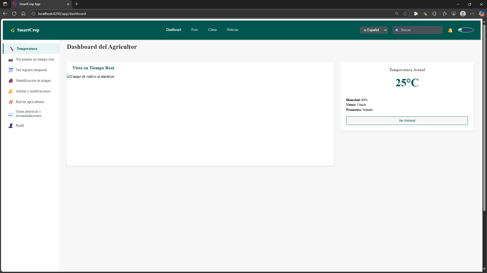

**Monitoreo de plantas**

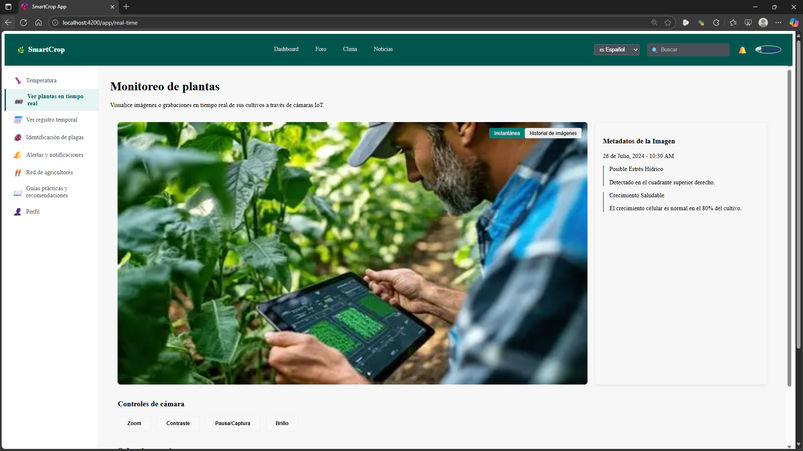

**Registro temporal**


**Identificación de plagas**


**Alertas y notificaciones**

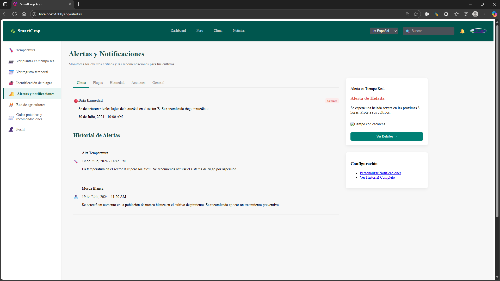

**Red de agricultores**

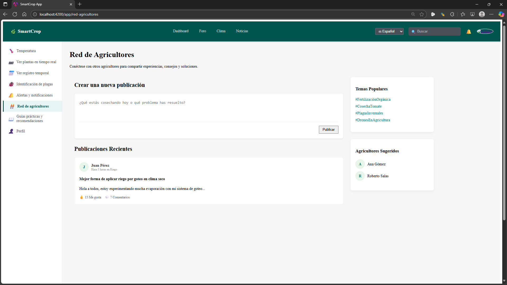

**Guías prácticas**

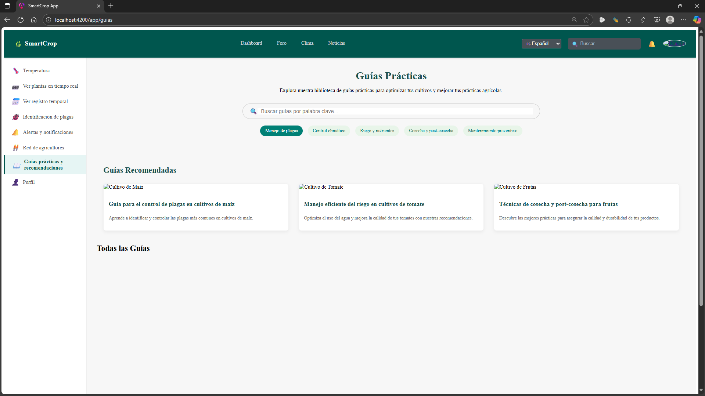

**Perfil de usuario**

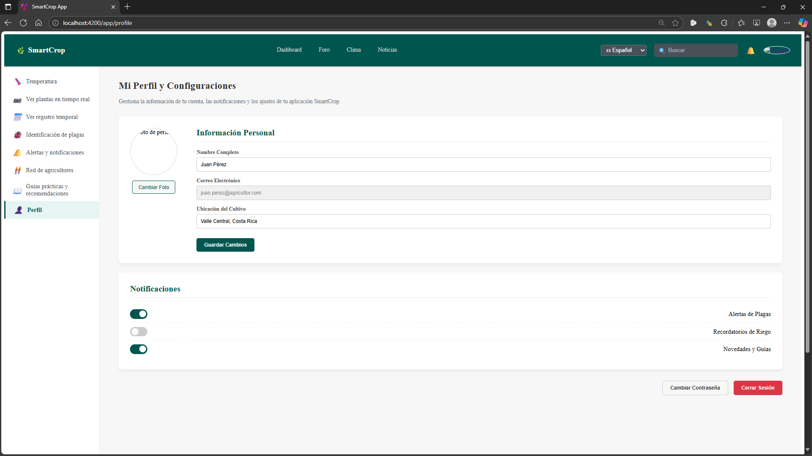

### 5.2.2.6. Team Collaboration Insights during Sprint

**Colaboradores activos**
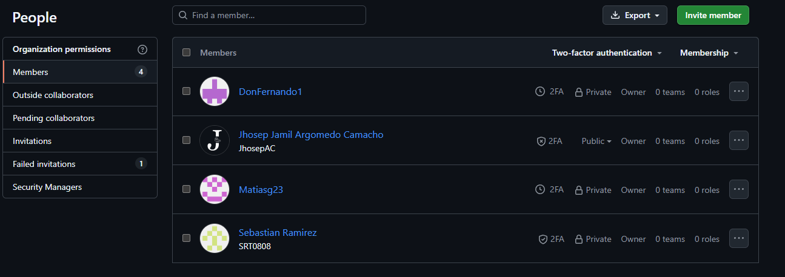


## 5.2.3. Sprint 3
### 5.2.3.1. Sprint Planning 3

El Sprint Planning es la reunión que da inicio al sprint y define qué se va a construir y cómo se logrará. Reúne al equipo Scrum para establecer un objetivo claro (Sprint Goal), seleccionar las historias de usuario más relevantes y descomponerlas en tareas concretas. Esta planificación asegura un enfoque común, organiza el trabajo de forma eficiente y alinea al equipo con la entrega de valor al usuario.

A continuación se mostrará la tabla del Sprint Planning:

| **Sprint #** | Sprint 3 |
| :--- | :--- |
| **Sprint Planning Background** | |
| **Date** | 2025-10-26 |
| **Hour** | 01:00 PM |
| **Location** | Virtual |
| **Prepared By** | Jhosep Argomedo |
| **Attendees (to planning meeting)** | Jamil Argomedo <br> Matias Rodolfo <br> Ivan Fernando <br> Sebastian Ramirez |
| **Sprint n - 3 Review Summary** | Durante el Sprint 3, el equipo implemento las secciones clave de la aplicación: Tarea, Finca, Usuarios, Monitoreo IoT, Contenido, Alertas y su diseño responsive. |
| **Sprint n - 3 Retrospective Summary** | Se identificó la necesidad de mejorar la navegación y optimizar el rendimiento en el landing page |
| **Sprint Goal & User Stories** | |
| **Sprint Goal** | Finalizar respecto a las funcionalidades pendientes, pulir y estelizar la interfaz de usuario, integrar servicios externos y preparar el producto para pruebas de validación con usuarios. |
| **Sprint Velocity** |  |
| **Sum of Story Points** |  |
### 5.2.3.2. Aspect Leaders and Collaborators
#### 5.2.3.3. Sprint Backlog 3
En el sprint backlog 3, enfocamos como prioridad nuestros esfuerzos para el desarrollo del backend del sistema. Utilizando la herramienta enseñada en el curso que es IntelliJ,  avanzamos significativamente en la implementación de la lógica del servidor como la estructuración respecto de los varios *bounded contexts* definidos en la arquitectura del proyecto.

## **Tabla de Control de Estado - Sprint 3**

| sprint # | Sprint 3 | | | | | | |
|-|-|-|-|-|-|-|-|
| User<br>Story | | Work-Item / Task | | | | | |
| ID | Title | ID | Title | Description | Estimation<br>(Hours) | Assigned<br>To | Status<br>(To-do<br>/InProcess<br>/To-Review<br>/Done) |
| US26 | Leer noticias agrícolas | *TA01* | Implementar un apartado de noticias en la aplicacion | Crear endpoint POST para registrar por con ayuda tambien de apis del tema noticias de agricultura y se almacene respecto a la base de datos. | 6 horas | Jhosep Jamil | Done |
| US09 | Iniciar sesión | *TA02* | Implementar el apartado de Inicio de Sesión | Desarrollar endpoint POST para autenticación de usuarios| 5 horas | Matias Rodolfo | Done |
| US23 | Consultar pronóstico meteorológico | *TA03* | Pestaña de Clima | Desarrollar endpoint GET que permita averiguar el tiempo y clima de la semana por medio de la apis | 8 horas | Fernando Sanchez | To-Review |
| US17 | Recibir Alertas de Plaga | *TA04* | Visualizacion de Alertas de amenzas | Implementar endpoint post para obtener información detallada de las amenzas que presente por. | 10 horas | Sebastian Ramirez | Done |
| US19 | Monitoreo de Temperatura de Cultivos | *TA05* | Gestión de Temperatura | Crear funcionalidad para recibir por medio de aparatos IoT la temperatura de los cultivos | 12 horas | Jhosep Jamil | Done |
| US20 | Recibir Alerta de Temperatura Minima | *TA06* | Notificaciones emergencia respecto a los cultivos | Desarrollar endpoint GET para que el usuario Reciba notificaciones cuando su cultivo se reporte alguna amenaza identificada por medio de la base de datos. | 15 horas | Sebastian Ramirez | Done |
| US05 | Contactar con EcoCrop | *TA07* | Metodo de contacto direacto | Crear un apartado para que el usuario pueda contactarse con nosotros de manera sencilla y directa | 11 horas | Fernando Sanchez | Done |

### 5.2.3.4. Development Evidence for Sprint Review

Durante el tercer sprint, se implementaron funcionalidades clave como el Getionar Temperatura, Alertas de plagas, Foro para agricultores, despliegue en Netlify, y configuración de infraestructura básica.


> [!Note]
> Se ha enviado todo el desarrollo en un solo commit, debido a que para subir los cambios al repositorio remoto, los integrantes han presentado problemas con el activation token. No obstante, todos han aportado al desarrollo.

| Repository | Branch | Commit Id | Commit Message | Commit Message Body | Commited on (Date) |
|------------|---------|------------|----------------|---------------------|-------------------|
| https://github.com/SmartCrop-EcoCrop/web-services | main | SRT0808 | doc: add first version of Backend | -- | 2025-10-29 |


### 5.2.3.4. Execution Evidence for Sprint Review

Durante el Sprint 3, se logró un gran progreso en la implementación del backend del sistema. Nos enfocamos en la creación de múltiples endpoints RESTful que permiten la gestión de entidades clave como monitoreo, usuarios, cultivos, etc. Todo el código fue desarrollado siguiendo una estetica de arquitectura limpiamy la persistencia adecuada de datos.

Además, se realizó el despliegue exitoso del backend en Netlify, lo que permitió validar el comportamiento del sistema en un entorno de producción. Para verificar la creación, edición y eliminación de datos, se utilizó MySQL workbench, accediendo directamente a la base de datos SQL vinculada al servicio de Render.

Evidencia visual:
<h3>Backend</h3>

- Datos en bounded context Usuario
 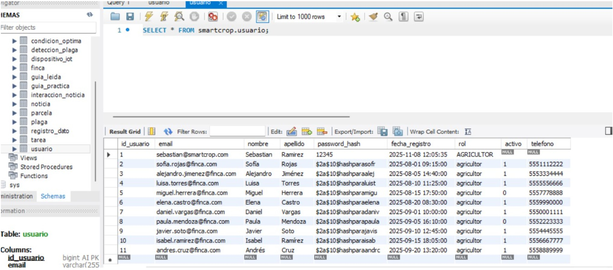

- Datos en bounded context Condicion_Optica
 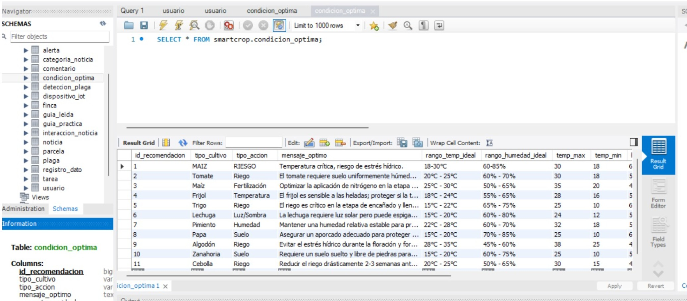

- Datos en bounded context finca
 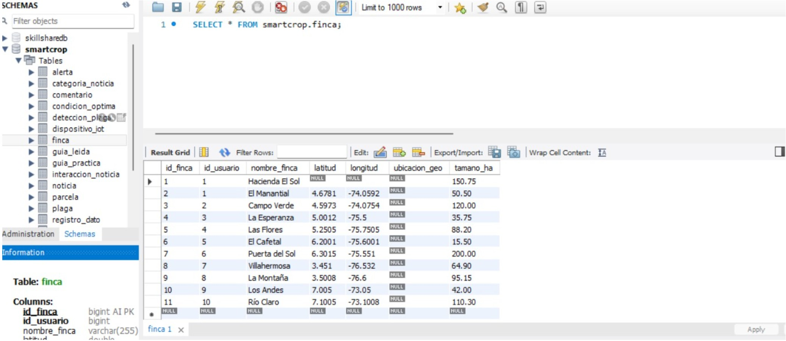

- Datos en bounded context noticia
 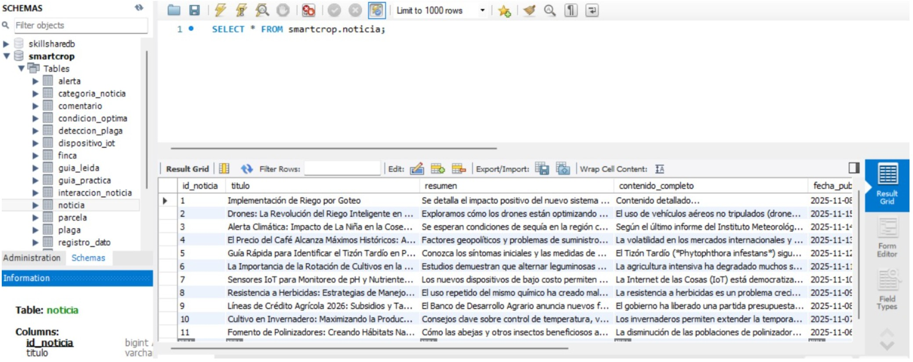

- Datos en bounded context tarea
 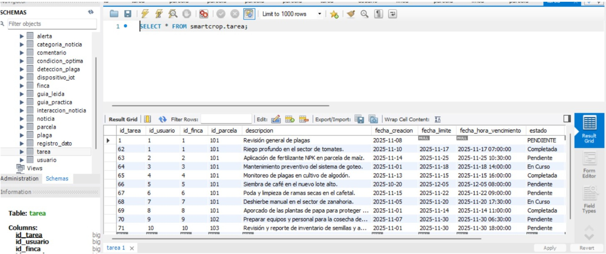

- Capturas del Backend deployado
 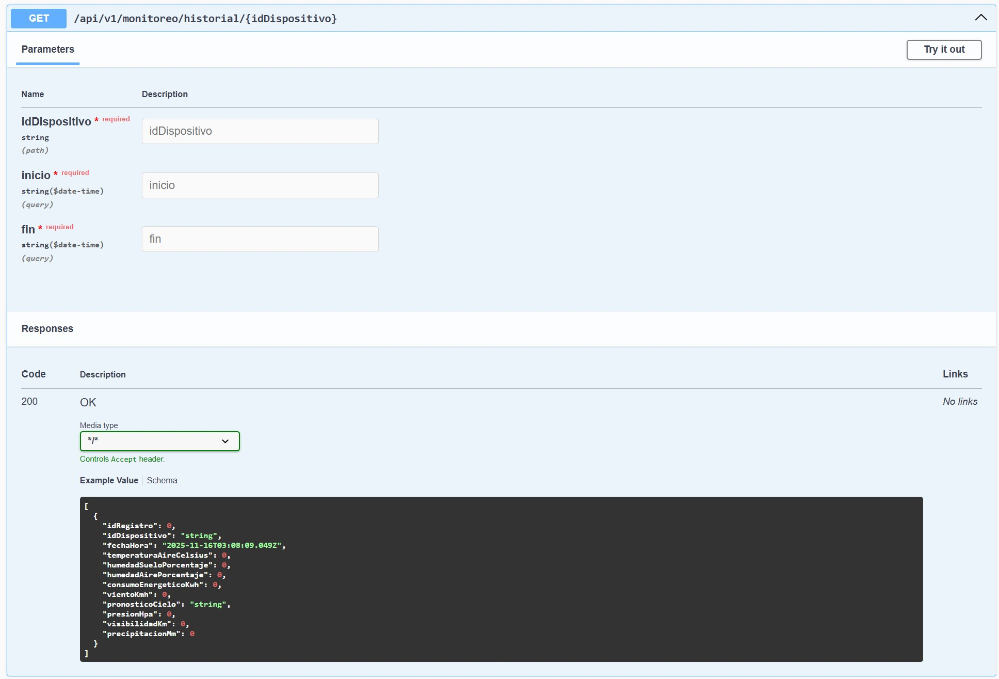

 A continuacion se muestra la evidencia de despliegue del backend entrando al siguiente enlace:   
 https://smart-crop-app-rafael.netlify.app/

#### 5.2.3.6. Services Documentation Evidence for Sprint Review

En esta sección se incluye la relación de endpoints desarrollados como parte del alcance del Sprint 3. Se resumen los logros alcanzados en relación con la implementación y documentación de los servicios respecto del Backend.

#### Backend en IntelliJ IDEA

En esta seccion el backend está desarrollado siguiendo el patrón **Domain-Driven Design (DDD)**, estructurando la lógica en **Bounded Contexts** perfectamentes definidos y separados. Cada contexto encapsula su propio modelo de dominio, comportamientos y reglas de negocio, lo que permite una arquitectura modular, mantenible y alineada con el negocio.
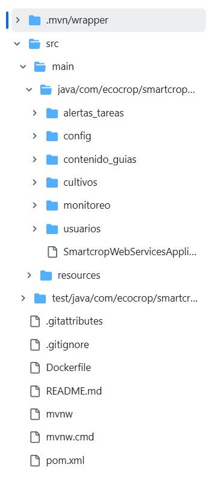
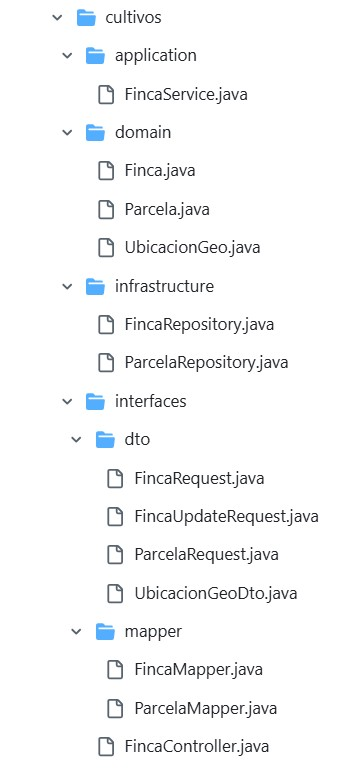

#### Bounded Contexts

- **Tarea** – Manejo de actividades por hacer.
- **Finca** – Gestión de Propiedad.
- **Usuario** – Información general y roles del sistema
- **Monitoreo IoT** – Gestión de dispositivos IoT en los cultivos.
- **Contenido** – Publicacion de Noticias y contenido social.
- **Alerta** – Publicaciones de alarma respecto a la Finca.

####  Buenas Prácticas Aplicadas
- Separación clara de **entidades de dominio**.
- Control de errores centralizado.
- Arquitectura lista para pruebas, integración y ampliación.


###  Tarea Bounded Context

**TareaController**

| Tag      | HTTP Verbs | Endpoint                     | Summary           | Description                           | OperationId    |
|----------|------------|------------------------------|-------------------|---------------------------------------|----------------|
| Tarea | PUT        | /api/v1/tareas/{idTarea}/pendiente | List profiles     | Retrieve all registered profiles      | GetAllProfiles |
| Tarea | PUT        | /api/v1/tareas/{idTarea}/Completar | Create profile    | Register a new profile                | CreateProfile  |
| Tarea | POST       | /api/v1/tareas | Get profile by ID | Retrieve a profile by its ID          | GetProfileById |
| Tarea | GET        | /api/v1/tareas/ | Update profile    | Update existing profile information   | UpdateProfile  |

### Finca Bounded Context

**FincaController**

| Tag | HTTP Verbs | Endpoint | Summary | Description | OperationId |
| :--- | :--- | :--- | :--- | :--- | :--- |
| Finca | GET | `/api/v1/fincas/{idFinca}` | Get Farm | Retrieve details of a specific farm by ID | `GetFincaById` |
| Finca | PUT | `/api/v1/fincas/{idFinca}` | Update Farm | Modify existing farm registration data | `UpdateFinca` |
| Finca | DELETE | `/api/v1/fincas/{idFinca}` | Delete Farm | Remove a farm record from the system | `DeleteFinca` |
| Finca | POST | `/api/v1/fincas` | Register Farm | Create a new property/farm record | `CreateFinca` |
| Finca | GET | `/api/v1/fincas/usuario/{idUsuario}` | List User Farms | Retrieve all farms associated with a specific user | `GetFincasByUsuario` |

### Usuario Bounded Context

**UsuarioController**

| Tag | HTTP Verbs | Endpoint | Summary | Description | OperationId |
| :--- | :--- | :--- | :--- | :--- | :--- |
| Usuario | POST | `/api/v1/usuarios/registro` | Register User | Create a new farmer or administrator account | `RegisterUser` |
| Usuario | POST | `/api/v1/usuarios/login` | Login User | Authenticate user and return access credentials | `LoginUser` |
| Usuario | GET | `/api/v1/usuarios/{idUsuario}` | Get User Profile | Retrieve profile information for a specific user | `GetUserProfile` |

### Monitoreo IoT Bounded Context

**MonitoreoController**

| Tag | HTTP Verbs | Endpoint | Summary | Description | OperationId |
| :--- | :--- | :--- | :--- | :--- | :--- |
| Monitoreo | POST | `/api/v1/monitoreo/ingestar` | Ingest Data | Receive temperature/humidity data from IoT sensors | `IngestSensorData` |
| Monitoreo | GET | `/api/v1/monitoreo/historial/{idDispositivo}` | Device History | Retrieve historical measurements for a specific sensor | `GetDeviceHistory` |

### Contenido Bounded Context

**ContenidoController**

| Tag | HTTP Verbs | Endpoint | Summary | Description | OperationId |
| :--- | :--- | :--- | :--- | :--- | :--- |
| Contenido | POST | `/api/v1/contenido/noticias` | Publish News | Create a new agricultural news post | `CreateNews` |
| Contenido | POST | `/api/v1/contenido/comentar` | Add Comment | Add a comment to a publication or guide | `AddComment` |
| Contenido | GET | `/api/v1/contenido/noticias/recientes` | Recent News | List the latest news added to the system | `GetRecentNews` |
| Contenido | GET | `/api/v1/contenido/guias` | List Guides | Retrieve the list of available guides and tutorials | `GetGuides` |
| Contenido | GET | `/api/v1/contenido/comentarios/recientes` | Recent Comments | Show the latest comments from the community | `GetRecentComments` |

### Alerta Bounded Context

**AlertaController**

| Tag | HTTP Verbs | Endpoint | Summary | Description | OperationId |
| :--- | :--- | :--- | :--- | :--- | :--- |
| Alerta | POST | `/api/v1/alertas/evaluar-datos-prueba` | Evaluate Risks | Analyze incoming data to detect pests or adverse climate | `EvaluateRiskData` |
| Alerta | GET | `/api/v1/alertas/reglas-optimas` | Get Business Rules | Retrieve configured parameters for triggering alerts | `GetAlertRules` |
| Alerta | GET | `/api/v1/alertas/parcela/{idParcela}/activas` | Active Alerts | List active alerts for a specific land plot | `GetActiveAlertsByParcela` |


### 5.2.3.7. Software Deployment Evidence for Sprint Review

 En esta entrega se ha finalizado la implementación de la lógica de negocio restante, junto con la optimización y estilización de la experiencia visual (UI).

Se realizó la integración exitosa de servicios de terceros, consolidando una versión estable del producto que cumple con los requisitos necesarios para la ejecución de pruebas de aceptación y validación.

### Validación de Funcionalidades Desplegadas (Sprint 3)

A continuación se presenta el estado operativo de los módulos críticos en el entorno de producción (Netlify + Backend):

| Aspecto Evaluado | Estado Sprint 3 | Observaciones |
| :--- | :---: | :--- |
| **Disponibilidad** | ✅ Online | Accesible públicamente mediante enlace de Netlify. Backend respondiendo solicitudes. |
| **Autenticación** | ✅ Funcional | Endpoints de seguridad integrados. Validación contra base de datos MySQL. |
| **Monitoreo IoT** | ✅ Implementado | Visualización de temperatura de cultivos y lógica de alertas de mínimos activa. |
| **Gestión Core** | ✅ Integrado | CRUD de Fincas y Tareas conectado a los *Bounded Contexts*. Persistencia verificada. |
| **Servicios Externos** | ✅ Conectado | Consumo exitoso de APIs para Pronóstico Meteorológico y Noticias Agrícolas. |
| **Alertas** | ✅ Activo | Notificaciones de plagas y emergencias visibles en el dashboard. |
| **Bugs/Estabilidad** | ⚠️ En revisión | Funcionalidad core estable. Se detectó leve latencia en carga de noticias (optimización pendiente). |

### 5.2.3.8. Team Collaboration Insights during Sprint

La colaboración del equipo durante el **Sprint 3** se orientó a la finalización de la lógica de negocio en el Backend y su integración total con la interfaz de usuario. El trabajo se distribuyó respetando la arquitectura de *Bounded Contexts*, asegurando que servicios críticos como IoT, alertas y consumo de APIs externas funcionaran armónicamente antes del despliegue final en producción.

| Integrante | Actividad Principal en Sprint 3 |
| :--- | :--- |
| **Argomedo Camacho, Jhosep Jamil** | Desarrollo de lógica para **Monitoreo IoT** (Temperatura) y gestión de contenido para el módulo de Noticias Agrícolas. |
| **Salcedo Champi, Matias Rodolfo** | Implementación segura del **Inicio de Sesión (Login)** y validación de credenciales de usuario en el Backend. |
| **Sanchez Guevara, Ivan Fernando** | Integración de **APIs externas** para el pronóstico meteorológico y desarrollo del canal de contacto/soporte. |
| **Ramírez Tello, Sebastian** | Construcción del sistema de **Alertas y Notificaciones**, enfocándose en detección de plagas y temperaturas críticas. |

Observaciones del trabajo colaborativo:

- Se establecieron ramas de desarrollo separadas  por módulo para evitar conflictos de código.
- Se aplicó una política de pull requests y revisiones por pares antes de integrar a la rama principal.
- El uso de GitHub Projects permitió gestionar tareas y seguimiento del progreso en tiempo real.
- La comunicación constante facilitó la resolución de conflictos y el refinamiento del diseño UI/UX.

### 5.3. Validation Interviews

#### 5.3.1. Diseño de Entrevistas

## Pruebas de Usabilidad – Plataforma Web de Agricultura

### Preguntas para Agricultores

#### Diseño general y navegación

- ¿Desde la pantalla principal, supiste rápidamente cómo empezar a usar la plataforma?
- ¿Te perdiste en algún momento navegando entre las secciones? ¿Dónde?
- ¿Los íconos o botones te parecieron claros y comprensibles? ¿Alguno te generó dudas?
- ¿Qué función o acceso agregarías para facilitar tu trabajo diario?

#### Iniciar sesión

- ¿Fue fácil encontrar el botón para iniciar sesión?
- ¿El proceso de ingreso fue claro y rápido?
- ¿Tuviste algún problema con el ingreso de usuario o contraseña?
- ¿Qué mejorarías en esta parte para que sea más sencilla o rápida?

#### Monitorear temperatura de cultivos

- ¿Pudiste encontrar fácilmente la sección de monitoreo de temperatura?
- ¿La información de temperatura se entiende con claridad (valores, unidades, ubicación)?
- ¿Te resultó útil la visualización (gráficas, colores, alertas)?
- ¿Agregarías algún dato o funcionalidad adicional en esta sección?

#### Identificar plagas

- ¿Pudiste acceder fácilmente a la herramienta para identificar plagas?
- ¿Las imágenes o descripciones de plagas te ayudaron a reconocer lo que ocurre en tus cultivos?
- ¿Te pareció clara la forma de reportar una plaga o pedir ayuda?
- ¿Qué mejorarías para que esta sección sea más útil en tu día a día?

#### Ver alertas y notificaciones

- ¿Recibiste las alertas en el momento adecuado?
- ¿Te pareció clara la información de cada alerta (ubicación, tipo de riesgo, recomendaciones)?
- ¿Pudiste distinguir fácilmente entre alertas urgentes y otras menos críticas?
- ¿Qué tipo de alertas te gustaría recibir que aún no están disponibles?

#### Foro comunitario

- ¿Fue fácil encontrar y acceder al foro?
- ¿Pudiste publicar una pregunta sin dificultad?
- ¿Te sentiste cómodo/a interactuando con otros agricultores?
- ¿Qué mejorarías para que el foro sea más útil o fácil de usar?

#### Opinión general

- ¿Qué parte de la plataforma te pareció más útil y cuál más confusa?
- ¿Hubo algo que no entendiste o que te pareció innecesario?
- ¿Qué tan fácil fue moverte entre las distintas secciones?
- ¿Qué cambiarías para que esta plataforma te ayude más en tu trabajo?

---

### Preguntas para Cooperativas y Técnicos

#### Diseño general y navegación

- ¿Te pareció clara la estructura general de la plataforma?
- ¿Hubo botones o etiquetas que te generaron dudas?
- ¿Qué mejorarías en la navegación para facilitar tu trabajo?


#### Monitoreo remoto de Dispoisitvos IoT

- ¿Pudiste acceder fácilmente al monitoreo de parcelas?
- ¿La información (temperatura, humedad, alertas) fue clara y útil?
- ¿Te pareció intuitiva la navegación entre diferentes parcelas o zonas?
- ¿Qué mejorarías para facilitar el seguimiento remoto?

#### Opinion Variada

- ¿Qué tipo de contenidos o formatos te gustaría que se incluyeran?
- ¿Qué tipo de análisis o visualizaciones te gustaría tener disponibles?
- ¿Fue fácil agregar usuario?
- ¿Qué funcionalidades adicionales te ayudarían a gestionar mejor los accesos?

#### 5.2.4.2. Registro de Entrevistas

**User Persona del Segmento Objetivo 1: Agricultores**

| <p align="center">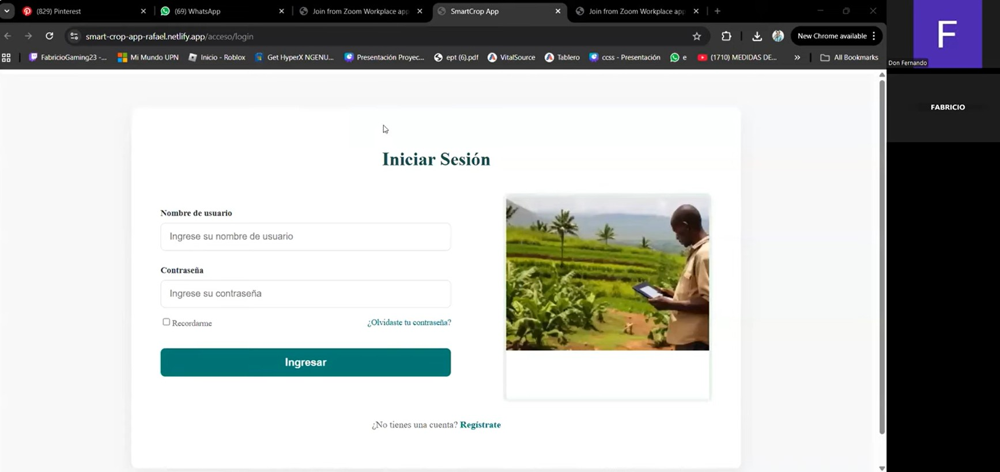  |
|--------------------------------------------------------------------------------------------------------------------------------------------------------------------------------------------------------------------------------------------------------------------------------------------------------------------------------------------------------------------------------------------------------------------------------------------------------------------------------------------------------------------------------------------------------------------------------------------------------------------------------------------------------------------------------------------------------------------------------------------------------------------------------------------------------------------------------------------------------------------------------------------------------------------------------------------------------------------------------|
| **Entrevistado(a):** Fabricio Roncal  |
| **Género:** Masculino  |
| **Edad:** 18 años   |
| **Link de la entrevista (YouTube):** https://www.youtube.com/watch?v=FSpnCvF8BVM  |
| Fabricio Roncal, Es hijo de agricultores, en esta ocasion nos pudo probar nuestra aplicacion webb, para darnos una retroalimentacion respecto a foro, pestaña de temperatura, alertas y notificaciones, entre otras cosas, entre los aspectos positivos nos menciona que le gusta el uso de iconos como guia ademas de proporicionar las informacion principal al inicio de cada pestaña, tambien no da sus pespectiva en lo negativo, como mejorar el reporte de notificaciones, quitar cierto grado de informacion para no agobiar al usuario, ademas de orientarlo en varias plataformas como celular, pero fuera de eso ve a la pagina con potencia|

**User Persona del Segmento Objetivo 2: Cooperativas y Técnicos**

| <p align="center">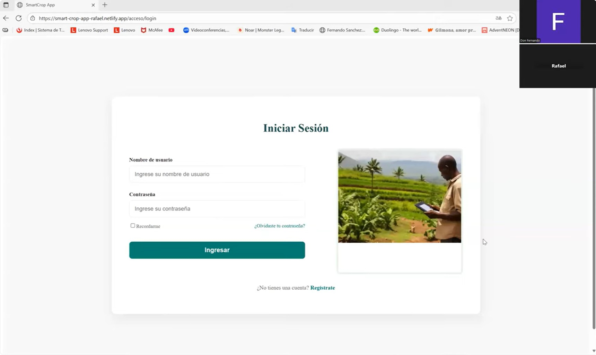  |
|--------------------------------------------------------------------------------------------------------------------------------------------------------------------------------------------------------------------------------------------------------------------------------------------------------------------------------------------------------------------------------------------------------------------------------------------------------------------------------------------------------------------------------------------------------------------------------------------------------------------------------------------------------------------------------------------------------------------------------------------------------------------------------------------------------------------------------------------------------------------------------------------------------------------------------------------------------------------------------|
| **Entrevistado(a):** Rafael Hernandez  |
| **Género:** Masculino    |
| **Edad:** 24 años   |
| **Link de la entrevista (YouTube):** https://www.youtube.com/watch?v=d-Fh49zNN-Y  |
| Rafael Hernandez, Es Tecnico capacitado, en esta ocasion nos realizo un feedback respecto a nuestra aplicacion webb, nos comento que la intuicion par entrar tanto como tecnico u agricultor, lo que nos sugirio tambien es aplicar un modo nocturno a nuestro, para los usuarios que trabajan a horas muy tardes en la noche,como tambien nos recomendo hacer un apartado para almacenos para complementar el proposito de la pagina webb, y por ultimo pide que las notificaciones tambien pueda ser llegadas por su celular para estar al pendiente de cualquier problema respecto a la pagina como implementacion de un asistente IA|

#### 5.3.3. Evaluaciones según heurísticas

## SITE o APP A EVALUAR
**Nombre:** SmartCrop  
**Objetivo:** Identificar problemas de usabilidad en el sistema web de Gestion respecto a la Agricultura usando la Lista Heurística de Nielsen.

--


##  TAREAS A EVALUAR

1. Visualización de Optimizacion de pagina
2. Disminucion de Informacion para el usuario
3. Accesibilidad y claridad del menú lateral y Horizontal (ubicación, iconos, diseño)
4. Claridad de iconografía y etiquetas

## PROBLEMAS DETECTADOS 

| # | Problema detectado | Heurística violada | Severidad |
|---|--------------------|--------------------|-----------|
| 1 | Falta de opciones de modo nocturno | Estética y diseño minimalista / Flexibilidad | 3 |
| 2 | Sobrecarga de informacion en algunos apartados | Control y libertad del usuario  | 2 |


---


## ESCALA DE SEVERIDAD

| Nivel | Descripción |
|-------|-------------|
| **1** | Problema superficial: sencillamente superado por el usuario o muy frecuencia baja. No es prioritario. |
| **2** | Problema menor: algo más frecuente o confuso; su arreglo debe esta planteado en una próxima versión. |
| **3** | Problema mayor: ocurre frecuentemente y ocasiona problemas en el uso normal. Prioridad alta. |
| **4** | Problema muy grave: no permite el uso correcto del sistema. Debe corregirse antes del lanzamiento. |

## ANÁLISIS HEURÍSTICO DETALLADO

### Problema #01: Falta de opciones de modo nocturno

**Severidad:** 3  
**Heurística violada:** Estética y diseño minimalista / Flexibilidad  

**Descripción:**  
La plataforma no ofrece un modo nocturno o de alto contraste, lo que dificulta su uso en condiciones de baja iluminación, especialmente para agricultores que acceden desde el campo en horarios nocturnos o los tecnicos en cuestion. Esto puede generar fatiga visual y reducir la eficiencia en tareas críticas como monitoreo o lectura de alertas.

**Recomendación:**  
Incluir una opción de modo nocturno accesible desde el menú principal o ajustes del usuario. También se recomienda detectar automáticamente la configuración del sistema operativo para adaptar el tema visual. Esto hara una mejora a la accesibilidad, reduce el esfuerzo de la vision y permite una experiencia más cómoda en distintos entornos.

---

### Problema #02: Sobrecarga de información en algunos apartados

**Severidad:** 2  
**Heurística violada:** Control y libertad del usuario  

**Descripción:**  
Algunas secciones como el monitoreo de cultivos o la identificación de plagas presentan demasiada información en un solo bloque, sin jerarquía visual clara. Esto dificulta la lectura rápida, genera confusión y puede llevar a errores en la interpretación de los datos importantes.

**Recomendación:**  
Aplicar principios de diseño visual jerárquico: agrupar información por contexto, usar títulos claros, colores diferenciados y elementos colapsables. Incorporar filtros o resúmenes iniciales para que el usuario pueda decidir qué nivel de detalle necesita. Esto facilita la toma de decisiones y mejora la eficiencia en tareas operativas.

---

<br>
<br>

## 5.3.4. Sprint 4

| **Sprint #** | Sprint 4 |
| :--- | :--- |
| **Sprint Planning Background** | |
| **Date** | 2025-11-26 |
| **Hour** | 04:00 PM |
| **Location** | Virtual |
| **Prepared By** | Jhosep Argomedo |
| **Attendees (to planning meeting)** | Jamil Argomedo <br> Matias Rodolfo <br> Ivan Fernando <br> Sebastian Ramirez |
| **Sprint n - 3 Review Summary** | Se implementaron las mejoras respectivas en los endpoints de nuestro BackEnd. |
| **Sprint n - 3 Retrospective Summary** | Se identificó la necesidad de la vinculación del contenido de nuestro FrontEnd con nuestro BackEnd |
| **Sprint Goal & User Stories** | |
| **Sprint Goal** | Finalizar con las mejoras pendientes, integrar los endpoints del BackEnd con el contenido del FrontEnd para brindar una experiencia del usuario. |
| **Sprint Velocity** |  |
| **Sum of Story Points** |  |


## 5.3.4.1. Development Evidence for Sprint Review
Durante el cuarto sprint, se mejoraron funcionalidades clave en el backEnd y FrontEnd de nuestra solución, con el fin de mostrar una solución solida para los usuarios, Respecto a la cantidad de informacion mostrada, acceso a ciertos apartados, informacion de alarmas, etc

> [!Note]
> Se ha enviado todo el desarrollo en un solo commit, debido a que para subir los cambios al repositorio remoto, los integrantes han presentado problemas con el activation token. No obstante, todos han aportado al desarrollo.

| Repository | Branch | Commit Id | Commit Message | Commit Message Body | Commited on (Date) |
|------------|---------|------------|----------------|---------------------|-------------------|
| https://github.com/SmartCrop-EcoCrop/Front-SmarCrop-Main | main | 2c629bf | feat: improvement in key areas based on interview feedback | -- | 2025-11-20 |
| https://github.com/SmartCrop-EcoCrop/web-services | main | 798dec2 | feat: fixing database errors | -- | 2025-11-23 |


#### 5.2.4.7. Testing Suite Evidence for Sprint Review

Durante el Sprint 4 nos enfocamos en la conexión entre nuestro Frontend y Backend, para ello tuvimos que realizar moficiaciones en nuestros respectivos Bounded Context

A continuación, se muestra un resumen del estado de testing al cierre del Sprint 4:

| **Aspecto Evaluado**          | **Resultado**                                                                 |
|------------------------------|------------------------------------------------------------------------------|
| Conexión FrontEnd-BackEnd    | Se concreto de forma efectiva la conexión entre el ForntEnd y BackEnd del proyecto para mostrar el contenido respectivo                |
| Pruebas locales            | De manera local cada uno de los miembros del equipo realizó pruebas de manera local para probar la respuesta entre los servicios que se mostraban en el BackEnd y como se reflejarian estos en nuestro FrontEnd                     |
| Herramientas utilizadas      | IntelliJ IDEA, MySQL workbench, Swagger UI. |
| Estado general de testing    | Funcionalidad comprobada de forma exitosa                                   |

#### 5.2.4.8. Execution Evidence for Sprint Review

Durante el Sprint 4. Nos enfocamos en la mejora de nuestro Frontend y la conexión de su contenido con nuestro BackEnd, todo el código fue desarrollado se desarrollo mantiendo principios de arquitectura limpia, con especial énfasis en la separación de capas y la persistencia adecuada de datos.

<h3>Frontend</h3>
En este sprint, hemos logrado mejoras significativas en el desarrollo del frontend de nuestro producto. Nos hemos concentrado en conectar múltiples nuestros multiples endpoints RESTful con el contenido presentado en nuestro FrontEnd. En este momento, se le presentaran las evidencias técnicas del backend desarrollado durante este sprint.

**Capturas de Pantalla del FrontEnd mejorado**
- Mejora en bounded context IAM - Crear cuenta

- Mejora en bounded context IAM - Iniciar Sesión

- Mejora en bounded context Profile - Visualización de Información


# Video About-the-product

https://youtu.be/7noGMxTq5rw

# Video About-the-team

https://youtu.be/YYt8RJ1qkMk


## Conclusiones 
<p>El proyecto <b>SmartCrop-EcoCrop</b> ha logrado definir y materializar componentes fundamentales durante el Sprint 1, tales como la landing page y sus secciones principales (Home, Partners y Pie de Página, Servicios, Sobre Nosotros, Testimonios y Contacto). Estos avances evidencian un enfoque claro en transmitir la propuesta de valor y generar confianza en los usuarios desde el primer contacto. Sin embargo, la funcionalidad técnica de la plataforma aún se encuentra en fases iniciales, lo que implica que en los siguientes sprints será crucial fortalecer la integración con el backend y las funcionalidades principales del producto.</p>


<p>Se observa un esfuerzo consistente en priorizar el diseño y la experiencia de usuario. La estructura de la landing page, la claridad en la comunicación del valor del producto y la navegación intuitiva son fortalezas del proyecto. Aun así, persisten oportunidades de mejora en aspectos técnicos como la velocidad de carga, la optimización para dispositivos móviles y la consistencia tipográfica. Las evaluaciones heurísticas y futuras pruebas con usuarios permitirán identificar ajustes que mejoren aún más la usabilidad y refuercen la percepción de confiabilidad de la plataforma.</p>

<p>El equipo ha mostrado una organización adecuada, distribuyendo responsabilidades de forma clara y utilizando prácticas ágiles basadas en sprints. Esto ha permitido avanzar de manera incremental y documentada. Sin embargo, se identifica la necesidad de incorporar <b>feedback real de usuarios finales</b> para validar las hipótesis de valor y usabilidad. El éxito del proyecto dependerá no solo de la calidad técnica y del diseño, sino también de su aceptación y pertinencia en el contexto social y tecnológico en el que busca posicionarse.</p>

<br><br>

## Bibliografía

- Nielsen Norman Group. *10 Usability Heuristics for User Interface Design*.  
  Disponible en: [https://www.nngroup.com/articles/ten-usability-heuristics/](https://www.nngroup.com/articles/ten-usability-heuristics/)

- Nielsen Norman Group. *How to Rate the Severity of Usability Problems*.  
  Disponible en: [https://www.nngroup.com/articles/how-to-rate-the-severity-of-usability-problems/](https://www.nngroup.com/articles/how-to-rate-the-severity-of-usability-problems/)

- Gothelf, Jeff; Seiden, Josh. *Lean UX: Designing Great Products with Agile Teams*.  
  O’Reilly Media.

- Microsoft Docs. *TypeScript Handbook*.  
  Disponible en: [https://www.typescriptlang.org/docs/handbook/intro.html](https://www.typescriptlang.org/docs/handbook/intro.html)

- Astro Documentation. *Astro Framework Documentation*.  
  Disponible en: [https://docs.astro.build](https://docs.astro.build)

- Tidwell, Jenifer. *Designing Interfaces: Patterns for Effective Interaction Design*.  
  O’Reilly Media.

- World Wide Web Consortium (W3C). *Web Content Accessibility Guidelines (WCAG)*.  
  Disponible en: [https://www.w3.org/WAI/standards-guidelines/wcag/](https://www.w3.org/WAI/standards-guidelines/wcag/)

- Sethi, P.; Sarangi, S. *Internet of Things: Architectures, Protocols, and Applications*.  
  *Journal of Electrical and Computer Engineering*.

- Google Web Fundamentals. *Web Performance Optimization Guidelines*.  
  Disponible en: [https://developers.google.com/web/fundamentals/performance](https://developers.google.com/web/fundamentals/performance)

<br><br>

## Anexos

https://agriculture.basf.com/pe/es/contenidos-de-agricultura/cambio-climatico-y-agricultura-cual-es-el-impacto

https://www.bancomundial.org/es/topic/climate-smart-agriculture 

[def]: mages/WireframeLandingSmartCrop.jpg.pn
